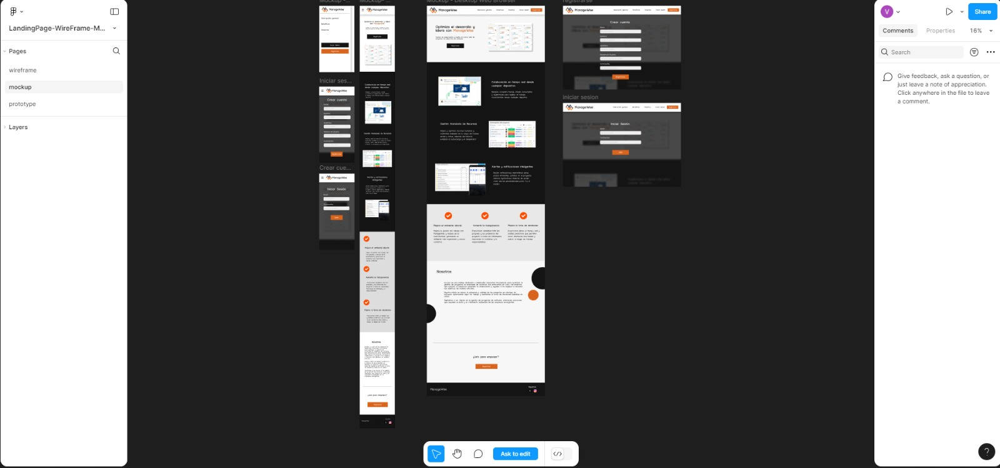
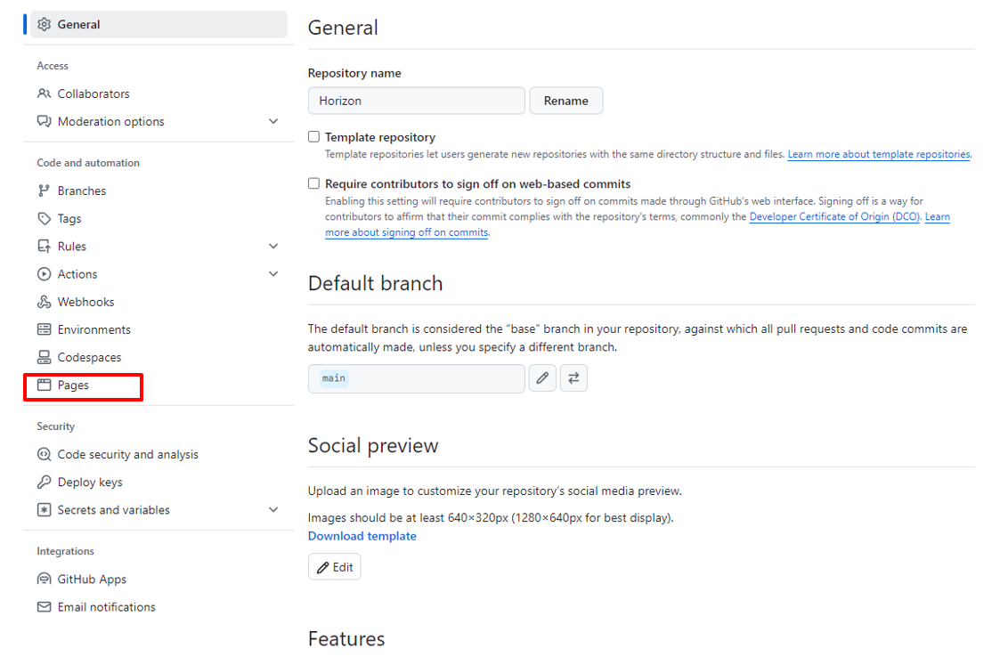
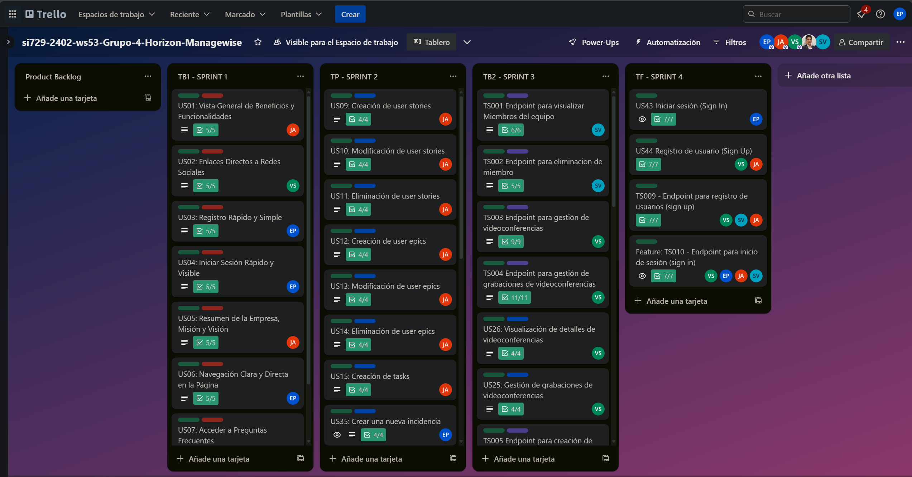
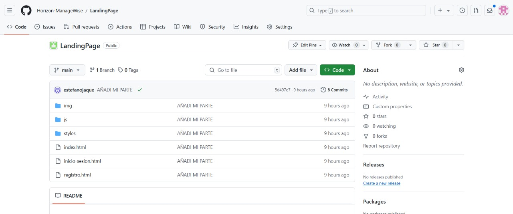
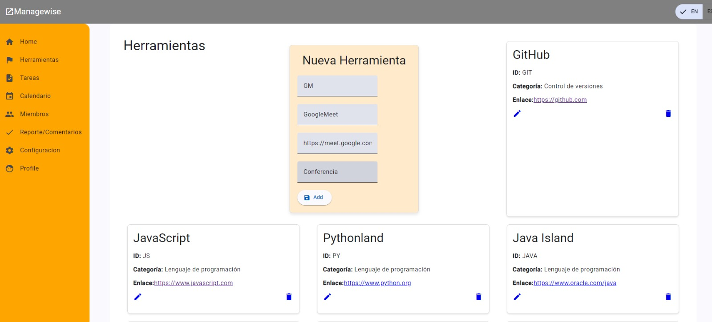
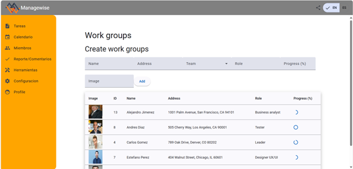
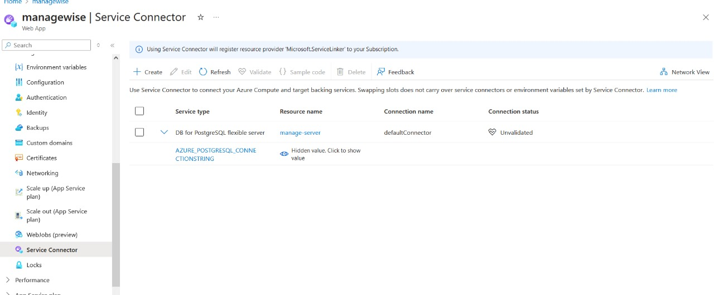

# Horizon

Product: ManageWise

# UNIVERSIDAD PERUANA DE CIENCIAS APLICADAS

<p align="center">
  
</p>

## Ingenieria de Software

## 7mo Ciclo

## Diseño de Experimentos de Ingeniería de Software

### **Sección:** 4436

### **Profesor:** Julio Manuel Noriega Melendez

### Informe de Trabajo Final

### " "

### "ManageWise"

### **Integrantes:**

- John Telesforo Arevalo Meza - u202117377
- Michael Stefano Carmelino Dueñas - u202212760
- Rodrigo Manuel Chirinos Zúñiga - u202217804
- Fabian Alonso Reyes Trujillano - u202218233
- Alessandro Netto Zevallos Linares - u202216035

### Abril, 2025

### Url del proyecto: https://github.com/DisenoDeExperimentos-4436-Grupo3

## Registro de Versiones del Informe

|Version|Fecha|Autor|Descripcion|
|-|-|-|-|
| | | | |
| | | | |

## Project Report Collaboration Insights

|  URL de la organización del proyecto  |          URL del repositorio del reporte          |
| :-----------------------------------: | :-----------------------------------------------: |
| https://github.com/DisenoDeExperimentos-4436-Grupo3 | https://github.com/DisenoDeExperimentos-4436-Grupo3/Documentation |

TB1: 


TB1:<br>
|Integrante|Tarea Asignada|
|-|-|
| | |
| | |
| | |
| | |
| | |


## Contenido

### Tabla de contenidos

- [Capítulo I: Introducción](#capítulo-i-introducción)
  - [1.1. Startup Profile](#11-startup-profile)
  - [1.1.1. Descripción de la Startup](#111-descripción-de-la-startup)
  - [1.1.2. Perfiles de integrantes del equipo](#112-perfiles-de-integrantes-del-equipo)
  - [1.2. Solution Profile](#12-solution-profile)
  - [1.2.1. Antecedentes y problemática](#121-antecedentes-y-problemática)
  - [1.2.2. Lean UX Process](#122-lean-ux-process)
  - [1.2.2.1. Lean UX Problem Statements](#1221-lean-ux-problem-statements)
  - [1.2.2.2. Lean UX Assumptions](#1222-lean-ux-assumptions)
  - [1.2.2.3. Lean UX Hypothesis Statements](#1223-lean-ux-hypothesis-statements)
  - [1.2.2.4. Lean UX Canvas](#1224-lean-ux-canvas)
  - [1.3. Segmentos objetivo](#13-segmentos-objetivo)
- [Capítulo II: Requirements Elicitation & Analysis](#capítulo-ii-requirements-elicitation--analysis)
  - [2.1. Competidores](#21-competidores)
  - [2.1.1. Análisis competitivo](#211-análisis-competitivo)
  - [2.1.2. Estrategias y tácticas frente a competidores](#212-estrategias-y-tácticas-frente-a-competidores)
  - [2.2. Entrevistas](#22-entrevistas)
  - [2.2.1. Diseño de entrevistas](#221-diseño-de-entrevistas)
  - [2.2.2. Registro de entrevistas](#222-registro-de-entrevistas)
  - [2.2.3. Análisis de entrevistas](#223-análisis-de-entrevistas)
  - [2.3. Needfinding](#23-needfinding)
  - [2.3.1. User Personas](#231-user-personas)
  - [2.3.2. User Task Matrix](#232-user-task-matrix)
  - [2.3.3. User Journey Mapping](#233-user-journey-mapping)
  - [2.3.4. Empathy Mapping](#234-empathy-mapping)
  - [2.3.5. As-is Scenario Mapping](#235-as-is-scenario-mapping)
  - [2.4. Ubiquitous Language](#24-ubiquitous-language)
- [Capítulo III: Requirements Specification](#capítulo-iii-requirements-specification)
  - [3.1. To-Be Scenario Mapping](#31-to-be-scenario-mapping)
  - [3.2. User Stories](#32-user-stories)
  - [3.3. Product Backlog](#33-product-backlog)
  - [3.4. Impact Mapping](#34-impact-mapping)
- [Capítulo IV: Product Design](#capítulo-iv-product-design)
  - [4.1. Style Guidelines](#41-style-guidelines)
    - [4.1.1. General Style Guidelines](#411-general-style-guidelines)
    - [4.1.2. Web Style Guidelines](#412-web-style-guidelines)
    - [4.1.3. Mobile Style Guidelines](#413-mobile-style-guidelines)
      - [4.1.3.1. iOS Mobile Style Guidelines](#4131-ios-mobile-style-guidelines)
      - [4.1.3.2. Android Mobile Style Guidelines](#4132-android-mobile-style-guidelines)
  - [4.2. Information Architecture](#42-information-architecture)
    - [4.2.1. Organization Systems](#421-organization-systems)
    - [4.2.2. Labeling Systems](#422-labeling-systems)
    - [4.2.3. SEO Tags and Meta Tags](#423-seo-tags-and-meta-tags)
    - [4.2.4. Searching Systems](#424-searching-systems)
    - [4.2.5. Navigation Systems](#425-navigation-systems)
  - [4.3. Landing Page UI Design](#43-landing-page-ui-design)
    - [4.3.1. Landing Page Wireframe](#431-landing-page-wireframe)
      - [Desktop Web Browser](#desktop-web-browser)
      - [Mobile Web Browser](#mobile-web-browser)
    - [4.3.2. Landing Page Mock-up](#432-landing-page-mock-up)
      - [Desktop Web Browser](#desktop-web-browser-1)
      - [Mobile Web Browser](#mobile-web-browser-1)
  - [4.4. Mobile Applications UX/UI Design](#44-mobile-applications-uxui-design)
    - [4.4.1. Mobile Applications Wireframes](#441-mobile-applications-wireframes)
    - [4.4.2. Mobile Applications Wireflow Diagrams](#442-mobile-applications-wireflow-diagrams)
    - [4.4.3. Mobile Applications Mock-ups](#443-mobile-applications-mock-ups)
    - [4.4.4. Mobile Applications User Flow Diagrams](#444-mobile-applications-user-flow-diagrams)
  - [4.5. Mobile Applications Prototyping](#45-mobile-applications-prototyping)
    - [4.5.1. Android Mobile Applications Prototyping](#451-android-mobile-applications-prototyping)
    - [4.5.2. iOS Mobile Applications Prototyping](#452-ios-mobile-applications-prototyping)
  - [4.6. Web Applications UX/UI Design](#46-web-applications-uxui-design)
    - [4.6.1. Web Applications Wireframes](#461-web-applications-wireframes)
    - [4.6.2. Web Applications Wireflow Diagrams](#462-web-applications-wireflow-diagrams)
    - [4.6.3. Web Applications Mock-ups](#463-web-applications-mock-ups)
    - [4.6.4. Web Applications User Flow Diagrams](#464-web-applications-user-flow-diagrams)
  - [4.7. Web Applications Prototyping](#47-web-applications-prototyping)
  - [4.8. Domain-Driven Software Architecture](#48-domain-driven-software-architecture)
    - [4.8.1. Software Architecture Context Diagram](#481-software-architecture-context-diagram)
    - [4.8.2. Software Architecture Container Diagrams](#482-software-architecture-container-diagrams)
    - [4.8.3. Software Architecture Components Diagrams](#483-software-architecture-components-diagrams)
  - [4.9. Software Object-Oriented Design](#49-software-object-oriented-design)
    - [4.9.1. Class Diagrams](#491-class-diagrams)
    - [4.9.2. Database Dictionary](#492-database-dictionary)
  - [4.10. Database Design](#410-database-design)
    - [4.10.1. Database Diagram](#4101-database-diagram)
- [Capítulo V: Product Implementation, Validation & Deployment](#capítulo-v-product-implementation-validation--deployment)
  - [5.1. Software Configuration Management](#51-software-configuration-management)
    - [5.1.1. Software Development Environment Configuration](#511-software-development-environment-configuration)
    - [5.1.2. Source Code Management](#512-source-code-management)
    - [5.1.3. Source Code Style Guide & Conventions](#513-source-code-style-guide--conventions)
    - [5.1.4. Software Deployment Configuration](#514-software-deployment-configuration)
  - [5.2. Product Implementation & Deployment](#52-product-implementation--deployment)
    - [5.2.1. Sprint Backlogs](#521-sprint-backlogs)
    - [5.2.2. Implemented Landing Page Evidence](#522-implemented-landing-page-evidence)
    - [5.2.3. Implemented Frontend-Web Application Evidence](#523-implemented-frontend-web-application-evidence)
    - [5.2.4. Acuerdo de Servicio - SaaS](#524-acuerdo-de-servicio---saas)
    - [5.2.5. Implemented Native-Mobile Application Evidence](#525-implemented-native-mobile-application-evidence)
    - [5.2.6. Implemented RESTful API and/or Serverless Backend Evidence](#526-implemented-restful-api-andor-serverless-backend-evidence)
    - [5.2.7. RESTful API Documentation](#527-restful-api-documentation)
    - [5.2.8. Team Collaboration Insights](#528-team-collaboration-insights)
  - [5.3. Video About-the-Product](#53-video-about-the-product)
- [Capítulo VI: Product Verification & Validation](#capítulo-vi-product-verification--validation)
  - [6.1. Testing Suites & Validation](#61-testing-suites--validation)
    - [6.1.1. Core Entities Unit Tests](#611-core-entities-unit-tests)
    - [6.1.2. Core Integration Tests](#612-core-integration-tests)
    - [6.1.3. Core Behavior-Driven Development](#613-core-behavior-driven-development)
    - [6.1.4. Core System Tests](#614-core-system-tests)
  - [6.2. Static testing & Verification](#62-static-testing--verification)
    - [6.2.1. Static Code Analysis](#621-static-code-analysis)
      - [6.2.1.1. Coding standard & Code conventions.](#6211-coding-standard--code-conventions)
      - [6.2.1.2. Code Quality & Code Security.](#6212-code-quality--code-security)
    - [6.2.2. Reviews](#622-reviews)
  - [6.3. Validation Interviews.](#63-validation-interviews)
    - [6.3.1. Diseño de Entrevistas.](#631-diseño-de-entrevistas)
    - [6.3.2. Registro de Entrevistas.](#632-registro-de-entrevistas)
    - [6.3.3. Evaluaciones según heurísticas.](#633-evaluaciones-según-heurísticas)
  - [6.4. Auditoría de Experiencias de Usuario](#64-auditoría-de-experiencias-de-usuario)
    - [6.4.1. Auditoría realizada.](#641-auditoría-realizada)
      - [6.4.1.1. Información del grupo auditado.](#6411-información-del-grupo-auditado)
      - [6.4.1.2. Cronograma de auditoría realizada.](#6412-cronograma-de-auditoría-realizada)
      - [6.4.1.3. Contenido de auditoría realizada.](#6413-contenido-de-auditoría-realizada)
    - [6.4.2. Auditoría recibida.](#642-auditoría-recibida)
      - [6.4.2.1. Información del grupo auditor.](#6421-información-del-grupo-auditor)
      - [6.4.2.2. Cronograma de auditoría recibida.](#6422-cronograma-de-auditoría-recibida)
      - [6.4.2.3. Contenido de auditoría recibida.](#6423-contenido-de-auditoría-recibida)
      - [6.4.2.4. Resumen de auditoría para subsanar hallazgos.](#6424-resumen-de-auditoria-para-subsanar-hallazgos)
- [Capítulo VII: DevOps Practices](#capítulo-vii-devops-practices)
  - [7.1. Continuous Integration](#71-continuous-integration)
    - [7.1.1. Tools and Practices](#711-tools-and-practices)
    - [7.1.2. Build & Test Suite Pipeline Components](#712-build--test-suite-pipeline-components)
  - [7.2. Continuous Delivery](#72-continuous-delivery)
    - [7.2.1. Tools and Practices](#721-tools-and-practices)
    - [7.2.2. Stages Deployment Pipeline Components](#722-stages-deployment-pipeline-components)
  - [7.3. Continuous Deployment](#73-continuous-deployment)
    - [7.3.1. Tools and Practices](#731-tools-and-practices)
    - [7.3.2. Production Deployment Pipeline Components](#732-production-deployment-pipeline-components)
  - [7.4. Continuous Monitoring](#74-continuous-monitoring)
    - [7.4.1. Tools and Practices](#741-tools-and-practices)
    - [7.4.2. Monitoring Pipeline Components](#742-monitoring-pipeline-components)
    - [7.4.3. Alerting Pipeline Components](#743-alerting-pipeline-components)
    - [7.4.4. Notification Pipeline Components.](#744-notification-pipeline-components)
- [Capítulo VIII: Experiment-Driven Development](#capítulo-viii-experiment-driven-development)
  - [8.1. Experiment Planning](#81-experiment-planning)
    - [8.1.1. As-Is Summary.](#811-as-is-summary)
    - [8.1.2. Raw Material: Assumptions, Knowledge Gaps, Ideas, Claims.](#812-raw-material-assumptions-knowledge-gaps-ideas-claims)
    - [8.1.3. Experiment-Ready Questions.](#813-experiment-ready-questions)
    - [8.1.4. Question Backlog.](#814-question-backlog)
    - [8.1.5. Experiment Cards.](#815-experiment-cards)
  - [8.2. Experiment Design](#82-experiment-design)
    - [8.2.1. Hypotheses.](#821-hypotheses)
    - [8.2.2. Measures.](#822-measures)
    - [8.2.3. Conditions.](#823-conditions)
    - [8.2.4. Scale Calculations and Decisions.](#824-scale-calculations-and-decisions)
    - [8.2.5. Methods Selection.](#825-methods-selection)
    - [8.2.6. Data Analytics: Goals, KPIs and Metrics Selection.](#826-data-analytics-goals-kpis-and-metrics-selection)
    - [8.2.7. Web and Mobile Tracking Plan.](#827-web-and-mobile-tracking-plan)
  - [8.3. Experimentation](#83-experimentation)
    - [8.3.1. To-Be User Stories.](#831-to-be-user-stories)
    - [8.3.2. To-Be Product Backlog](#832-to-be-product-backlog)
- [Conclusiones](#conclusiones)
- [Bibliografía](#bibliografía)
- [Anexos](#anexos)

## Student Outcome

_ABET – EAC - Student Outcome _  
**Criterio:** 

En el siguiente cuadro se describen las acciones realizadas y enunciados de conclusiones por parte del grupo, que permiten sustentar el haber alcanzado el logro del ABET - EAC - Student Outcome .

| Criterio especifico | Acciones Realizadas| Conclusiones|
| :-- | :-- | -- |
| 1.   | | |
| 2.  | |   |


# Part I: As-Is Software Project
## Capítulo I: Introducción

### 1.1. Startup Profile

### 1.1.1. Descripción de la Startup

   es una startup innovadora creada por estudiantes de la Facultad de Ingeniería de la Universidad Privada de Ciencias Aplicadas (UPC).
Las empresas emergentes en el sector del desarrollo de software enfrentan una serie de desafíos únicos, entre los cuales se destaca la carencia de herramientas eficaces para gestionar proyectos e iniciativas.
Esta falta de recursos puede limitar el crecimiento y la capacidad de estas empresas para competir en un mercado cada vez más exigente.
Con el objetivo de proporcionar un apoyo significativo a estas startups, estamos desarrollando un software que no solo mejorará la eficiencia en la gestión de iniciativas, sino que también fomentará una cultura de innovación y adaptabilidad.
Este software integrará tecnologías avanzadas para ofrecer análisis predictivos y automatización de tareas, y bases de datos robustas para una gestión efectiva de la información. Además, nuestro software incluirá características personalizables para adaptarse a las necesidades específicas de cada empresa, permitiendo una integración fluida con sus procesos existentes y facilitando una colaboración más eficiente entre equipos.

Misión:
Nuestra misión es elevar la eficiencia, calidad y rentabilidad de los proyectos en startups pequeñas de desarrollo de software mediante la optimización de sus procesos de gestión de iniciativas. Buscamos ofrecer soluciones innovadoras que no solo simplifiquen y agilicen los flujos de trabajo, sino que también fomenten la colaboración efectiva y la toma de decisiones basada en datos.
Nuestra misión es no solo ser un proveedor de herramientas de gestión, sino un socio estratégico en el camino hacia el éxito y el crecimiento sostenido de nuestras empresas clientes.

Visión:
Aspiramos a convertirnos en el referente principal en la optimización de la gestión de proyectos para startups de desarrollo de software, siendo reconocidos no solo por nuestras soluciones innovadoras, sino también por nuestra capacidad de transformar y potenciar el éxito de las empresas emergentes. Queremos ser el socio estratégico preferido que permita a las startups no solo alcanzar sus metas, sino superar sus expectativas y mantenerse a la vanguardia en un entorno tecnológico en constante evolución.
Nuestro objetivo es liderar el mercado con herramientas que no sólo aborden las necesidades actuales, sino que también anticipen las tendencias futuras y adapten nuestras soluciones a los cambios del sector. Planeamos desarrollar capacidades adicionales como la integración con plataformas emergentes, el soporte para metodologías ágiles avanzadas y la incorporación de funciones de colaboración global para equipos distribuidos.

### 1.1.2. Perfiles de integrantes del equipo

- John Telésforo Arévalo Meza - U202117377

| <p align="center"> </p> | Soy John Arévalo, tengo 20 años y soy estudiante de la carrera de Ingeniería de Software. Tengo conocimiento en lenguajes de programación como python y c++, y bases de datos como SQLServer y MongoDB. Desde pequeño me sentí atraído por la tecnología, por lo que me decidí a estudiar la carrera, además disfruto de jugar videojuegos con amigos en mi tiempo libre. |
| :---------------------------------------------------------------------------- | ------------------------------------------------------------------------------------------------------------------------------------------------------------------------------------------------------------------------------------------------------------------------------------------------------------------------------------------------------------------------- |

- Alessandro Zevallos Linares - U202216035 

| <p align="center"> </p> | Soy estudiante de Ingeniería de Software con un fuerte interés en el desarrollo de productos digitales y la tecnología. En mi tiempo libre, me gusta jugar videojuegos. También tengo un interés especial en la música, lo que me ayuda a equilibrar mi vida académica y personal. |
| --------------------------------------------------------------------------------------------- | :------------------------------------------------------------------------------------------------------------------------------------------------------------------------------------------------------------------------------------------------------------------------------------------------------------------------------------------------------------------------------------------------------------------------------------------------------------------------------------------------------------------------------------------------------------------------------------------------------------------------------------------------------------------------------------------------------------------------------------------------------------------------------------------------------------------------------------------------------------------------------------------- |

- Rodrigo Manuel Chirinos Zúñiga - u202217804

| <p align="center"> | Tengo 20 años, soy un estudiante de la carrera de Ingeniería de Software, considero que soy una persona responsable y de escucha activa. Estoy comprometido con mis compañeros en realizar un buen trabajo y así aprender todos en el proceso. También tengo conocimientos en programación en C++, HTML, CSS y JavaScript. |
| ----------------------------------------------------------------------------------------- | :------------------------------------------------------------------------------------------------------------------------------------------------------------------------------------------------------------------------------------------------------------------------------------------------------------------------------------------------------------------------------------------------------------------------------------------------------------------------------------------------------------------------------------------------------------------------------------------------------------------------------------------------------------------------------------------------------------------------------------------------------------------------------------------------------------------------------------------------------------------- |

-  Michael  Stefano Carmelino Dueñas - U202212760 

| <p align="center"></p> | Estoy en la carrera de ing de software. Actualmente en 7mo ciclo, me encuentro haciendo actualmente mis prácticas pre profesionales. Me gusta mucho lo que es el aprendizaje costante sobre nuevas tecnologías y el uso de IA para la rapidez de esto. Actualmente lo que más uso es React con Vite y Tailwind, me gusta mucho escuchar musica mientras me traslado de lugar a lugar y de vez en cuando ir a conciertos |
| ------------------------------------------------------------------------------------ | :--------------------------------------------------------------------------------------------------------------------------------------------------------------------------------------------------------------------------------------------------------------------------------------------------------------------- |

-  Fabian Alonso Reyes Trujillano - U202218233 

| <p align="center"></p> | Me llamo Fabian tengo 20 años. Soy estudiante de la carrera de ingenieria de software. Soy una persona segura de sí misma, capaz de tomar decisiones importantes y brindar ideas rápidas para solucionar un problema. Tengo conocimientos intermedios en C++, Python, HTML. |
| :-------------------------------------------------------------------------------------- | -------------------------------------------------------------------------------------------------------------------------------------------------------------------------------------------------------------------------------------------------------------------------------------------------------------------------------------------------------------------------------------------------------------------------------------- |

### 1.2. Solution Profile

### 1.2.1. Antecedentes y problemática

Las empresas de desarrollo de software operan en un entorno de alta competencia e incertidumbre, donde es fundamental cumplir con proyectos que apoyen sus objetivos estratégicos. La gestión eficaz de estos proyectos requiere tanto habilidades especializadas como herramientas que permitan un seguimiento adecuado. Sin embargo, incluso los project managers más capacitados carecen a menudo de herramientas que les proporcionen una visibilidad clara del progreso. Esta falta de control incrementa el riesgo de fracaso en los proyectos y afecta negativamente el rendimiento y la capacidad de la organización para alcanzar sus objetivos.

**What?**

**¿Qué problema hay?**  
El principal problema radica en la falta de herramientas especializadas diseñadas para gestionar de manera eficaz proyectos de software que siguen metodologías ágiles como Scrum. Estas herramientas deben ser capaces de dar soporte a las dinámicas rápidas y cambiantes de estos proyectos, así como de ofrecer visibilidad en tiempo real sobre el progreso y los posibles obstáculos. La ausencia de estas soluciones lleva a una gestión ineficiente de proyectos, lo que se traduce en:

Retrasos en las entregas: Dificultad para cumplir con los plazos establecidos en cada sprint.
Baja calidad del producto: Mayor probabilidad de errores y defectos en el software desarrollado.
Desmotivación del equipo: La falta de herramientas adecuadas puede generar frustración y reducir la productividad del equipo de desarrollo.
Dificultad para tomar decisiones basadas en datos: La falta de visibilidad sobre el progreso del proyecto impide una toma de decisiones informada.

**¿Qué relación tiene el problema con el usuario/cliente?**  
Para las startups de desarrollo de software que utilizan Scrum, este problema se traduce en una pérdida de competitividad, mayor riesgo de fracaso de los proyectos y disminución de la satisfacción del cliente. Los equipos de desarrollo se ven afectados por la sobrecarga de trabajo, la falta de claridad en las tareas y la dificultad para adaptarse a los cambios constantes. Por otro lado, los clientes experimentan retrasos en la entrega del producto, una menor calidad del software y una comunicación poco efectiva con el equipo de desarrollo.

**When?**

**¿Cuándo sucede el problema?**  
El problema se manifiesta a lo largo de todo el ciclo de vida de un proyecto Scrum. Desde la planificación inicial, pasando por la ejecución de los sprints, hasta la revisión y adaptación del producto. La falta de herramientas adecuadas dificulta la gestión de cada una de estas etapas, generando cuellos de botella y retrasos.

**¿Cuándo utiliza el cliente el producto?**  
Los clientes utilizarán ManageWise a lo largo de todo el ciclo de vida de sus proyectos, desde la fase de planificación inicial hasta la implementación y revisión de tareas.

**Where?**

**¿Dónde ocurre el problema?**  
El problema se presenta en todos los entornos de trabajo donde se desarrollan proyectos de software, tanto en oficinas físicas como en entornos de trabajo remoto. La falta de una plataforma centralizada para la gestión del proyecto dificulta la colaboración entre los miembros del equipo y la visibilidad del progreso.

**¿Dónde está el cliente cuando usa el producto?**  
Los clientes pueden usar ManageWise en sus oficinas, espacios de trabajo remoto o durante reuniones virtuales de equipo.

**Who?**

**¿Quiénes son los involucrados en este problema?**  
Los principales actores involucrados son los equipos de desarrollo de software, los product owners y los scrum masters. También se ven afectados los inversores y los clientes, ya que los problemas en la gestión del proyecto pueden impactar directamente en el éxito del producto y la satisfacción del cliente.

**¿Quiénes están afectados por el problema?**  
Los equipos de desarrollo de software y los líderes de empresas de software son los principales afectados. Los desarrolladores enfrentan dificultades para completar tareas a tiempo y gestionar recursos, mientras que los líderes sufren por la falta de control, planificación ineficaz y dificultades para cumplir con los plazos.

**Why?**

**¿Por qué ocurre el problema?**  
El problema surge principalmente debido a la falta de adaptación de las herramientas de gestión de proyectos tradicionales a las necesidades específicas de los proyectos Scrum. Estas herramientas suelen estar diseñadas para proyectos más grandes y complejos, y no ofrecen las funcionalidades necesarias para gestionar de manera ágil y eficiente los proyectos de software.

**How?**

**¿En qué condiciones los clientes usan nuestro producto?**  
 Los ususarios-clientes utilizan el software en condiciones de alta demanda, donde la eficiencia y la capacidad de adaptación son cruciales para la gestión de proyectos. Además, los clientes lo emplearán durante todas las fases del ciclo de vida de un proyecto: planificación, ejecución, monitoreo y revisión.

**¿Cómo nos conocieron los compradores?**  
Los compradores potenciales conocen ManageWise a través de diversos canales, como recomendaciones de colegas en la industria del software, marketing digital, eventos de tecnología y conferencias, y a través de contenido relevante publicado en blogs y redes sociales.

**¿Qué llevó a la persona a llegar a esta situación?**  
Las personas llegaron a la situación de buscar una solución como ManageWise debido a los desafíos enfrentados con las herramientas de gestión de proyectos actuales, que no satisfacen las necesidades específicas de las startups de desarrollo de software. Estos desafíos incluyen la falta de características avanzadas, como análisis predictivos, automatización de tareas, y personalización. Los clientes buscan una solución que les permita mejorar la eficiencia, la colaboración y la gestión de proyectos para poder competir eficazmente en el mercado.

**How much?**

**¿Cuánto cuesta este problema?**  
La carencia de herramientas avanzadas para la gestión de proyectos en startups de desarrollo de software conlleva graves consecuencias.El Standish Group CHAOS Report 2020 revela que el 45% de los proyectos de software se retrasan significativamente, y aproximadamente el 19% se consideran fracasos completos debido a problemas en la gestión y falta de herramientas adecuadas.


Los costos operativos también se ven incrementados significativamente. Un análisis de Gartner indica que las empresas que no cuentan con herramientas adecuadas pueden enfrentar un aumento del 25% en sus costos operativos debido a ineficiencias. La insatisfacción con las herramientas actuales es alta, con un 40% de los equipos de desarrollo reportando descontento, según un estudio de Atlassian. Finalmente, un informe de Forrester revela que el 50% de las decisiones en proyectos de software se basan en datos insuficientes, lo que afecta la calidad de la toma de decisiones y el éxito general de los proyectos.

### 1.2.2. Lean UX Process

El proceso Lean UX se adapta especialmente bien a startups como Horizon que buscan crear soluciones innovadoras y efectivas en el mercado. Este enfoque se caracteriza por su agilidad y centrado en el usuario, lo que significa que estamos constantemente buscando validar nuestras ideas y prototipos con los usuarios para garantizar que estamos abordando sus necesidades de manera adecuada.

### 1.2.2.1. Lean UX Problem Statements

El objetivo es gestionar proyectos de software de manera eficiente, mejorando la planificación, la asignación de recursos y el monitoreo del progreso en tiempo real.
Actualmente, la falta de herramientas especializadas para la gestión de proyectos en el desarrollo de software está afectando la eficiencia y la capacidad de cumplir con los plazos. Las soluciones genéricas no abordan las complejidades particulares de este tipo de proyectos, lo que resulta en retrasos, recursos mal asignados y problemas no resueltos a tiempo.
Se requiere una mejora en la gestión de proyectos que permita optimizar la planificación y supervisión, brindando una mayor visibilidad del progreso y una asignación más eficiente de recursos, sin imponer una solución específica.

### 1.2.2.2. Lean UX Assumptions

Assumptions:

1. Creo que mis clientes necesitan una forma más eficiente de gestionar proyectos e iniciativas dentro de sus empresas emergentes de desarrollo de software.

2. Estas necesidades se pueden resolver con una herramienta de gestión de proyectos ágil(metologia Scrum) y adaptable que se integre fácilmente con los flujos de trabajo existentes.

3. Mis clientes iniciales serán startups emergentes de tecnología que buscan mejorar la eficiencia y la colaboración en sus equipos de desarrollo.

4. El valor que un cliente quiere de mi servicio que requieren los usuarios es una plataforma intuitiva que les permita planificar, seguir y adaptarse rápidamente a los cambios en sus proyectos.

5. El cliente también puede obtener estos beneficios adicionales en donde implementaremos integraciones con herramientas populares de desarrollo de software.

6. Voy a adquirir la mayoría de mis clientes a través de estrategias de marketing digital dirigidas a startups de tecnología y a través de referencias de clientes satisfechos.

7. Haré dinero a través de un modelo de suscripción mensual o anual, ofreciendo diferentes niveles de funcionalidad según las necesidades del cliente y mediante publicidad dentro de nuestra plataforma .

8. Mi competencia principal en el mercado serán Trello, Wrike y ClickUp.

9. Los venceremos debido a nuestra facilidad de uso, integraciones flexibles y enfoque en las necesidades específicas de las empresas emergentes de desarrollo de software.

10. Mi mayor riesgo de producto es la falta de adopción por parte de los equipos de desarrollo, debido a la resistencia al cambio o a la preferencia por soluciones existentes.

11. ¿Quién es el usuario?  
    Los usuarios son lideres o gerentes de proyectos de software en los que se encuetran el Product Owner y el Scrum master .Ademas, los equipos de desarrollo de software.

12. ¿Dónde encaja nuestra empresa en su trabajo o vida?  
    Nuestra empresa se posiciona como proveedora de herramientas de gestión de proyectos e iniciativas para facilitar el desarrollo de software en empresas emergentes.

13. ¿Qué problemas tiene nuestra empresa?  
    Nos enfrentamos a la falta de herramientas especializadas que se adapten a las necesidades únicas de las empresas emergentes de desarrollo de software, lo que dificulta la gestión eficiente de proyectos y recursos.

14. ¿Cuándo y cómo es nuestra empresa?  
    Nuestra empresa está en una etapa inicial, ofreciendo soluciones ágiles y flexibles que se ajustan a las demandas cambiantes del mercado de desarrollo de software.

15. ¿Qué características son importantes?  
    Las características importantes incluyen una interfaz intuitiva y fácil de usar, capacidades para la gestión de tareas y asignación de recursos, así como integraciones con herramientas populares de desarrollo de software.

16. ¿Cómo debe verse nuestra empresa y comportarse?  
    Nuestra empresa debe presentarse como un aliado confiable que simplifica y optimiza la gestión de proyectos de desarrollo de software, siendo receptiva a las sugerencias de los usuarios y comprometida con la innovación y la mejora continua.

Business Outcomes:

- Incrementar la base de usuarios activos en un 12% durante el primer semestre, enfocado principalmente en startups de desarrollo de software.
- Reducir los costos operativos relacionados con la gestión de proyectos en un 18% en los primeros 9 meses mediante la implementación de automatización de tareas y análisis predictivos.
- Aumentar la tasa de éxito de proyectos en un 25% en el primer año, optimizando la planificación y el monitoreo de avances en tiempo real.
- Mejorar la retención de clientes en un 20% dentro de los primeros 6 meses, proporcionando herramientas especializadas que aborden las necesidades únicas de los desarrolladores de software.
- Lograr que el 30% de los nuevos clientes provengan de recomendaciones de usuarios existentes mediante la creación de una experiencia positiva y diferenciada en la gestión de proyectos de software.

User Outcomes:

- Aumentar la eficiencia de los equipos de desarrollo, reduciendo el tiempo perdido en tareas repetitivas mediante la automatización de procesos.
- Mejorar la coordinación y visibilidad del proyecto al brindar reportes en tiempo real sobre el progreso y asignación de recursos.
- Facilitar la toma de decisiones estratégicas mediante análisis predictivos y reportes de avance automatizados.
- Proporcionar una plataforma intuitiva que permita a los usuarios planificar, ejecutar y monitorear proyectos sin depender de múltiples herramientas genéricas.
- Reducir los retrasos en los proyectos al facilitar la comunicación directa de problemas y necesidades del equipo a los líderes de software.

### 1.2.2.3. Lean UX Hypothesis Statements

- Hypothesis 1:

Creemos que brindar herramientas adecuadas para la gestión eficaz de proyectos e iniciativas en startups de desarrollo de software permitirá superar obstáculos y dificultades relacionados con plazos y recursos limitados.
Sabremos que hemos tenido exito cuando los usuarios informen un incremento del 35% en la claridad y seguimiento de tareas, junto con una mejora del 18% en la satisfacción del equipo respecto a la gestión de proyectos.

- Hypothesis 2:

Creemos que la implementacion de un software integral que simplifique el seguimiento y la gestión de proyectos en startups de desarrollo de software mejorará el trabajo en equipo y la suficiencia de entrega de productos a tiempo.
Sabremos que estamos en lo cierto cuando veamos con una reducción del 25% en los costos asociados a retrasos y una mejora del 15% en la capacidad de adaptación a cambios en los requisitos.

- Hypothesis 3:

Creemos que al brindar una herramienta tecnológica que favorezca la gestión de proyectos en startups de desarrollo de software, incrementaremos la capacidad de produccion del equipo y la capacidad de adaptarse rápidamente a cambios en los requisitos del proyecto.
Sabremos que hemos tenido éxito cuando veamos un aumento del 22% en la agilidad y una reduccion del 10% de tiempo de respuesta del equipo ante nuevas solicitudes y una reducción del 10% en los tiempos de comunicación y coordinación entre equipos.

- Hypothesis 4:

Creemos que la integración de herramientas de seguimiento y análisis de datos en nuestro software aumentará la transparencia y visibilidad del desarrollo de los proyectos para los líderes de equipo y supervisores en startups de desarrollo de software.
Sabremos que estamos en lo cierto cuando veamos un aumento del 25% en la capacidad de los líderes para tomar decisiones informadas basadas en datos y una mejora del 20% en la precisión de los estimados de tiempo y optimizacion de recursos.

- Hypothesis 5:

Creemos que al ofrecer una plataforma de facil uso y acceso desde múltiples dispositivos, aumentaremos la aceptacion y la eficacia del software por parte de los equipos de trabajo en startups de desarrollo de software.
Sabremos que hemos tenido exito cuando observemos en un incremento del 30% en la tasa de aceptacion del software y una mejora del 20% en la colaboración y participación entre equipos.

- Hypothesis 6:

Creemos que la implementación de un sistema automatizado de seguimiento de proyectos disminuira la carga administrativa y permitirá que los equipos se concentren en actividades más productivas durante el desarrollo de software.
Sabremos que hemos tenido exito cuando veamos una reducción del 10% en el tiempo destinado a tareas administrativas y una mejora del 22% en el tiempo invertido en actividades de desarrollo y despliegue de software.

- Hypothesis 7:

Creemos que al proveer herramientas de análisis predictivo para la gestionar riesgos, ayudaremos a aminorizar problemas potenciales y a mejorar la capacidad de anticipación en startups de desarrollo de software.
Sabremos que hemos tenido éxito cuando veamos una reducción del 12% en los riesgos identificados durante los proyectos y un incremento del 30% en la capacidad de respuesta ante riesgos críticos.

- Hypothesis 8:

Creemos que posibilitar la colaboración remota y la comunicación en tiempo real entre los equipo de trabajo incrementará la eficiencia operativa y la flexibilidad laboral en startups de desarrollo de software.
Sabremos que hemos tenido exito cuando veamos un aumento del 35% en la productividad de los equipos de trabajo y una reducción del 15% en los tiempos de respuesta al solucionar problemas y organizar actividades entre ubicaciones distantes.

### 1.2.2.4. Lean UX Canvas

| Seccion| Contenido|
| -- | -- |
| **Business Problem** | La falta de herramientas especializadas para la gestión de proyectos de software resulta en demoras en las entregas, sobrepaso de presupuestos y disminución de la satisfacción del cliente. Las soluciones genéricas no abordan las complejidades específicas de los proyectos de desarrollo de software, lo que lleva a una gestión ineficiente, retrasos en la entrega, recursos mal asignados y problemas no resueltos a tiempo.|
| **Business Outcomes**| Aumentar la productividad de la empresa. <br> Reducir el tiempo desde la planificación del proyecto hasta el lanzamiento del producto final.|
| **Users and Customers**| Identificación de los diferentes tipos de usuarios y clientes que interactuarán con el producto, sus necesidades, comportamientos y características.|
| **User Benefits**| Optimización del tiempo y recursos <br> Comunicación mejorada <br> Productos y servicios de excelente calidad.|
| **Solution Ideas**| Integrar herramientas de comunicación para facilitar la comunicación y colaboración entre equipos mediante la integración de herramientas de mensajería instantánea, como Slack o Microsoft Teams, directamente en la plataforma de gestión de proyectos. <br> Permitir planificar y monitorear funcionalidades específicas para la planificación detallada, la asignación de recursos y el monitoreo en tiempo real, adaptadas a las particularidades del desarrollo de software. <br> Implementar un dashboard que proporcione visibilidad clara del progreso del proyecto y permita la identificación rápida de problemas y desviaciones.<br>|
| **Hypotheses**| Creemos que brindar herramientas adecuadas para la gestión eficaz de proyectos e iniciativas en startups de desarrollo de software permitirá superar obstáculos y dificultades relacionados con plazos y recursos limitados.Sabremos que hemos tenido exito cuando los usuarios informen un incremento del 35% en la claridad y seguimiento de tareas, junto con una mejora del 18% en la satisfacción del equipo respecto a la gestión de proyectos. <br> Creemos que brindar herramientas adecuadas para la gestión eficaz de proyectos e iniciativas en startups de desarrollo de software permitirá superar obstáculos <br> y dificultades relacionados con plazos y recursos limitados. Sabremos que hemos tenido exito cuando los usuarios informen un incremento del 35% en la claridad y seguimiento de tareas, junto con una mejora del 18% en la satisfacción del equipo respecto a la gestión de proyectos. |
| **What's the most important <br> thing we need to learn first?**| Conocer las expectativas y deseos de los clientes. <br> Identificar los problemas que los clientes puedan enfrentar. <br> Descubrir qué actualizaciones esperan los futuros usuarios para mejorar la app.|
| **What's the least amount of <br> work we need to do to learn <br> the next most important thing?** | Realizar entrevistas para explorar cómo abordar el tema. <br> Tener como referencia una app similar que tenga algunas funciones, pero no idénticas. <br> Realizar encuestas a personas con experiencia y conocimientos.|

### 1.3. Segmentos objetivo

**Lider o gerente de empresa de desarrollo de software en crecimiento(Product Owner y Scrum Master):**  
Descripción: Líderes y gerentes de empresas de desarrollo de software que buscan adoptar o mejorar sus prácticas ágiles. Están comprometidos con la transformación digital y buscan herramientas y metodologías que les permitan entregar valor al cliente de manera más rápida y eficiente.

Necesidades: Requieren soluciones que les ayuden a implementar y escalar Scrum, Kanban o otras metodologías ágiles en sus organizaciones. Buscan herramientas que faciliten la gestión del backlog, la planificación de sprints, el seguimiento del progreso y la colaboración entre equipos distribuidos.

Aspiraciones: Desean convertirse en referentes en la adopción de metodologías ágiles en su sector, mejorar la productividad y la calidad de sus productos, y fomentar una cultura de innovación y mejora continua en sus equipos.

**Equipo de Desarrollo de Software:**  
Descripción: Profesionales técnicos que trabajan en equipos ágiles y colaborativos, dedicados a la creación y mantenimiento de software.

Necesidades: Buscan herramientas que les permitan optimizar su flujo de trabajo, mejorar la comunicación y aumentar su productividad. Necesitan plataformas que integren diversas herramientas de desarrollo y que les proporcionen una visión unificada de su trabajo.

Aspiraciones: Desean entregar software de alta calidad de manera más rápida y eficiente, reducir el tiempo dedicado a tareas repetitivas y aumentar su satisfacción laboral.

## Capítulo II: Requirements Elicitation & Analysis

### 2.1. Competidores

Wrike: Wrike es una plataforma de gestión de proyectos colaborativa que permite a los equipos planificar, rastrear y gestionar proyectos con alta eficiencia.

Trello:Trello es una herramienta de gestión de proyectos basada en tableros que permite organizar tareas de manera visual y sencilla.

ClickUp: ClickUp es una plataforma todo-en-uno de gestión de proyectos que incluye desde tareas simples hasta colaboración avanzada y gestión de tiempo.

### 2.1.1. Análisis competitivo

Competitive Analysis Landscape

¿Por qué llevar a cabo este análisis?  
Para poder tener un análisis completo sobre nuestro modelo de negocio además de poder comprender a nuestros competidores.

| Nombre de <br>los Startups <br> o Empresas | | Nuestra startup| Competidor 1| Competidor 2| Competidor 3|
| -- | -- | -- | -- | -- | -- |
| Perfil                                     | Overview                                                      | Horizon <br>                                                                                                                                                                                          | Wrike <br>                                                                                                                                                                                                                                                   | Trello <br>                                                                                                                                  | ClickUp <br>                                                                                                                                             |
|                                            | Ventaja competitiva:<br>¿Qué valor ofrece<br> a los clientes? | Proporciona una interfaz intuitiva <br>y fácil de usar, en la que Lo usan<br> antes, durante y después del<br> Ciclo de Vida del Desarrollo de<br> Software.                                                                                                     | ofrece análisis predictivos,<br> automatización avanzada y <br>herramientas de colaboración <br>que permiten a los equipos<br> mejorar la productividad y <br>la visibilidad del proyecto<br> en tiempo real.                                                                                                    | Proporciona una interfaz <br>intuitiva y fácil de usar,<br> ideal para equipos pequeños<br> y startups que buscan <br>simplicidad en la gestión <br>de tareas.                                     | Proporciona una solución <br>altamente personalizable <br>que puede adaptarse a <br>diferentes necesidades <br>empresariales, integrando <br>gestión de tareas, tiempo <br>y recursos en una sola <br>plataforma. |
| Perfil de Marketing                        | Mercado Objetivo                                              | Startups de tecnología que buscan<br> mejorar la eficiencia y la colaboración<br> en sus equipos de desarrollo                                                                                                                                                   | Empresas medianas a grandes,<br> así como equipos de proyectos <br>complejos que requieren <br>integración y colaboración <br>avanzadas.                                                                                                                                                                         | Equipos pequeños, startups<br> y empresas que necesitan <br>una herramienta <br>de gestión de proyectos <br>visual y simple.                                                                       | Startups, pequeñas y medianas <br>empresas que buscan una <br>herramienta flexible y completa <br>para la gestión de proyectos.                                                                                   |
|                                            | Estrategias de Marketing                                      | Uso de marketing digital dirigido<br> a comunidades tecnológicas, con <br> pruebas gratuitas y asociaciones<br> estratégicas                                                                                                                                     | Wrike se posiciona como una <br>herramienta robusta y flexible <br>para equipos que necesitan <br>mejorar la eficiencia operativa <br>y la gestión de proyectos. <br>Su estrategia incluye <br>demostraciones personalizadas <br>y un enfoque en las <br>integraciones con otras <br>herramientas empresariales. | Se enfoca en la simplicidad <br>y la accesibilidad, <br>promocionando su facilidad <br>de uso y la posibilidad de <br>integrarse con herramientas <br>populares como Slack y <br>Google Workspace. | Se posiciona como una alternativa<br> más económica y todo-en-uno a <br>las herramientas tradicionales de <br>gestión de proyectos, con un <br>fuerte enfoque en la personalización<br> y la escalabilidad.       |
| Perfil del producto                        | Productos y servicios                                         | Plataforma que ofrece un sistema <br>de colaboración en tiempo real <br>con características como edición <br>simultánea de documentos y un <br>espacio de trabajo unificado,<br> permitiendo a los equipos trabajar<br> de manera más eficiente y<br> conectada. | Ofrece un conjunto completo de <br>herramientas de gestión de <br>proyectos, desde la planificación <br>hasta la ejecución, incluyendo <br>paneles de control, cronogramas <br>de Gantt y flujos de trabajo<br> automatizados.                                                                                   | Ofrece tableros Kanban para<br> la gestión de proyectos, con<br> opciones de listas de tareas,<br> etiquetas y archivos adjuntos                                                                   | Ofrece una amplia gama de <br>herramientas para la gestión de <br>tareas, seguimiento del tiempo, <br>automatización de flujos de <br>trabajo y colaboración en equipo.                                           |
|                                            | Precios y Costos                                              | Planes escalables, comenzando <br>con versiones gratuitas para<br> atraer startups en etapas iniciales                                                                                                                                                           | Sus planes varían desde versiones <br>gratuitas limitadas hasta <br>suscripciones empresariales <br>premium, comenzando en<br>aproximadamente $9.80 por<br> usuario/mes.                                                                                                                                         | Ofrece una versión gratuita<br> con limitaciones y planes <br>premium que comienzan en <br>$5 por usuario/mes.                                                                                     | Plan gratuito robusto y planes <br>pagos que comienzan en $5 <br>por usuario/mes.                                                                                                                                 |
|                                            | Canales de distribución <br>(Web y/o Móvil)                   | La plataforma se ofrecerá <br>como un servicio web basado<br> en la nube (SaaS), accesible<br> desde cualquier navegador, <br>con integraciones clave como <br>Slack y Google Workspace.                                                                         | Se distribuye principalmente a <br>través de su sitio web oficial,<br> con soporte adicional en <br>aplicaciones móviles y a través<br> de integraciones con plataformas<br> como Microsoft Teams y <br>Salesforce.                                                                                              | Distribuido principalmente a <br>través de su sitio web oficial,<br> y también disponible en <br>aplicaciones móviles para iOS <br>y Android.                                                      | Se distribuye a través de su<br> sitio web y tiene aplicaciones<br> para dispositivos móviles,<br> además de extensiones <br>para navegadores.                                                                    |
| Análisis SWOT                              | Fortalezas                                                    | Innovación en colaboración<br> en tiempo real, enfoque en startups.                                                                                                                                                                                              | Funcionalidad robusta,<br> integración con otras herramientas<br> empresariales, análisis predictivo.                                                                                                                                                                                                            | Interfaz intuitiva, amplia <br>accesibilidad, integración<br> con múltiples herramientas.                                                                                                          | Altamente personalizable,<br> excelente relación calidad-precio,<br> fuerte integración.                                                                                                                          |
|                                            | Debilidades                                                   | Base de usuarios inicial limitada.                                                                                                                                                                                                                               | Curva de aprendizaje<br> pronunciada para nuevos usuarios.                                                                                                                                                                                                                                                       | Limitaciones en funciones <br>avanzadas para la gestión<br> de proyectos complejos.                                                                                                                | Puede ser abrumador para <br>usuarios nuevos debido<br> a su vasta cantidad de funciones.                                                                                                                         |
|                                            | Oportunidades                                                 | Expansión en mercados emergentes <br>y nuevas tecnologías.                                                                                                                                                                                                       | Expansión en mercados emergentes,<br> desarrollo de nuevas <br> funcionalidades de IA.                                                                                                                                                                                                                           | Expansión de integraciones <br>y nuevas funcionalidades<br> para grandes equipos.                                                                                                                  | Expansión en mercados globales, <br>mejoras continuas en <br>automatización y AI.                                                                                                                                 |
|                                            | Amenazas                                                      | Competencia con herramientas <br>más establecidas y la necesidad <br>de mantenerse al día con la<br> evolución tecnológica.                                                                                                                                      | Competencia creciente con <br>herramientas más accesibles <br>y económicas.                                                                                                                                                                                                                                      | Competencia con<br> herramientas que ofrecen <br>más funciones por un costo<br> similar.                                                                                                           | La competencia con<br> herramientas establecidas <br>que tienen una base de<br> usuarios leal.                                                                                                                    |

### 2.1.2. Estrategias y tácticas frente a competidores

Para enfrentarnos a la competencia, nuestra estrategia se centrará en maximizar nuestra ventaja competitiva mediante la oferta de una interfaz intuitiva que optimice la colaboración en tiempo real, dirigida a startups tecnológicas. Aprovecharemos tácticas de marketing digital segmentadas, destacando nuestras pruebas gratuitas y estableciendo asociaciones estratégicas con comunidades tecnológicas clave. Para competir con empresas como Wrike y ClickUp, que ofrecen herramientas robustas y personalizables, nos enfocaremos en nuestra simplicidad y eficiencia, adaptando nuestros precios de manera flexible para atraer a equipos en crecimiento. Además, desarrollaremos integraciones con plataformas populares como Slack y Google Workspace, facilitando la conectividad y colaboración entre equipos. Nuestro compromiso con la mejora continua incluirá no solo la automatización de tareas, sino también la incorporación de funcionalidades innovadoras basadas en la retroalimentación de los usuarios. Este enfoque proactivo nos permitirá no solo diferenciarnos en el mercado, sino también garantizar que nuestra propuesta evolucione y se mantenga relevante, ofreciendo un valor excepcional que responda a las necesidades cambiantes de nuestros clientes y fomente una experiencia de usuario excepcional.

### 2.2. Entrevistas

En esta sección del informe se realizará el diseño, registro y análisis de las entrevistas de nuestros segmentos objetivos

### 2.2.1. Diseño de entrevistas

Segmentos encontrados:

- Líder o Gerente de Empresa de Desarrollo de Software en Crecimiento(Product Owner y Scrum Master)

- Equipo de Desarrollo de Software

Antes de poder realizar las entrevistas, consideramos prudente poder concretar un análisis previo para poder realizar las entrevistas de una mejor manera. Es por ello, que para cada uno de nuestros segmentos proponemos estas preguntas para poder conocer un poco más sobre nuestro público objetivo.

Preguntas :
preguntas ordenadas para entrevistar a los dos segmentos objetivos de la startup "Horizon":

**Segmento: Líder o Gerente de Empresa de Desarrollo de Software en Crecimiento (Product Owner y Scrum Master)**

**Principales:**

1. **Introducción al Rol**: ¿Podría describir su rol en la empresa y las principales responsabilidades que tiene en el área de desarrollo de software?
2. **Contexto Empresarial**: ¿Cuál es el enfoque principal de su empresa en términos de productos o servicios de software?
3. **Crecimiento y Desafíos**: ¿Cuáles son los mayores desafíos que enfrenta su empresa actualmente en términos de crecimiento y gestión de proyectos?
4. **Experiencias Pasadas**: ¿Ha tenido alguna experiencia negativa con las herramientas actuales de gestión de proyectos que utiliza?
5. **Necesidades Específicas**: ¿Qué características considera esenciales en una herramienta de gestión de proyectos para apoyar el crecimiento y la eficiencia de su equipo?
6. **Colaboración y Comunicación**: ¿Cómo maneja actualmente la colaboración y la comunicación entre los diferentes equipos dentro de su empresa?
7. **Evaluación de Soluciones Actuales**: ¿Siente que las herramientas actuales limitan su capacidad para innovar y liderar en su sector?
8. **Visión Futura**: ¿Cómo imagina la evolución de sus procesos de gestión de proyectos en los próximos 5 años?
9. **Interés en Nuevas Soluciones**: ¿Qué tan abierto estaría a explorar y adoptar una nueva herramienta de gestión de proyectos que ofrezca características avanzadas y personalizables?
10. **Experiencia con Proveedores Externos**: ¿Cuál ha sido su experiencia al trabajar con proveedores externos de soluciones de software? ¿Qué busca en un socio estratégico?
11. **Expectativas a Largo Plazo**: ¿Qué expectativas tendría para una colaboración a largo plazo con una empresa que ofrezca soluciones de gestión de proyectos?
12. **Adaptabilidad y Personalización**: ¿Qué tan importante es para usted que una herramienta de gestión se adapte específicamente a las necesidades y procesos de su empresa?
13. **Consideraciones de Seguridad**: ¿Qué preocupaciones o requisitos de seguridad tiene al implementar nuevas herramientas de software?
14. **Disposición a Colaborar**: Si encuentra que una herramienta cumple con sus expectativas, ¿estaría dispuesto a colaborar con la empresa desarrolladora para ajustar la herramienta a las necesidades emergentes de su equipo?

**Complementarias:**

1. **Integración con Herramientas Existentes**: ¿Qué tan importante es para usted que la nueva herramienta de gestión de proyectos se integre sin problemas con las herramientas de software que ya utiliza su equipo?
2. **Medición del Éxito del Proyecto**: ¿Cuáles son los indicadores clave que utiliza para medir el éxito de un proyecto? ¿Cómo una nueva herramienta podría ayudar a mejorar estos indicadores?
3. **Gestión de Riesgos**: ¿Cómo maneja actualmente los riesgos en los proyectos de desarrollo de software? ¿Qué características le gustaría ver en una herramienta de gestión para facilitar este proceso?
4. **Personalización de Flujos de Trabajo**: ¿Qué tan crucial es para usted la capacidad de personalizar los flujos de trabajo dentro de una herramienta de gestión de proyectos?
5. **Soporte y Actualizaciones**: ¿Qué expectativas tiene respecto al soporte técnico y la frecuencia de actualizaciones de una herramienta de gestión de proyectos?

**Segmento: Equipo de Desarrollo de Software**

**Principales:**

1. **Introducción al Rol**: ¿Podría compartirnos un poco sobre su rol en el equipo de desarrollo y las tareas diarias que realiza?
2. **Contexto del Equipo**: ¿Cómo describiría la estructura de su equipo y el tipo de proyectos en los que trabajan habitualmente?
3. **Desafíos en el Desarrollo**: ¿Cuáles son los principales desafíos que enfrenta su equipo en la gestión del flujo de trabajo y la colaboración?
4. **Experiencias Pasadas**: ¿Han tenido alguna experiencia negativa con las herramientas actuales que utilizan para la gestión de proyectos?
5. **Necesidades Específicas**: ¿Qué funcionalidades cree que le facilitarían a su equipo la colaboración y la gestión del trabajo diario?
6. **Impacto en la Productividad**: ¿Cómo afecta la falta de herramientas adecuadas en la eficiencia y productividad del equipo?
7. **Visibilidad y Supervisión**: ¿Qué tan importante es para su equipo tener visibilidad sobre el progreso de los proyectos y el trabajo de cada miembro?
8. **Satisfacción con Soluciones Actuales**: ¿Sienten que las herramientas actuales limitan su capacidad de entregar proyectos de alta calidad en tiempo y forma?
9. **Visión Futura**: ¿Cómo imagina que podrían mejorar los procesos de desarrollo con una herramienta que optimice la gestión y la colaboración?
10. **Evaluación de Nuevas Soluciones**: ¿Qué factores considera cruciales al evaluar una nueva herramienta de gestión para su equipo?
11. **Experiencia con Proveedores Externos**: ¿Han trabajado anteriormente con proveedores de herramientas de software? ¿Cómo fue esa experiencia?
12. **Expectativas a Largo Plazo**: ¿Qué espera de una colaboración a largo plazo con un proveedor de soluciones de gestión de proyectos?
13. **Personalización y Flexibilidad**: ¿Qué tan importante es para su equipo que una herramienta de gestión sea flexible y personalizable según sus necesidades?
14. **Disposición a Adoptar Nuevas Herramientas**: Si una nueva herramienta satisface las necesidades del equipo, ¿estaría dispuesto a adoptarla y colaborar con la empresa desarrolladora para su mejora continua?

**Complementarias:**

1. **Interfaz de Usuario**: ¿Qué tan importante es para usted que la interfaz de la herramienta de gestión sea intuitiva y fácil de usar? ¿Cómo influiría esto en la adopción por parte del equipo?
2. **Colaboración entre Equipos**: ¿Cómo podría una nueva herramienta de gestión mejorar la colaboración no solo dentro de su equipo, sino también con otros departamentos de la empresa?
3. **Manejo de Prioridades**: ¿Cómo maneja actualmente su equipo las prioridades de tareas y proyectos? ¿Qué funcionalidades en una herramienta de gestión podrían facilitar este proceso?
4. **Capacitación y Adaptación**: ¿Qué tan fácil o difícil le resulta a su equipo adaptarse a nuevas herramientas? ¿Qué tipo de soporte o capacitación considera necesario para una transición exitosa?
5. **Retroalimentación Continua**: ¿Cómo se maneja actualmente la retroalimentación dentro del equipo? ¿Qué tan útil sería una herramienta que facilite la retroalimentación continua sobre el progreso y la calidad del trabajo?

Estas preguntas están diseñadas para llevar la conversación de manera lógica y ordenada, desde la comprensión del rol y desafíos actuales hasta la exploración de futuras colaboraciones y expectativas.

### 2.2.2. Registro de entrevistas

**Segmento 1: Líder o Gerente de Empresa de Desarrollo de Software en Crecimiento(Product Owner y Scrum Master)**

1. Entrevista 1: <br>
   Datos del entrevistado <br>
   Nombre: Carlos  <br>
   Apellidos: Rincon <br>
   Edad: 25 años <br>
   Distrito: San Isidro <br>


URL: [Link de entrevista](https://upcedupe-my.sharepoint.com/:v:/g/personal/u202216035_upc_edu_pe/EdSkRkzT4BZBsKmgPdo-YusBvR9tU1-4Omwxihv5JeMNiw?nav=eyJyZWZlcnJhbEluZm8iOnsicmVmZXJyYWxBcHAiOiJTdHJlYW1XZWJBcHAiLCJyZWZlcnJhbFZpZXciOiJTaGFyZURpYWxvZy1MaW5rIiwicmVmZXJyYWxBcHBQbGF0Zm9ybSI6IldlYiIsInJlZmVycmFsTW9kZSI6InZpZXcifX0%3D&e=GPrpi4)

Inicio: 0:19<br>
Duracion: 5:14

Resumen:<br>
Carlos nos comenta que su empresa se encarga de desarrollar soluciones web para PYMES y star-ups,su rol se enfoca más gestion de producto y el marco agil,se encarga de coordinar equipos y definir prioridades. Los principales desafíos que tienen es escalar sin perder agilidad, y estan trabajando mejorando la planificacion de preyectos.Considera cruciales que la herramienta tenga facilidad de integración, de uso y personalización. Aunque han trabajo con proveedores de herramientas de software, la experiencia no ha sido satisfactoria porque no se acomodan a sus necesidades específicas. Es clave tener una herramienta que se adapte, ya que cada empresa tiene procesos y necesidades unicas.


2.  Entrevista 2: <br>
    Datos del entrevistado <br>
    Nombre: Nora <br>
    Apellidos: <br>
    Edad:  45 <br>
    Distrito: Magdalena del Mar <br>


URL: [Link de entrevista](https://drive.google.com/file/d/11xswJuEZQy51WRqAmZDu0KfjyF-6rV-F/view?usp=sharing "Entrevista 3")

Inicio: 0:40 <br>
Duracion: 5:39

Resumen:<br>
La entrevista con Nora reveló aspectos importantes sobre la gestión y flujo de trabajo. Se destacó que el trabajo en equipo es fundamental para el éxito de un proyecto, y que contar con herramientas de gestión y seguimiento efectivas es crucial para mantener la coordinación y el progreso del equipo. Además, se considera que, tecnologías emergentes serían de mucha ayuda. En un futuro, se espera que este tipo de tecnologías sumadas a herramientas existentes puedan ayudar a su adaptación para diferentes modelos de negocio y a agilizar el trabajo.

**Segmento 2: Equipo de Desarrollo de Software**

1.  Entrevista 1: <br>
    Datos del entrevistado <br>
    Nombre: Diego <br>
    Apellidos: <br>
    Edad: 22 <br>
    Distrito: Puente Piedra<br>

[](https://postimg.cc/DmCBvrK4)

URL: [Link de entrevista](https://upcedupe-my.sharepoint.com/:v:/g/personal/u202217804_upc_edu_pe/EYlzDLybn_RLj47ItGE5h8sBACQmRw-WWlpaAtlBSC9kqQ?nav=eyJyZWZlcnJhbEluZm8iOnsicmVmZXJyYWxBcHAiOiJPbmVEcml2ZUZvckJ1c2luZXNzIiwicmVmZXJyYWxBcHBQbGF0Zm9ybSI6IldlYiIsInJlZmVycmFsTW9kZSI6InZpZXciLCJyZWZlcnJhbFZpZXciOiJNeUZpbGVzTGlua0NvcHkifX0&e=wdqUzW "Entrevista 1")

Inicio: 0:03<br>
Duracion: 8:44

Resumen:<br>
Diego nos comenta que su equipo se enfoca más en desarrollo web y móvil. Los principales desafíos que tienen es la falta de visibilidad sobre el progreso de los miembros, el control de versiones. También han tenido problemas con la sincronización de los trabajos. Considera cruciales que la herramienta tenga facilidad de integración, de uso y personalización. Aunque han trabajo con proveedores de herramientas de software, la experiencia no ha sido satisfactoria porque no se acomodan a sus necesidades específicas.  Define que a su equipo les resulta fácil adaptarse a otra herramienta pero necesitan capacitaciones para garantizar que el equipo se adoptar de la mejor manera la herramienta. Explica que una plataforma que facilite la retroalimentación continua en tiempo real ayudaría en la comunicación y aceleraría el proceso de mejora.


### 2.2.3. Análisis de entrevistas

**Análisis Segmento 1: Líder o Gerente de Empresa de Desarrollo de Software en Crecimiento(Product Owner y Scrum Master)**

Las entrevistas con líderes de empresas de desarrollo de software destacan una urgente necesidad de modernizar las herramientas de gestión de proyectos. Un 75% de los entrevistados enfatiza la importancia de integrar tecnologías emergentes, mientras que 85% considera que estas herramientas deben ser intuitivas y adaptables a diversos dispositivos.

La mayoría de los líderes, aproximadamente 67%, ha tenido experiencias mixtas con las soluciones actuales, citando problemas de integración y personalización. La flexibilidad y una buena relación costo-beneficio son cruciales, con un 70% de los encuestados indicando que las nuevas soluciones deben adaptarse a las necesidades del equipo. Además, la seguridad de los datos es prioritaria para el 80%, quienes buscan proveedores confiables.

Los líderes están enfocados en encontrar herramientas modernas que no solo mejoren la eficiencia y la colaboración, sino que también respondan a las cambiantes demandas de los proyectos. La integración de la IA y la personalización de las herramientas son vistas como esenciales para el éxito futuro en sus organizaciones.

**Análisis Segmento 2: Equipo de Desarrollo de Software**

Las entrevistas con integrantes de equipos de desarrollo de software revelan desafíos significativos con las herramientas de gestión actuales. Un 78% menciona la falta de flexibilidad y adaptabilidad, lo que limita la colaboración y la eficiencia. Estas herramientas son a menudo percibidas como poco intuitivas y difíciles de personalizar.
Los entrevistados coinciden en que es crucial contar con herramientas innovadoras con una interfaz de usuario mejorada y seguimiento constante del progreso. Un 70% sostiene que las soluciones ideales deben ser precisas y adaptables a distintos modelos de negocio.
Fabricio destaca que la falta de herramientas innovadoras afecta la colaboración. Agustín señala que herramientas como GitHub son poco intuitivas y que la comunicación podría mejorar con mejores programas de gestión. Rodrigo menciona que la falta de seguimiento y flexibilidad ralentiza el trabajo y espera que futuras herramientas integren tecnologías emergentes.
En resumen, los equipos de desarrollo buscan soluciones que mejoren la eficiencia y la colaboración, priorizando la adaptabilidad y la facilidad de uso.

### 2.3. Needfinding

### 2.3.1. User Personas

**Segmento 1: Líder o Gerente de Empresa de Desarrollo de Software en Crecimiento(Product Owner y Scrum Master)**

<p align="center">

  

</p>

**Segmento 2: Equipo de Desarrollo de Software**

<p align="center">


</p>

### 2.3.2. User Task Matrix

En este apartado de la User Task Matrix se va a hacer un análisis de las tareas realizadas por dos perfiles clave en el ámbito del desarrollo de software: Líder o Gerente de Empresa de Desarrollo de Software (Leonardo) y Equipo de Desarrollo de Software (Oscar). A través de esta matriz, se identificarán las tareas críticas y su frecuencia e importancia según cada User Persona, lo que permitirá comprender mejor sus necesidades y aspiraciones en la gestión de proyectos.
| **Tarea** | **Leonardo Frecuencia** | **Leonardo Importancia** | **Oscar Frecuencia** | **Oscar Importancia** |
| ---------------------------------------------------------------------------- | ----------------------- | ------------------------ | -------------------- | --------------------- |
| Monitorear operaciones y gestionar proyectos | A menudo | Alta | A menudo | Alta |
| Evaluar y seleccionar software de gestión de proyectos | A menudo | Alta | A menudo | Alta |
| Verificar la adaptabilidad y facilidad de uso del software | A veces | Alta | A veces | Alta |
| Asegurarse de que el software tenga seguridad de datos | A veces | Alta | A veces | Alta |
| Investigar sobre nuevas tecnologías e IA aplicadas a la gestión de proyectos | Mensual | Media | Mensual | Media |
| Utilizar herramientas de desarrollo para colaboración | A menudo | Alta | A menudo | Alta |
| Conducir capacitaciones sobre nuevas herramientas | A veces | Media | A veces | Media |
| Evaluar la precisión y fiabilidad de las herramientas usadas | Mensual | Alta | Mensual | Alta |
| Adaptar herramientas a los modelos de negocio específicos | A veces | Alta | A veces | Alta |
| Mantener un registro del avance de cada miembro del equipo | A menudo | Alta | A menudo | Alta |
|

**Análisis de Tareas**

Al observar la matriz, podemos destacar que tanto Oscar como Leonardo consideran como tareas de alta frecuencia e importancia las siguientes:

**Monitorear operaciones y gestionar proyectos**: Es fundamental para garantizar el desarrollo óptimo y la coordinación del equipo.

**Evaluar y seleccionar software de gestión de proyectos**: Ambas User Personas están alineadas en la necesidad de herramientas efectivas que les ayuden a optimizar su flujo de trabajo.

**Utilizar herramientas de desarrollo para colaboración**: La colaboración efectiva es vital, especialmente para Leonardo, quien enfatiza que la falta de herramientas innovadoras limita el trabajo en equipo.

### 2.3.3. User Journey Mapping

**User Journey Mapping - Líder de Empresa de Desarrollo de Software(Product Owner y Scrum Master)**

1. End-to-End Journey: Líder o Gerente de Empresa() <br>

   El siguiente recorrido detalla el proceso completo que atraviesa un líder o gerente de empresa, desde la planificación inicial del proyecto hasta la evaluación y cierre. Este viaje abarca la supervisión estratégica y la toma de decisiones críticas para asegurar el éxito del proyecto y la alineación con los objetivos del negocio.

   1. Planificación del Proyecto:<br>

   El líder comienza identificando nuevas ideas para proyectos y definiendo objetivos claros para el equipo. Durante esta fase, se asegura de que los recursos sean asignados adecuadamente, pero también enfrenta ansiedad por la falta de visibilidad sobre los recursos disponibles y posibles retrasos en la planificación.

   2. Ejecución del Proyecto:<br>

   A medida que avanza el proyecto, el líder supervisa el progreso, revisa los reportes de rendimiento y participa en reuniones clave. Aquí, enfrenta estrés por la gestión de múltiples canales de información y frustración si los reportes de desempeño no son precisos. Es crucial que las herramientas de seguimiento sean automáticas y accesibles para evitar la incertidumbre sobre si el equipo está alineado con los plazos y presupuestos.

   3. Evaluación y Cierre:<br>

   En la etapa final, el líder revisa el rendimiento del proyecto en comparación con los objetivos y evalúa áreas de mejora para futuros proyectos. El cierre puede generar motivación si el proyecto es exitoso, pero también puede haber inseguridad si los informes de desempeño no fueron claros. El feedback del cliente es esencial para asegurar mejoras continuas en futuros proyectos.


**User Journey Mapping - Equipo de Desarrollo de Software**

1. End-to-End Journey: Integrante del Equipo de Desarrollo de Software<br>

Este recorrido muestra el proceso completo que experimenta un integrante del equipo de desarrollo de software, desde la recepción de tareas hasta la entrega final del proyecto. A lo largo del ciclo, el equipo de desarrollo enfrenta diversos retos, ajustes y expectativas, donde la eficiencia y la colaboración son claves para el éxito.

1.  Recibo de Tareas:<br>
    En esta fase inicial, el integrante recibe las asignaciones del proyecto y revisa los requerimientos. Su principal preocupación es obtener toda la información y los recursos necesarios para realizar su trabajo sin complicaciones. La confusión o la falta de acceso a estos recursos puede causar frustración y retrasos.

2.  Desarrollo y progreso:<br>
    Una vez que tiene las tareas claras, comienza el trabajo en las asignaciones. El desarrollador participa en reuniones de seguimiento para asegurar que su progreso esté alineado con las expectativas del cliente. Durante esta fase, la presión por cumplir con los plazos es constante, y la colaboración eficaz con herramientas adecuadas es fundamental para mantener el flujo de trabajo.

3.  Revisión y Entrega<br>
    En la fase final, el integrante revisa su código o entregables desarrollados y prueba las funcionalidades para asegurarse de que cumplen con los requisitos del cliente. Al finalizar la entrega, se siente alivio, aunque puede haber incertidumbre sobre si el resultado cumplirá con las expectativas del cliente o si surgirán problemas técnicos cerca del cierre.


### 2.3.4. Empathy Mapping

**Segmento 1: María (Líder/Gerente de Proyecto)**

| **¿Qué Piensa y Siente?**                                                                                                | **¿Qué Ve?**                                                                             |
| ------------------------------------------------------------------------------------------------------------------------ | ---------------------------------------------------------------------------------------- |
| Necesita garantizar que todos los proyectos se gestionen eficazmente y que el equipo alcance los objetivos establecidos. | Observa un entorno empresarial donde muchas empresas aún usan herramientas anticuadas.   |
| Está interesada en nuevas tecnologías y en cómo pueden mejorar la gestión de proyectos.                                  | Ve que la competencia está adoptando nuevas tecnologías y herramientas más avanzadas.    |
| Quiere un software intuitivo y adaptable que mejore la eficiencia del equipo y proteja los datos de la empresa.          | Nota una creciente integración de las tecnologias emergentes en la gestión de proyectos. |
| Lidiar con herramientas obsoletas y encontrar soluciones que se adapten a las necesidades cambiantes de la empresa.      |                                                                                          |

| **¿Qué Dice y Hace?**                                                                                     | **¿Qué Oye?**                                                                                                                   |
| --------------------------------------------------------------------------------------------------------- | ------------------------------------------------------------------------------------------------------------------------------- |
| Habla sobre la necesidad de modernizar el software y la importancia de la seguridad de los datos.         | Recibe comentarios de su equipo sobre la falta de funcionalidad en las herramientas actuales y las necesidades de capacitación. |
| Busca constantemente nuevas soluciones y herramientas que puedan integrarse y ser útiles para la empresa. | Escucha sobre nuevas tecnologías y herramientas que podrían ser beneficiosas para su empresa.                                   |

| **Dolores**                                                                                                                  | **Ganancias**                                                                                                    |
| ---------------------------------------------------------------------------------------------------------------------------- | ---------------------------------------------------------------------------------------------------------------- |
| Experimenta frustraciones con las herramientas obsoletas y la falta de opciones intuitivas que se adapten a sus necesidades. | Una solución moderna y segura que facilite la gestión de proyectos y mejore la colaboración del equipo.          |
| Preocupada por la seguridad de los datos y la posible falta de protección que puedan ofrecer las herramientas actuales.      | La implementación exitosa de un software eficiente que permita al equipo alcanzar sus metas con mayor facilidad. |

**Segmento 2: Fabricio (Equipo de Desarrollo de Software)**

| **¿Qué Piensa y Siente?**                                                                                                                 | **¿Qué Ve?**                                                                                                                 |
| ----------------------------------------------------------------------------------------------------------------------------------------- | ---------------------------------------------------------------------------------------------------------------------------- |
| Le preocupa que las herramientas actuales limiten la colaboración efectiva y el flujo de trabajo del equipo.                              | Observa que muchas herramientas están desactualizadas y no cumplen con las expectativas actuales del desarrollo de software. |
| Está interesado en herramientas que mejoren la eficiencia y precisión en el desarrollo de software.                                       | Ve que otras empresas están usando herramientas más avanzadas y adaptativas.                                                 |
| Desea trabajar con herramientas innovadoras que faciliten la colaboración y permitan un mejor seguimiento del progreso.                   | Nota una necesidad creciente de herramientas que promuevan una colaboración más efectiva y un registro preciso del trabajo.  |
| Enfrenta desafíos al trabajar con herramientas que no se adaptan bien a las necesidades del equipo y a la falta de capacitación adecuada. |                                                                                                                              |

| **¿Qué Dice y Hace?**                                                                                                   | **¿Qué Oye?**                                                                                                                        |
| ----------------------------------------------------------------------------------------------------------------------- | ------------------------------------------------------------------------------------------------------------------------------------ |
| Habla sobre la importancia de la precisión y fiabilidad de las herramientas y cómo estas impactan en su trabajo diario. | Escucha a sus compañeros expresar la necesidad de herramientas más actualizadas y la falta de eficacia de las herramientas actuales. |
| Participa en capacitaciones y busca herramientas que mejoren la colaboración y el seguimiento del progreso del equipo.  | Oye sobre nuevas soluciones y tecnologías que podrían ayudar a resolver problemas de colaboración y precisión.                       |

| **Dolores**                                                                                                                               | **Ganancias**                                                                                                    |
| ----------------------------------------------------------------------------------------------------------------------------------------- | ---------------------------------------------------------------------------------------------------------------- |
| **Frustraciones:** Frustrado por la falta de herramientas innovadoras que limiten la colaboración y el seguimiento del progreso.          | Herramientas de desarrollo que sean precisas, fiables, y que faciliten una colaboración efectiva.                |
| **Riesgos:** Preocupado por la falta de adaptación de las herramientas a los modelos de negocio y las necesidades específicas del equipo. | Un entorno de trabajo más colaborativo y eficiente con herramientas que se adaptan a las necesidades del equipo. |

### 2.3.5. As-is Scenario Mapping

**Segmento 1:** Lider o gerente de empresa de desarrollo de software en crecimiento(Product Owner y Scrum Master)


Anexo C

**Segmento 2:** Miembros de un equipo de Desarrollo de Software


Anexo D

### 2.4. Ubiquitous Language

| Término              | Definición                                                                                                                                                                                                                                                                                                                                                                                                                                                                                                                                   |
| -------------------- | -------------------------------------------------------------------------------------------------------------------------------------------------------------------------------------------------------------------------------------------------------------------------------------------------------------------------------------------------------------------------------------------------------------------------------------------------------------------------------------------------------------------------------------------- |
| **Proyecto**         | En el contexto del ciclo de vida de desarrollo de software, un proyecto es el uso de la mano de obra de programadores de manera estructurada y con planificación para el desarrollo de un producto de software especifico, para cumplir con objetivos, marco de tiempo y presupuesto definidos en reuniones con expertos en otras áreas.                                                                                                                                                                                                     |
| **Herramienta**      | En este contexto, una herramienta se refiere a un software, aplicación o recurso que se especializa en facilitar o automatizar aspectos de la gestión, desarrollo o comunicación en el proceso de desarrollo de un software especifico.                                                                                                                                                                                                                                                                                                      |
| **Opciones**         | En este contexto, las opciones son las diferentes características, funcionalidades, configuraciones que las herramientas que ayudan en la gestión de desarrollo de software ofrecen.                                                                                                                                                                                                                                                                                                                                                         |
| **Scrum**            | Scrum es un marco de gestión de proyectos de mitología ágil que es popular entre los desarrolladores de software. Facilita la gestión y ejecución de proyectos mediante reuniones recurrentes y tiempos específicos de entrega de avances, una ventaja significativa es su predisposición a ser flexible y permitir adaptarse a los cambios.                                                                                                                                                                                                 |
| **Product owner**    | Es un rol dentro del Scrum y miembro del Scrum Team, su función es ser el contacto entre los desarrolladores del proyecto y los clientes internos. Los últimos conocen las características que los clientes finales buscan, necesitan y utilizan, sin embargo, el Product owner debe filtrar por razones económicas, limitaciones tecnológicas o falta de experiencia del equipo de desarrollo para decidir qué características son aceptadas. Recordando que el Scrum pide la mayor cantidad de funcionalidades en el menor tiempo posible. |
| **Scrum Master**     | Es un rol dentro del Scrum y miembro del Scrum Team, sin embargo, no es un líder, él es un personal encargado en facilitar y corroborar el cumplimiento del Scrum de parte de todos los miembros del equipo de desarrollo. Entre sus responsabilidades esta la planificación de reuniones en todo el ciclo de tiempo de cada Sprint y estimar el tiempo para completar cada objetivo.                                                                                                                                                        |
| **Development Team** | En el Scrum se refiere al equipo de desarrollo del producto de software conformado por profesionales como los programadores, Frontends o Backends, y miembros del Scrum Team. Aquí se encuentran también los lideres del proyecto o los Project mánager, pues aquí se encuentran todos los que no tienen un rol especifico dentro del Scrum.                                                                                                                                                                                                 |
| **Customers**        | Es un rol en Scrum pero no son miembros del Scrum Team, son los clientes internos de la organización, ellos reconocen y comunican las características, apariencias o facilidades debe tener el software desarrollado. Aquí se encuentran los equipos de marketing, contabilidad, ventas todas las personas que pueden dar una opinión informada de otros campos, sin embargo, aquí no se encuentran los usuarios finales.                                                                                                                    |
| **Backlog**          | Dentro del Scrum es una lista de historias de usuario de donde se pueden sacar una o varias tareas filtradas por el Product owner y aprobadas por los Customers, pero solo el Development Team decide el orden y cantidad de objetivos desarrollados en cada sprint.                                                                                                                                                                                                                                                                         |
| **Sprint**           | El tiempo de desarrollo con Scrum se divide en Sprints, generalmente duran entre 1 y 4 semanas y se caracterizan en que terminado el tiempo estimado se espera que una parte funcional del proyecto este ya desarrollado.                                                                                                                                                                                                                                                                                                                    |

## Capítulo III: Requirements Specification

### 3.1. To-Be Scenario Mapping

**Segmento 1:** Lider o gerente de proyectos de software


Anexo A

**Segmento 2:** Miembro de un equipo de desarrollo de software


Anexo B

### 3.2. User Stories

EPICS:

|EPIC(ID)|Titulo|Descripcion|
|--------|------|-----------|
|EP01|Experiencia del Usuario en la Landing Page|Como usuario potencial, quiero tener una experiencia fluida y atractiva en la landing page de la plataforma, para que pueda entender fácilmente los beneficios y funcionalidades clave, y tomar una decisión informada sobre registrarme.|
|EP02|Gestión de backlog items| Como Scrum Master o Product Owner, quiero crear, actualizar y eliminar backlog items en un proyecto de manera organizada para definir claramente los requisitos, funcionalidades y especificaciones del producto, asegurando la alineación con los objetivos del equipo de desarrollo.|
|EP03|Gestión de artefactos|Como Scrum Master o Product Owner, quiero gestionar el sprint backlog y visualizar el product backlog en un tablero para reflejar de manera eficiente los requisitos y especificaciones del proyecto al equipo de desarrollo, facilitando así su comprensión y ejecución.|
|EP04|Administración de Colaboradores y Roles|Como Scrum Master, quiero invitar a nuevos usuarios, asignar roles específicos y permitir que los usuarios vean información personal para que pueda gestionar eficientemente el acceso al proyecto, garantizar que cada miembro del equipo tenga las autorizaciones adecuadas y asegurar que la información de contacto de todos esté actualizada.|
|EP05|Desarrollo de Funcionalidades de la Aplicación|Como equipo de desarrollo, queremos implementar un sistema robusto para gestionar las funcionalidades de ManageWise Horizon, que incluya la creación, edición y eliminación de videoconferencias, la gestión de miembros y notificaciones, y el seguimiento del historial de eventos. Esto nos permitirá mejorar la colaboración y la comunicación dentro del equipo, garantizando un acceso eficiente y transparente a los recursos y asegurando una experiencia de usuario óptima.|


| User Storiy ID | Título| Descripción| Criterios de Aceptación| Relacionado con(Epic ID) |     
| -- | -- | -- | -- | -- |
| US01| Vista General de Beneficios y Funcionalidades| Como usuario potencial, quiero ver una descripción general de los beneficios y funcionalidades clave de la plataforma| Escenario: El usuario potencial visita la página principal.<br>Dado que el usuario potencial ha accedido a la página de inicio, Cuando navega hacia la sección de beneficios y funcionalidades, Entonces puede ver una descripción clara y visualmente destacada de las características clave de la plataforma.| EP01|
| US02| Enlaces Directos a Redes Sociales| Como usuario potencial, quiero tener enlaces directos a las redes sociales de la plataforma para seguir la empresa y estar al tanto de novedades.| Escenario: El usuario potencial busca información sobre la plataforma en redes sociales.<br>Dado que el usuario potencial navega a la página de inicio,Cuando se desplaza hasta el pie de página o la sección de contacto,Entonces puede hacer clic en enlaces directos a las redes sociales de la plataforma.| EP01|
| US03| Registro Rápido y Simple| Como usuario nuevo, quiero poder registrarme de una manera rápida y sin tantas complicaciones| Escenario: Un nuevo usuario desea registrarse.<br>Dado que el usuario nuevo accede a la página de registro,Cuando completa el formulario con los datos básicos,Entonces puede finalizar el registro sin complicaciones ni pasos adicionales innecesarios.| EP01|
| US04| Iniciar Sesión Rápido y Visible| Como usuario de la plataforma, quiero poder iniciar sesión desde un enlace visible en la página principal para acceder rápidamente a mi cuenta.| Escenario: Un usuario de la plataforma busca iniciar sesión.<br>Dado que el usuario accede a la página principal,Cuando localiza el enlace de inicio de sesión en la esquina superior derecha,Entonces puede hacer clic en el enlace e iniciar sesión fácilmente.| EP01|
| US05| Resumen de la Empresa, Misión y Visión| Como visitante, quiero ver un resumen de la empresa junto con la misión y visión para entender su enfoque y valores antes de registrarme.| Escenario: El visitante quiere conocer más sobre la empresa antes de registrarse.<br>Dado que el visitante navega por la sección "Acerca de" en la página principal,Cuando lee el contenido de la misión y visión,Entonces puede obtener un resumen claro y conciso sobre la empresa y sus valores.| EP01|
| US06| Navegación Clara y Directa en la Página| Como usuario potencial, quiero poder navegar de forma clara y directa entre las secciones de la página para encontrar la información que necesito rápidamente.| Escenario: El usuario potencial navega por las secciones de la página.<br>Dado que el usuario se encuentra en la página principal,Cuando interactúa con el menú de navegación principal,Entonces puede moverse fácilmente entre las secciones sin perderse o sentir confusión.| EP01|
| US07|Acceder a Preguntas Frecuentes | Como usuario, quiero poder acceder a una sección de preguntas frecuentes en la landing page para resolver mis dudas sobre el uso de la plataforma.| titulo: Visualización de la sección <br>Dado que el usuario accede a la landing page,Cuando el usuario busca la sección de "Preguntas Frecuentes",Entonces la sección debe estar visible en el menú o al final de la página.<br>titulo2:Mostrar preguntas frecuentes<br>Dado que el usuario está en la sección de "Preguntas Frecuentes",Cuando el usuario hace clic en una pregunta,Entonces debe desplegarse la respuesta asociada de forma dinámica (sin recargar la página).<br>titulo3: Ocultar respuesta<br>Dado que el usuario ha desplegado una respuesta de la sección de "Preguntas Frecuentes",Cuando el usuario hace clic nuevamente en la misma pregunta,Entonces la respuesta debe colapsarse, ocultándose de nuevo.| EP01|
| US08|Contactar via correo| Como usuario, quiero poder acceder a la sección de "Contáctanos" para poder contactar rápidamente en caso de que tenga algún problema.| titulo:Visualización de la sección "Contáctanos"<br>Dado que el usuario accede a la landing page,Cuando el usuario navega por la página,Entonces debe visualizar claramente un botón de enviar en la sección Contactanos <br>titulo2:Acceso a enviar algun mensaje<br>Dado que el usuario desea contactar a la plataforma,Cuando el usuario vizualize la sección,Entonces debe llenar el  formulario  para poder mandar algun mensaje que requiera.| EP01|
| US09 | Creación de user stories | Como Product Owner, quiero poder crear user stories dentro del backlog para detallar funcionalidades específicas que el equipo de desarrollo pueda implementar. | Escenario: Creación de Nueva User Story en el Backlog.<br>Dado que el Product Owner está en la sección "Backlog items", Cuando selecciona la opción "Crear User Story", Entonces puede ingresar el título, descripción, prioridad y criterios de aceptación de la historia, Y al guardar, la nueva user story aparece en la vista user stories y backlog. | EP02 |
| US10 | Modificación de user stories | Como Product Owner, quiero poder editar las user stories existentes para modificar su descripción, criterios de aceptación o prioridad según los cambios del proyecto. | Escenario: Edición de User Story en el Backlog.<br>Dado que el Product Owner está en la sección "Backlog items", Cuando selecciona una user story para editarla, Entonces puede modificar su título, descripción, prioridad y criterios de aceptación, Y al guardar, los cambios se reflejan en la vista user stories y el backlog con un mensaje de éxito. |EP02 |
| US11 | Eliminación de user stories | Como Product Owner, quiero poder eliminar user stories que ya no sean relevantes o necesarias para mantener el backlog limpio. | Escenario: Eliminación de User Story en el Backlog.<br>Dado que el Product Owner está en la sección "Backlog items", Cuando selecciona una user story para eliminarla, Entonces el sistema solicita confirmación, Y al confirmar, la user story es eliminada del backlog y la vista user stories, mostrándose un mensaje de éxito. |EP02 |
| US12 | Creación de user epics | Como Product Owner, quiero poder crear epics para agrupar funcionalidades grandes y organizarlas dentro del backlog. | Escenario: Creación de Nueva Épica en el Backlog.<br>Dado que el Product Owner está en la sección "Backlog Items", Cuando selecciona la opción "Crear Epic", Entonces puede ingresar el título, descripción y criterios de éxito de la epic, Y al guardar, la nueva epic aparece listada en la vista epics con un mensaje de éxito. |EP02 |
| US13 | Modificación de user epics | Como Product Owner, quiero poder editar las epics existentes para ajustar su descripción, criterios de éxito o desglosarlas en nuevas user stories. | Escenario: Edición de Épica en el Backlog.<br>Dado que el Product Owner está en la sección "Backlog Items", Cuando selecciona una epic para editarla, Entonces puede modificar el título, descripción y criterios de éxito, Y al guardar, los cambios se reflejan en la vista epics con un mensaje de éxito. |EP02 |
| US14 | Eliminación de user epics | Como Product Owner, quiero poder eliminar epics que ya no sean relevantes o que hayan sido completadas para mantener el backlog organizado. | Escenario: Eliminación de Épica en el Backlog.<br>Dado que el Product Owner está en la sección "Backlog Items", Cuando selecciona una epic para eliminarla, Entonces el sistema solicita confirmación, Y al confirmar, la epic es eliminada y se muestra un mensaje de éxito. |EP02 |
| US15 | Creación de tasks | Como Product Owner, quiero poder crear tasks para así informar a los desarrolladores sobre esta y en caso sea necesario relacionarla a una user story. | Escenario: Creación de Nueva Task en el Backlog.<br>Dado que el desarrollador está en la sección “Backlog Items”, Cuando selecciona la opción "Crear Task", Entonces puede ingresar el título, descripción de la task, user story relacionada y encargados, Y al guardar, la task aparece listada en la vista Tasks y en el product backlog con un mensaje de éxito. |EP02 |
| US16 | Modificación de tasks | Como Product Owner, quiero poder editar las tasks asociadas a una user story para actualizar detalles técnicos o modificar el estado de la tarea. | Escenario: Edición de Tasks en el Backlog.<br>Dado que el desarrollador está visualizando una task en la sección “Backlog Items”, Cuando selecciona la opción "Editar Task", Entonces puede modificar el título, descripción de la task, encargado, Y al guardar, los cambios se reflejan dentro de la vista Tasks y en el product backlog con un mensaje de éxito. |EP02 |
| US17 | Eliminación de tasks | Como Product Owner, quiero poder eliminar tasks completadas o irrelevantes para mantener el backlog de tareas organizado. | Escenario: Eliminación de Tasks en el Backlog.<br>Dado que el desarrollador está visualizando una task en la sección “Backlog Items”, Cuando selecciona la opción "Eliminar Task", Entonces el sistema solicita confirmación, Y al confirmar, la task es eliminada y se muestra un mensaje de éxito. |EP02 |
| US18 | Vista centrada en backlog items | Como usuario, quiero una vista centrada en los backlog items para poder gestionar de manera eficiente las epics, user stories y tasks. | Escenario: Gestión de Ítems en el Backlog.<br>Dado que el usuario está en la sección "Backlog", Cuando selecciona la opción "Backlog Items", Entonces puede ver todas las épicas, user stories y tasks agrupadas, Y realizar acciones como crear, editar o eliminar directamente desde la vista, Y al realizar cualquier acción, se muestra un mensaje de éxito. |EP02 |
| US19 | Visualización del product backlog | Como usuario, quiero poder visualizar todos los items del product backlog para tener una visión clara de las épicas, user stories y tasks pendientes. | Escenario: Visualización del Product Backlog y Estado de Ítems.<br>Dado que el usuario está en la sección principal del sistema, Cuando selecciona la opción "Backlog" en el sidebar, Entonces puede observar el product backlog con los diferentes backlog items existentes, Y cada se visualiza el estado de cada item. |EP03 |
| US20 | Asignación de backlog items a un sprint | Como Product Owner, quiero poder asignar backlog items a un sprint para planificar el trabajo que se va a realizar durante el sprint. | Escenario 1: Asignación de Ítems al Sprint Backlog.<br>Dado que el Product Owner está en la sección “Backlog”, Cuando selecciona add item en el sprint backlog, Entonces puede ingresar la identificación de item deseado, Y al confirmar, el sistema muestra un mensaje de éxito, Y los items asignados aparecen listados en el sprint backlog seleccionado. |EP03 |
| US21 | Gestión de sprints | Como Scrum Master, quiero poder gestionar los sprints para poder crear, editar o finalizar sprints según sea necesario durante el ciclo de desarrollo. | Escenario 1: Creación de Sprint.<br>Dado que el Scrum Master está en la sección de "Backlog", Cuando selecciona la opción "Crear Sprint", Entonces puede ingresar los detalles del sprint (nombre, duración, fechas de inicio y fin), Y agregar los items correspondientes, Y al guardar, el sistema muestra un mensaje de éxito y el nuevo sprint pasa a ser el actual.<br>Escenario 2: Edición de Sprint.<br>Dado que el Scrum Master está visualizando un sprint en progreso, Cuando selecciona la opción "Editar Sprint", Entonces puede modificar los detalles del sprint (nombre, fechas, duración), Y al guardar, los cambios se reflejan en el sistema y se muestra un mensaje de éxito.<br>Escenario 3: Finalización de Sprint.<br>Dado que el Scrum Master está visualizando un sprint activo, Cuando selecciona la opción "Finalizar Sprint", Entonces el sistema muestra una confirmación solicitando si se desea finalizar el sprint, Y al confirmar, el sprint se marca como completado y los backlog items no terminados se liberan para reasignación, mostrando un mensaje de éxito. |EP03|
| US28| Ver la información de usuario de los miembros| Como Scrum Master, Quiero conocer la información de usuario de cada miembro del equipo de desarrollo,Para identificar habilidades técnicas y blandas que faciliten la asignación de roles (como Product Owner, Scrum Master o miembros del equipo de desarrollo), la formación de grupos y la asignación de su líder la toma de decisiones en tareas específicas.|- Escenario 1: Mostrar la información de usuario específico <br>Dado que el usuario ya creó su proyecto Y se encuentra en la sección “Members/Users”.Y al menos un usuario acepto su invitación para unirse al proyecto Cuando ponga el nombre o el correo electrónico del usuario que busco en el campo de entrada que diga “Enter name or email address”,Y cuando aparezca en el formato tabular que contiene a los usuarios, apretar el botón “Show details” Entonces aparecerá un cuadro de diálogo emergente que contiene toda la información de su perfil profesional, formación académica, experiencia, habilidades, entre otros.| EP05|
| US29 | Asignar roles a los miembros del equipo | Como Scrum Master, Quiero asignar roles específicos de la metodología SCRUM para cada miembro del equipo, Para asegurar una colaboración efectiva y un enfoque claro en las responsabilidades. | Escenario 1: Agregar rol a un miembro.<br>Dado que el usuario ya creó su proyecto Y se encuentra en la sección “Members/Users”, Y al menos un usuario aceptó su invitación para unirse al proyecto, Cuando ponga el nombre o el correo electrónico de un usuario que no tiene rol en el campo de entrada que diga “Enter name or email address”, Y presiona el botón de color verde “Edit”, aparece a la izquierda de cada miembro en formato tabular un cuadro de diálogo emergente, Y presiono el botón con el signo de suma, aparece un campo de entrada para agregar un rol específico (Product Owner, Scrum Master, Development Team) o más, Y después de agregar los roles presiono el botón “Apply” en el cuadro de diálogo emergente. Entonces el rol del usuario se guarda Y tiene los accesos que el rol le otorga.<br>Escenario 2: Cambiar el rol de un miembro.<br>Dado que el usuario ya creó su proyecto Y se encuentra en la sección “Members/Users”, Y al menos un usuario aceptó su invitación para unirse al proyecto, Cuando ponga el nombre o el correo electrónico de un usuario que tiene un rol en el campo de entrada que diga “Enter name or email address”, Y presiona el botón de color verde “Edit”, aparece a la izquierda de cada miembro en formato tabular un cuadro de diálogo emergente, Y presiono el botón con el signo de suma para agregar un rol o presiono el botón con un aspa al costado de cada rol para eliminar el rol, Y después de cambiar los roles presiono el botón “Apply” en el cuadro de diálogo emergente. Entonces el rol del usuario se guarda Y tiene los accesos que el rol le otorga. | EP05 |
| US30 | Conocer Información del Perfil de un Miembro | Como Scrum Master, Quiero poder acceder al perfil completo de un miembro del equipo, Para conocer mejor a mis colegas y fomentar relaciones interpersonales más fuertes. | Escenario 1: Acceso al perfil de un miembro.<br>Dado que el usuario ya creó su proyecto Y se encuentra en la sección lista de miembros del proyecto, Cuando ponga el nombre o el correo electrónico de un usuario en el campo de entrada que diga “Enter name or email address”, Y presione el botón “Show details”, Entonces se debe abrir su perfil personal, mostrando su foto, ubicación, intereses y pasatiempos.<br>Escenario 2: Miembro sin información compartida.<br>Dado que el usuario ya creó su proyecto Y se encuentra en la sección lista de miembros del proyecto, Cuando ponga el nombre o el correo electrónico de un usuario en el campo de entrada que diga “Enter name or email address”, Y presione el botón “Show details”, Entonces debo ver un mensaje que indique que no hay información disponible para ese miembro.<br>Escenario 3: Navegación entre perfiles.<br>Dado que estoy en un perfil personal a través de una ventana emergente, Cuando apriete el botón “X”, Entonces estaré en la lista de miembros del proyecto donde puedo buscar y ver otro perfil de usuario. | EP05 |

| US33| Estimación de Esfuerzo en User Stories | Como Desarrollador, quiero ver la estimación de esfuerzo asociada a cada User Story, para gestionar mejor el tiempo y recursos del equipo. | - Escenario 1: Visualización de estimaciones de esfuerzo<br>Dado que hay User Stories en el timeline, cuando el Desarrollador visualice una User Story, entonces debe ver la estimación de esfuerzo asociada.<br>- Escenario 2: Estimación de esfuerzo con color correspondiente<br>Dado que hay varias User Stories disponibles, cuando el Desarrollador acceda a la tabla de User Stories, entonces debe ver la estimación de esfuerzo mostrada en el mismo color que la User Story correspondiente. | EP06 |

| TS-43   | Configurar Entorno de Desarrollo para ManageWise Horizon   | Como desarrollador, quiero configurar un entorno de desarrollo para ManageWise Horizon, para asegurar que todos los miembros del equipo tengan un ambiente consistente y funcional para trabajar en el proyecto.                                                        | Given que se dispone de la documentación del entorno, when se realiza la configuración, then todos los miembros del equipo deben poder clonar el repositorio y ejecutar la aplicación sin errores. Además, se debe verificar la instalación de las dependencias necesarias y la configuración correcta del sistema.               | EP-08     |
| US43 | Iniciar sesión (Sign In) | Como miembro del equipo, quiero poder iniciar sesión en la aplicación con una cuenta ya creada, para así tener acceso a todos los recursos. | **Escenario 1: Inicio de sesión exitoso**<br> - **Dado** que estoy en la pantalla de inicio de sesión<br> - **Cuando** ingreso una cuenta ya creada con credenciales válidas y hago clic en "Iniciar sesión"<br> - **Entonces** debo ser redirigido a la página principal con acceso a los recursos disponibles en la plataforma.<br>**Escenario 2: Credenciales incorrectas**<br> - **Dado** que estoy en la pantalla de inicio de sesión<br> - **Cuando** ingreso credenciales incorrectas y hago clic en "Iniciar sesión"<br> - **Entonces** debo recibir un mensaje de error indicando que las credenciales son inválidas. | EP-05 |
| US44 | Registro de usuario (Sign Up) | Como miembro del equipo, quiero poder crear una cuenta en la plataforma, para así poder guardar datos importantes y acceder al inicio de sesión. | **Escenario 1: Registro exitoso**<br> - **Dado** que estoy en la pantalla de registro<br> - **Cuando** ingreso un correo electrónico único y una contraseña válida y hago clic en "Registrarse"<br> - **Entonces** debo recibir una confirmación de registro y ser redirigido a la página de inicio de sesión.<br>**Escenario 2: Correo ya registrado**<br> - **Dado** que estoy en la pantalla de registro<br> - **Cuando** ingreso un correo electrónico que ya está registrado en la plataforma<br> - **Entonces** debo recibir un mensaje de error indicando que el correo ya está en uso. | EP-05 |


### Technical Stories

| Story ID | Título | Descripción | Criterios de Aceptación con Escenarios | EPIC |
|----------|--------|-------------|----------------------------------------|-----------------|
| TS001    | Endpoint para visualizar Miembros del equipo | Como Developer, quiero implementar un endpoint para mostrar los miembros de un proyecto, facilitando el seguimiento del equipo. | **E01: Visualización exitosa de miembros**  <br> - **Dado** que el Developer implementa el endpoint "/api/team/members"  <br> - **Cuando** un usuario envía una solicitud GET para obtener los miembros del equipo  <br> - **Entonces** la respuesta debe ser 200 OK con una lista de miembros del equipo. <br> **Escenario 2: Equipo vacío **  <br> - **Dado** que el Developer implementa el endpoint "/api/team/members"  <br> - **Cuando** no hay miembros en el equipo  <br> - **Entonces** la respuesta debe ser 200 OK con una lista vacía. | EP-08 |
| TS002    | Endpoint para eliminación de miembro | Como Admin, quiero poder eliminar a un miembro del equipo para mantener actualizado el equipo en el sistema. | **E01: Eliminación exitosa de miembro **  <br> - **Dado** que el Admin implementa el endpoint "/api/team/members/{id}"  <br> - **Cuando** un usuario envía una solicitud DELETE para eliminar un miembro por su ID  <br> - **Entonces** la respuesta debe ser 200 OK con un mensaje confirmando la eliminación <br> **Escenario 2: Miembro no encontrado  **  <br> - **Dado** que el Admin implementa el endpoint "/api/team/members/{id}"   <br> - **Cuando** el ID del miembro no existe   <br> - **Entonces** la respuesta debe ser 404 Not Found con un mensaje indicando que el miembro no fue encontrado. | EP-08 |
| TS003    | Endpoint para gestión de videoconferencias | Como Developer, quiero implementar un endpoint para gestionar videoconferencias, permitiendo crear, editar y eliminar videoconferencias del equipo. | **E01: Creación exitosa de videoconferencia**  <br> - **Dado** que el Developer implementa el endpoint "/api/meetings" <br> - **Cuando** un usuario envía una solicitud POST con datos válidos de videoconferencia (título, fecha, hora y enlace) <br> - **Entonces** la respuesta debe ser 201 Created con el encabezado 'Location' que enlace a "/api/meetings/{id}" <br> - Y la videoconferencia debe ser registrada en el sistema.  <br> **Escenario 2: Eliminación de videoconferencia**  <br> - **Dado** el endpoint "/api/meetings/{id}" <br> - **Cuando** un usuario envía una solicitud DELETE con un ID de videoconferencia válido <br> - **Entonces** la respuesta debe ser 204 No Content <br> - Y la videoconferencia debe ser eliminada del sistema. | EP-08 |
| TS004    | Endpoint para gestión de grabaciones de videoconferencias | Como Developer, quiero implementar un endpoint para gestionar las grabaciones de las videoconferencias, facilitando el acceso y edición de enlaces de grabaciones. | **E01: Filtrado exitoso de grabaciones**  <br> - **Dado** que el Developer implementa el endpoint "/api/meetings/recordings" <br> - **Cuando** un usuario envía una solicitud GET con parámetros de filtro válidos (nombre, rango de fechas) <br> - **Entonces** la respuesta debe ser 200 OK con una lista de grabaciones que coinciden con los filtros aplicados.  <br> **Escenario 2: Edición de enlaces de grabación**  <br> - **Dado** el endpoint "/api/meetings/recordings/{recordingId}" <br> - **Cuando** un usuario envía una solicitud PUT con datos válidos para actualizar el enlace de una grabación <br> - **Entonces** la respuesta debe ser 200 OK y el enlace de grabación debe reflejar los cambios realizados. | EP-08 |
| TS005    | Endpoint para creación de User Stories en el Backlog | Como Developer, quiero implementar un endpoint para crear User Stories en el backlog, organizando las funcionalidades específicas del proyecto. | **E01: Creación exitosa de User Story**  <br> - **Dado** que el Developer implementa el endpoint "/api/backlog/user-stories" <br> - **Cuando** un usuario envía una solicitud POST con datos válidos de la User Story (título, descripción, prioridad) <br> - **Entonces** la respuesta debe ser 201 Created con el encabezado 'Location' que enlace a "/api/backlog/user-stories/{id}" <br> - Y la User Story debe estar registrada en el sistema.  <br> **Escenario 2: Datos de User Story faltantes o inválidos**  <br> - **Dado** que el Developer implementa el endpoint "/api/backlog/user-stories" <br> - **Cuando** un usuario envía una solicitud POST con datos de User Story faltantes o inválidos <br> - **Entonces** la respuesta debe ser 400 Bad Request con un mensaje que indique los campos requeridos o el formato incorrecto. | EP-08 |
| TS006    | Endpoint para modificación de User Stories | Como Developer, quiero implementar un endpoint para modificar User Stories en el backlog, ajustando la información según los cambios del proyecto. | **E01: Modificación exitosa de User Story**  <br> - **Dado** el endpoint "/api/backlog/user-stories/{id}" <br> - **Cuando** un usuario envía una solicitud PUT con datos válidos para modificar la User Story <br> - **Entonces** la respuesta debe ser 200 OK y la User Story debe reflejar las actualizaciones realizadas.  <br> **Escenario 2: User Story no encontrada**  <br> - **Dado** el endpoint "/api/backlog/user-stories/{id}" <br> - **Cuando** un usuario envía una solicitud PUT o DELETE con un ID de User Story que no existe <br> - **Entonces** la respuesta debe ser 404 Not Found indicando que la User Story no fue encontrada. | EP-08 |
| TS007    | Endpoint para creación de incidencias | Como Developer, quiero implementar un endpoint para crear incidencias en el sistema, permitiendo reportar problemas o sugerencias de mejora. | **E01: Creación exitosa de incidencia**  <br> - **Dado** que el Developer implementa el endpoint "/api/issues" <br> - **Cuando** un usuario envía una solicitud POST con datos válidos de incidencia <br> - **Entonces** la respuesta debe ser 201 Created con el encabezado 'Location' que enlace a "/api/issues/{id}" <br> - Y la incidencia debe estar registrada en el sistema.  <br> **Escenario 2: Datos de incidencia faltantes o inválidos**  <br> - **Dado** que el Developer implementa el endpoint "/api/issues" <br> - **Cuando** un usuario envía una solicitud POST con datos de incidencia faltantes o inválidos <br> - **Entonces** la respuesta debe ser 400 Bad Request con un mensaje que indique los campos requeridos o el formato incorrecto. | EP-08 |
| TS008    | Endpoint para actualización de incidencias | Como Developer, quiero implementar un endpoint para actualizar incidencias existentes en el sistema, facilitando su seguimiento y resolución. | **E01: Actualización exitosa de incidencia**  <br> - **Dado** el endpoint "/api/issues/{id}" <br> - **Cuando** un usuario envía una solicitud PUT con datos válidos para modificar la incidencia <br> - **Entonces** la respuesta debe ser 200 OK y la incidencia debe reflejar los cambios realizados.  <br> **Escenario 2: Incidencia no encontrada**  <br> - **Dado** el endpoint "/api/issues/{id}" <br> - **Cuando** un usuario envía una solicitud PUT o DELETE con un ID de incidencia que no existe <br> - **Entonces** la respuesta debe ser 404 Not Found indicando que la incidencia no fue encontrada. | EP-08 |
| TS009    | Endpoint para registro de usuarios (sign up) | Como Developer, quiero implementar un endpoint para registrar nuevos usuarios en el sistema, permitiendo la creación de una cuenta. | **E01: Registro exitoso**  <br> - **Dado** el endpoint "/api/auth/signup" <br> - **Cuando** un usuario envía una solicitud POST con datos válidos para crear una nueva cuenta <br> - **Entonces** la respuesta debe ser 201 Created y el usuario debe ser registrado correctamente.  <br> **Escenario 2: Usuario ya existe**  <br> - **Dado** el endpoint "/api/auth/signup" <br> - **Cuando** un usuario envía una solicitud POST con un correo electrónico ya registrado <br> - **Entonces** la respuesta debe ser 409 Conflict indicando que el usuario ya existe. | EP-09 |
| TS010    | Endpoint para inicio de sesión (sign in) | Como Developer, quiero implementar un endpoint para iniciar sesión, validando si la cuenta ingresada existe en el sistema y autenticando al usuario. | **E01: Inicio de sesión exitoso**  <br> - **Dado** el endpoint "/api/auth/signin" <br> - **Cuando** un usuario envía una solicitud POST con credenciales válidas <br> - **Entonces** la respuesta debe ser 200 OK y se debe proporcionar un token de acceso al usuario.  <br> **Escenario 2: Credenciales incorrectas**  <br> - **Dado** el endpoint "/api/auth/signin" <br> - **Cuando** un usuario envía una solicitud POST con credenciales incorrectas o inexistentes <br> - **Entonces** la respuesta debe ser 401 Unauthorized indicando que las credenciales son incorrectas. | EP-10 |


# Epic 01: Experiencia del Usuario en la Landing Page

| Story ID | Título                                   |
|----------|-------------------------------------------|
| US-01    | Vista General de Beneficios y Funcionalidades |
| US-02    | Enlaces Directos a Redes Sociales         |
| US-03    | Registro Rápido y Simple                  |
| US-04    | Iniciar Sesión Rápido y Visible           |
| US-05    | Resumen de la Empresa, Misión y Visión    |
| US-06    | Navegación Clara y Directa en la Página   |
| US-07    | Acceder a Preguntas Frecuentes            |
| US-08    | Contactar vía Correo                      |

# Epic 02: Gestión de backlog items

| Story ID | Título                                   |
|----------|-------------------------------------------|
| US-09    | Creación de User Stories                  |
| US-10    | Modificación de User Stories              |
| US-11    | Eliminación de User Stories        --       |
| US-32    | Estimación de Esfuerzo en User Stories    |
| US-12    | Creación de User Epics                    |
| US-13    | Modificación de User Epics                |
| US-14    | Eliminación de User Epics                 |
| US-15    | Creación de Tasks                         |
| US-16    | Modificación de Tasks                     |
| US-17    | Eliminación de Tasks                      |

# Epic 03: Gestión de artefactos

| Story ID | Título                                   |
|----------|-------------------------------------------|
| US-18    | Visualización del Product Backlog         |
| US-19    | Asignación de Backlog Items a un Sprint   |
| US-20    | Gestión de Sprints                |

# Epic 04: Administración de Colaboradores y Roles

| Story ID | Título                                   |
|----------|-------------------------------------------|
| US-27    | Ver Información de Usuario de los Miembros |
| US-28    | Asignar Roles a los Miembros del Equipo   |
| US-29    | Conocer Información del Perfil de un Miembro |
| US-42    | Sign In |
| US-43    | Sign Up |
| US-44 | Seguridad de la cuenta |


# Epic 05: Desarrollo de Funcionalidades de la Aplicación


| Story ID | Título |
|----------|-|
| TS001    | Endpoint para visualizar Miembros del equipo|
| TS002    | Endpoint para eliminacion de miembro|
| TS005    | Endpoint para creación de User Stories en el Backlog|
| TS006    | Endpoint para modificación de User Stories |
| TS009    | Endpoint para sign up|
| TS010    | Endpoint para sign in|


### 3.3. Product Backlog

| #Orden | User Story ID | Título                                                  | Descripción                                                                                                 | Story Points <br> (1/2/3/5/8) |
| ------ | ------------- | ------------------------------------------------------- | ----------------------------------------------------------------------------------------------------------- | :---------------------------: |
| 1| US01| Vista General de Beneficios y Funcionalidades| Como usuario potencial, quiero ver una descripción general de los beneficios y funcionalidades clave de la plataforma|2 | 
| 2| US02|Enlaces Directos a Redes Sociales| Como usuario potencial, quiero tener enlaces directos a las redes sociales de la plataforma para seguir la empresa y estar al tanto de novedades.| 2|
| 3|US03| Registro Rápido y Simple| Como usuario nuevo, quiero poder registrarme de una manera rápida y sin tantas complicaciones| 3|
| 4| US04| Iniciar Sesión Rápido y Visible| Como usuario de la plataforma, quiero poder iniciar sesión desde un enlace visible en la página principal para acceder rápidamente a mi cuenta.| 3 |
| 5| US05|Resumen de la Empresa, Misión y Visión| Como visitante, quiero ver un resumen de la empresa junto con la misión y visión para entender su enfoque y valores antes de registrarme.| 2|
| 6| US06|Navegación Clara y Directa en la Página| Como usuario potencial, quiero poder navegar de forma clara y directa entre las secciones de la página para encontrar la información que necesito rápidamente.|  2|
| 7|US07|Acceder a Preguntas Frecuentes | Como usuario, quiero poder acceder a una sección de preguntas frecuentes en la landing page para resolver mis dudas sobre el uso de la plataforma.| 2|
| 8|US08|Contactar via correo| Como usuario, quiero poder acceder a la sección de "Contáctanos" para poder contactar rápidamente en caso de que tenga algún problema.| 3|
| 9 | US09|Creación de user stories | Como Product Owner, quiero poder crear user stories dentro del backlog para detallar funcionalidades específicas que el equipo de desarrollo pueda implementar. | 5 |
| 10 | US10|Modificación de user stories | Como Product Owner, quiero poder editar las user stories existentes para modificar su descripción, criterios de aceptación o prioridad según los cambios del proyecto. | 3 |
| 11 | US11|Eliminación de user stories | Como Product Owner, quiero poder eliminar user stories que ya no sean relevantes o necesarias para mantener el backlog limpio. |3 |
| 12 | US12|Creación de user epics | Como Product Owner, quiero poder crear epics para agrupar funcionalidades grandes y organizarlas dentro del backlog. |2 |
| 13 | US13|Modificación de user epics | Como Product Owner, quiero poder editar las epics existentes para ajustar su descripción, criterios de éxito o desglosarlas en nuevas user stories. |2|
| 14 | US14|Eliminación de user epics | Como Product Owner, quiero poder eliminar epics que ya no sean relevantes o que hayan sido completadas para mantener el backlog organizado. |2 |
| 15 | US15|Creación de tasks | Como Product Owner, quiero poder crear tasks para así informar a los desarrolladores sobre esta y en caso sea necesario relacionarla a una user story. | 3|
| 16 | US16|Modificación de tasks | Como Product Owner, quiero poder editar las tasks asociadas a una user story para actualizar detalles técnicos o modificar el estado de la tarea. |3 |
| 17 | US17|Eliminación de tasks | Como Product Owner, quiero poder eliminar tasks completadas o irrelevantes para mantener el backlog de tareas organizado. | 2 |
| 18 | US18|Vista centrada en backlog items | Como usuario, quiero una vista centrada en los backlog items para poder gestionar de manera eficiente las epics, user stories y tasks. |2 |
| 19 | US19|Visualización del product backlog | Como usuario, quiero poder visualizar todos los items del product backlog para tener una visión clara de las épicas, user stories y tasks pendientes. | 3 |
| 20 | US20|Asignación de backlog items a un sprint | Como Product Owner, quiero poder asignar backlog items a un sprint para planificar el trabajo que se va a realizar durante el sprint. | 5|
| 21| US21 | Gestión de sprints | Como Scrum Master, quiero poder gestionar los sprints para poder crear, editar o finalizar sprints según sea necesario durante el ciclo de desarrollo. | 5|
| 22 | US22|Gestión de nuevas videoconferencias desde la sección de Reuniones | Como Scrum Master, quiero poder agregar una nueva videoconferencia desde la sección de Reuniones, para gestionar las reuniones del equipo de manera eficiente. | 3 |
| 23 | US23|Edición de videoconferencias existentes | Como Product Owner, quiero poder editar los detalles de una videoconferencia existente, para asegurarme de que la información esté actualizada. | 2 |
| 24 | US24|Eliminación de videoconferencias | Como Scrum Master, quiero poder eliminar una videoconferencia, para mantener la lista organizada y eliminar reuniones innecesarias. |  2|
| 25 | US25|Gestión de grabaciones de videoconferencias | Como Product Owner, quiero poder gestionar las grabaciones de las videoconferencias, para organizar y acceder fácilmente a los enlaces. |5|
| 26 | US26|Visualización de detalles de videoconferencias | Como Scrum Master, quiero poder visualizar los detalles de una videoconferencia desde la lista, para tener un resumen rápido de la información. | 3|
| 27| US27|Editar el acceso de miembros al proyecto| Como Scrum Master, Quiero agregar miembros al proyecto, Para que los miembros de mi equipo de desarrollo puedan colaborar en tiempo real, compartir sus ideas, sus reportes de errores y avances.| 5|
| 28| US28|Ver la información de usuario de los miembros| Como Scrum Master, Quiero conocer la información de usuario de cada miembro del equipo de desarrollo,Para identificar habilidades técnicas y blandas que faciliten la asignación de roles (como Product Owner, Scrum Master o miembros del equipo de desarrollo), la formación de grupos y la asignación de su líder la toma de decisiones en tareas específicas.| 2|
| 29 | US29 |Asignar roles a los miembros del equipo | Como Scrum Master, Quiero asignar roles específicos de la metodología SCRUM para cada miembro del equipo, Para asegurar una colaboración efectiva y un enfoque claro en las responsabilidades. | 3 |
| 30 | US30|Conocer Información del Perfil de un Miembro | Como Scrum Master, Quiero poder acceder al perfil completo de un miembro del equipo, Para conocer mejor a mis colegas y fomentar relaciones interpersonales más fuertes. |3 |
| 31 | US31|Ver Habilidades de Cada Miembro | Como Scrum Master, Quiero poder acceder a la lista de habilidades de cada miembro del equipo, Para entender mejor sus capacidades y asignar tareas de manera más efectiva. | 3 |
| 32| US22|Visualización de User Stories en el Timeline | Como Scrum Master, quiero visualizar las User Stories en el timeline, para seguir el progreso del equipo y gestionar mejor las tareas. |  5 |
| 33| US33|Estimación de Esfuerzo en User Stories | Como Desarrollador, quiero ver la estimación de esfuerzo asociada a cada User Story, para gestionar mejor el tiempo y recursos del equipo. | 5 |
| 34| US34|Visualización de Estadísticas del Rendimiento del Equipo | Como Product Owner, quiero visualizar estadísticas del rendimiento del equipo, para evaluar el progreso de las User Stories y tomar decisiones informadas sobre la gestión del proyecto. |5|
| 35 | US35|Crear una nueva incidencia | Como miembro del equipo, quiero crear una nueva incidencia, para reportar un problema o sugerir una mejora en el sistema. |  3 |
| 36 | US36|Visualizar las incidencias | Como miembro del equipo, quiero visualizar una lista de todas las incidencias, para tener una visión general de los problemas y su estado. |  3 |
| 37 | US37|Editar una incidencia | Como miembro del equipo, quiero editar una incidencia existente, para actualizar su información o cambiar su estado. | 3 |
| 38 | US38|Eliminar una incidencia | Como miembro del equipo, quiero eliminar una incidencia, cuando ya ha sido resuelta y no es necesaria. | 2 |
| 39 | US39|Ver reporte de una incidencia | Como miembro del equipo, quiero ver un reporte detallado de una incidencia específica, para comprender completamente su contexto, resolución y acciones tomadas. | 3 |
| 40 | US40|Ver historial de una incidencia | Como miembro del equipo, quiero ver un historial completo de una incidencia, incluyendo todos los cambios, comentarios y archivos adjuntos, para entender su evolución y resolución. | 3 |
| 41 | US41|Creación automática de los eventos creación y asignación del issue | Como miembro del equipo, quiero que automáticamente al llenar el reporte del issue que quiero agregar, automáticamente se añadan los eventos creación y asignación del issue. | 3 |
| 42 | US42|Filtrar incidencias por Sprint y Prioridad | Como miembro del equipo, quiero poder filtrar las incidencias por el Sprint al que están asociadas y por su Prioridad, para poder visualizar solo aquellas que son relevantes para mi trabajo. | 2 |
| 43 | US42|Sign In | Como miembro del equipo, quiero poder iniciar sesion en la aplicacion con una cuenta ya creada, para asi tener acceso a todos los recursos. | 3 |
| 44 | US42|Sign up | Como miembro del equipo, quiero poder crear una cuenta en la plataforma, para de esta forma poder guardar datos importante y acceder al inicio de sesión. | 3 |
| 45     | TS001          | Endpoint para visualizar Miembros del equipo | Crear un endpoint que permita visualizar todos los miembros.    | 3                               |
| 46     | TS002          | Endpoint para eliminacion de miembro | Crear un endpoint que permita eliminar a un miembro especifico.  | 5                               |
| 47     | TS003          | Endpoint para gestión de videoconferencias         | Crear un endpoint para crear, editar y eliminar videoconferencias.             | 5                               |
| 48     | TS004          | Endpoint para gestión de grabaciones de videoconferencias | Crear un endpoint para gestionar grabaciones de videoconferencias.             | 5                               |
| 49     | TS005          | Endpoint para creación de User Stories en el Backlog | Crear un endpoint para permitir la creación de nuevas User Stories.            | 3                               |
| 50     | TS006          | Endpoint para modificación de User Stories         | Crear un endpoint que permita modificar User Stories existentes.                | 3                               |
| 51     | TS007          | Endpoint para creación de incidencias              | Crear un endpoint que permita crear nuevas incidencias.                        | 3                               |
| 52     | TS008          | Endpoint para actualización de incidencias         | Crear un endpoint que permita actualizar incidencias existentes.                | 2                               |
| 53     | TS009          | Endpoint para sign up         | Crear un endpoint que permita crear una nueva cuenta.                | 5                               |
| 54     | TS010          | Endpoint para sign in         | Crear un endpoint que permita iniciar sesión validando si existe la cuenta ingresada.                | 5                               |


LINK PIVOTAL TRACKER : https://www.pivotaltracker.com/projects/2716327

### 3.4. Impact Mapping


Anexo E

## Capítulo IV: Product Design

### 4.1. Style Guidelines.

En este capítulo se mostrará el desarrollo de las interfaces y procesos relacionados a la aplicación. Se tiene como objetivo ser llamativa y simple para el usuario. Para ello, se usaron colores atractivos, uso del espacio de manera dinámica independiente del dispositivo enfocado, uso de imágenes y texto que no sobrecarga de información al usuario y la separación de las herramientas según su grupo determinado.

### 4.1.1. General Style Guidelines.

**Colors:**

Para los colores de la aplicación “MANAGEWISE” utilizamos una corta variedad de colores vivos, enfocado en los caminos que brinda nuestro logo. Hubo variaciones en PC, ya que se decidió darle espacio a la interfaz y a la simplicidad de está. Además, utilizamos colores importantes para llamar la atención del usuario. Esto se debe a que el mayor público se encuentra en estos dispositivos y se necesita de mayor visibilidad de la app.


**Logo:**


**Tipografía:**

**Escala:**

En formato general se utiliza 30px y Sulphur point como tipografía del programa. Estas medidas tendrán variaciones según el dispositivo. A continuación, se presentará la tipografía elegida para el diseño de la app web.

**• Base:** 30 px

**• Ratio:** 2,05

**• Tipografía:** Sulphur Point

**• Interlineado:** 1,1


**Weights:**


**Nomenclature:**


**Example:**

**• Título:** Sulphur Point

**• Cuerpo:** Sulphur Point

**• Tamaño:** 30 letra y 60 título

**Elementos Gráficos:**

La principal estética tanto de la página web como de la aplicación será minimalista, enfocándose en mantener una paleta de colores limitada y resaltando el producto por encima del diseño de la interfaz.

### 4.1.2. Web Style Guidelines.

**Diseño de Página:**

- La página contará con una barra de navegación, en donde se encontrarán los apartados de: Descripción general, Beneficios y FAQ. Así mismo, contará con un footer en donde habrán links a diferentes redes como por ejemplo instagram.  
  Se emplearán animaciones simples y básicas para mostrar diferentes imágenes y texto que ayude al usuario a conocer más acerca del servicio. Si este se encuentra en una laptop o pc, bastará con scrollear para poder visualizar toda la página.

**Diseño Responsive:**

- Para permitir que la página se adapte a diferentes pantallas o el usuario cambie el tamaño de la ventana para que el contenido siga pudiéndose entender y visualizar de manera correcta, se utilizará CSS3 y media queries para definir estilos según el tamaño de la pantalla. Los elementos clave, como la barra de navegación y el footer, se ajustarán automáticamente en diferentes dispositivos mediante unidades de medida relativas.

**Imágenes**

- Los formatos de imagen sugeridos son JPEG y PNG para asegurar una alta calidad. Se establecerán tamaños recomendados y se aplicarán normas de compresión para mejorar el rendimiento del sitio web.

**Interacción del Usuario**

- Se utilizarán animaciones sencillas para presentar imágenes y textos que informen al usuario sobre el servicio. En laptops o PCs, basta con hacer scroll para ver toda la página y disfrutar de estas interacciones.

**Navegación:**

- La barra de navegación y el pie de página tendrán márgenes y espaciado apropiados para garantizar una visualización óptima en distintos dispositivos. El menú de navegación será intuitivo y fácil de usar, incluyendo una opción de menú tipo hamburguesa para dispositivos más pequeños. Los enlaces a las redes sociales en el footer serán fácilmente accesibles y se ajustarán al diseño responsive.

**Recursos:**

- Se facilitarán enlaces a recursos visuales, como imágenes de marca y gráficos, para que el equipo pueda acceder a ellos de manera sencilla. Además, se incluirán enlaces de descarga para las fuentes y archivos de diseño utilizados en el sitio web.

### 4.1.3. Mobile Style Guidelines.

#### 4.1.3.1. iOS Mobile Style Guidelines.


**Colores:**
- Utilizar la paleta de colores vivos definida para la aplicación “MANAGEWISE”, asegurando consistencia con el logo y el diseño general.
- Compatibilidad con el modo oscuro de iOS, utilizando colores dinámicos para adaptarse automáticamente.

**Tipografía:**
- Fuente: Sulphur Point, siguiendo la misma fuente utilizada en el diseño general.
- Tamaño base: 17 pt para texto principal, con variaciones según jerarquía.
- Interlineado: 1.2 para mejorar la legibilidad.

**Diseño General:**
- Seguir las Human Interface Guidelines de Apple.
- Diseño minimalista, destacando el contenido sobre los elementos visuales.
- Uso de componentes nativos de UIKit para garantizar una experiencia fluida y familiar.

**Elementos Gráficos:**
- Resaltar el producto con una estética minimalista y una paleta de colores limitada.
- Incorporar el logo de “MANAGEWISE” en las pantallas principales.

**Interacción:**
- Gestos nativos como deslizar para eliminar o retroceder.
- Feedback háptico para interacciones clave.

**Diseño Responsive:**
- Adaptar el diseño a diferentes tamaños de pantalla (iPhone SE, iPhone 14, etc.) utilizando Auto Layout.


#### 4.1.3.2. Android Mobile Style Guidelines.

**Colores:**
- Utilizar la paleta de colores vivos definida para la aplicación “MANAGEWISE”, asegurando consistencia con el logo y el diseño general.
- Compatibilidad con el modo oscuro de Android, utilizando colores dinámicos definidos en el tema.

**Tipografía:**
- Fuente: Sulphur Point, siguiendo la misma fuente utilizada en el diseño general.
- Tamaño base: 16 sp para texto principal, con variaciones según jerarquía.
- Interlineado: 1.5 para mejorar la legibilidad.

**Diseño General:**
- Seguir las guías de Material Design para garantizar una experiencia coherente y moderna.
- Diseño minimalista, destacando el contenido sobre los elementos visuales.
- Uso de componentes estándar de Material Design como botones flotantes y tarjetas.

**Elementos Gráficos:**
- Resaltar el producto con una estética minimalista y una paleta de colores limitada.
- Incorporar el logo de “MANAGEWISE” en las pantallas principales.

**Interacción:**
- Feedback visual y táctil para interacciones clave.

**Diseño Responsive:**
- Adaptar el diseño a diferentes tamaños de pantalla.

### 4.2. Information Architecture

#### 4.2.1. Organization Systems

Tenemos como objetivo proporcionar una experiencia de usuario coherente y eficiente tanto en nuestra página web como en nuestra aplicación móvil. A continuación, podemos ver la estructura visual, la cual fue diseñada para adaptarse a nuestros dos segmentos objetivos.

Aunque ambos segmentos tienen acceso a las mismas secciones, la diferencia clave radica en los permisos. Mientras que el Scrum Master o Product Owner puede gestionar y editar múltiples aspectos del proyecto, los miembros del equipo solo pueden visualizar el contenido y acceder a los enlaces, sin posibilidad de modificar la información.

**Scrum Master/Product Owner:**  
Se inicia accediendo a la plataforma "ManageWise" desde la landing page, donde se presenta una lista de todos los proyectos en los que el usuario está involucrado. El usuario puede seleccionar un proyecto específico para gestionar o crear nuevos proyectos. Una vez dentro de un proyecto, se despliegan las siguientes secciones clave:

- Statistics: Aquí, el Scrum Master/Product Owner puede ver métricas clave sobre el proyecto, como el número de backlog items completados. También puede acceder a la Timeline del proyecto, donde se muestra un flujo visual de las tareas y eventos a lo largo del tiempo.

- Backlog: En esta sección, el usuario puede gestionar tanto el product backlog como el sprint backlog. Tiene la opción de agregar items al sprint backlog y comenzar un nuevo sprint. Además, hay un botón para acceder a la gestión de items (user stories, epics y tasks).

- Board: Este espacio ofrece un Scrum Board donde el Scrum Master puede actualizar el estado de los items de trabajo (to-do, in progress, done), facilitando el monitoreo del flujo de trabajo.

- Meeting: Aquí, el usuario puede gestionar las reuniones de Scrum (planning, daily scrum, review, retrospective). Si tiene los permisos adecuados, puede agregar enlaces a herramientas externas (ej. Google Meet) y visualizar grabaciones externas de las reuniones.

- Members: El Scrum Master/Product Owner puede invitar o agregar nuevos miembros al equipo, así como ver y gestionar los roles de los usuarios actuales.

- Issues: En esta sección, el usuario puede crear nuevos reportes de issues (problemas o errores) y añadir un historial para monitorear el progreso de cada problema a lo largo del tiempo.


**Miembro del equipo de desarrollo:**  
Este segmento tiene acceso a las mismas secciones de la plataforma, pero su capacidad se limita a la visualización de información. Puede acceder a las estadísticas del proyecto, ver la timeline, consultar el product y sprint backlog, revisar el Scrum Board y los issues, pero no puede editar ni gestionar ningún aspecto del proyecto, a exepción de actualizar el historial en issues. En la sección de Meeting, puede unirse a reuniones y acceder a los enlaces proporcionados por el Scrum Master, pero no puede agregar o modificar enlaces.

#### 4.2.2. Labeling Systems

El equipo de "ManageWise" opto por usar etiquetas simples, claras y que están diseñadas para minimizar la confusión, garantizando una navegación intuitiva y fluida para todos los usuarios de la plataforma "ManageWise". Acontinuacion las mencionaremos y sus relaciones:

- Proyectos: <br>
  La sección de Proyectos en ManageWise es el punto de partida de la aplicación. Aquí, los usuarios pueden crear, visualizar y administrar proyectos de manera integral.

- Statistics: <br>
  La sección de Statistics proporciona diferentes métricas clave del proyecto y es a través de esta se puede acceder a la timeline.

- Backlog: <br>
  La sección de Backlog permite visualizar el product backlog y gestionar el sprint backlog, además se cuenta con acceso a backlog items, en donde se puede gestionar estos.

- Board: <br>
  La sección de Board permite visualizar el estado de los diferentes items, ademas de modificar este dependiendo del avance en los mismos.

- Meeting: <br>
  Meeting es la sección dedicada a la gestión de reuniones y sus enlaces.

- Members: <br>
  La sección de Members permite visualizar los diferentes miembros de un proyecto, además de agregar o invitar a nuevos.

- Issues: <br>
  La sección de Issues permite a los usuarios gestionar reportes sobre incidencias y seguir el historial de estas, además de modificarlo según sea necesario.

#### 4.2.3. SEO Tags and Meta Tags

Para mejorar la visibilidad de "ManageWise" en los motores de búsqueda y atraer a los usuarios adecuados se ha optado por definir los siguientes datos:

- Landing Page

  - Title :<br>
    ManageWise - Plataforma de Gestión de Proyectos para Startups de Software <br>
  - Meta Description: ManageWise es una plataforma integral diseñada para startups de desarrollo de software. Mejora la eficiencia, calidad y rentabilidad de tus proyectos con herramientas avanzadas de gestión, seguimiento de progreso y colaboración en equipo.<br>
  - Keywords :
    gestión de proyectos, plataforma para startups, administración de tareas, herramientas de colaboración, software de gestión, productividad de equipos.<br>
  - Author: ManageWise Team

- Statistics

  - Title :<br>
    Estadísticas de Proyecto <br>
  - Meta Description: Revisa las métricas clave de tus proyectos y accede a la timeline para monitorear el progreso de principio a fin.<br>
  - Keywords :
    estadísticas de proyecto, timeline, progreso de proyecto, backlog completado.<br>
  - Author: ManageWise Team

- Backlog

  - Title :<br>
    Product Backlog y Sprint Backlog<br>
  - Meta Description: Gestiona tus items de backlog y organiza sprints efectivos con ManageWise.<br>
  - Keywords :
    product backlog, sprint backlog, gestión de tareas, sprints ágiles.<br>
  - Author: ManageWise Team

- Board

  - Title :<br>
    Scrum Board <br>
  - Meta Description: Visualiza y actualiza el estado de tus tareas en el Scrum Board interactivo de ManageWise.<br>
  - Keywords :
    Scrum Board, gestión de tareas, flujo de trabajo ágil.<br>
  - Author: ManageWise Team

- Meeting

  - Title :<br>
    Gestión de Reuniones Scrum<br>
  - Meta Description: Accede a tus reuniones Scrum, agenda enlaces y consulta grabaciones de las sesiones pasadas.<br>
  - Keywords :
    reuniones Scrum, planificación de sprint, daily scrum, enlaces de reunión.<br>
  - Author: ManageWise Team

- Members

  - Title :<br>
    Gestión de Miembros y Roles<br>
  - Meta Description: Administra los roles y permisos de los miembros de tu equipo en ManageWise.<br>
  - Keywords :
    gestión de miembros, roles de equipo, administración de equipo ágil.<br>
  - Author: ManageWise Team

- Issues

  - Title :<br>
    Gestión de Issues y Reportes <br>
  - Meta Description: Crea y monitorea issues en tus proyectos de software para mejorar la calidad y el rendimiento.<br>
  - Keywords :
    gestión de issues, reporte de errores, seguimiento de problemas.<br>
  - Author: ManageWise Team

#### 4.2.4. Searching Systems

1. Búsqueda en Issues<br>
   Objetivo: Facilitar la localización de reportes de incidencias específicos dentro de los proyectos.

   - Ubicación: En la sección de Issues.

   - Funcionalidad: Permite buscar por nombre de incidencia, descripción, encargado.

   - Vista de Resultados: Muestra los reportes de incidencias correspondientes.

#### 4.2.5. Navigation Systems

1. **Página Principal (Proyectos)**

   - **Estructura**:
     - Muestra todos los proyectos en los que el usuario está involucrado.
     - Botones de acción para crear, editar o gestionar los proyectos existentes.
   - **Acción del Usuario**:
     - **Scrum Master/Product Owner**: Puede gestionar proyectos, crear nuevos y editar los existentes.
     - **Miembro del equipo de desarrollo**: Solo puede visualizar los proyectos en los que participa.

2. **Sección de Statistics**

   - **Estructura**:
     - Visualización de estadísticas sobre el proyecto: backlog items completados, tareas pendientes, entre otros.
     - Submenú para acceder a la vista **Timeline**.
   - **Acción del Usuario**:
     - **Scrum Master/Product Owner**: Puede interactuar con las estadísticas y ver la **Timeline** del proyecto.
     - **Miembro del equipo de desarrollo**: Solo puede visualizar las estadísticas y la **Timeline**.

3. **Sección de Backlog**

   - **Estructura**:
     - Dividido en **Product Backlog** y **Sprint Backlog**.
     - Botón de acceso a la gestión de **User Stories, Epics y Tasks** mediante la opción **Items**.
   - **Acción del Usuario**:
     - **Scrum Master/Product Owner**: Puede gestionar el backlog, agregar items y comenzar el sprint.
     - **Miembro del equipo de desarrollo**: Solo puede visualizar los items del backlog y acceder a la sección de items sin editar.

4. **Sección de Board**

   - **Estructura**:
     - Un Scrum Board que muestra los items del sprint en categorías como **To Do**, **In Progress** y **Done**.
   - **Acción del Usuario**:
     - **Scrum Master/Product Owner**: Puede cambiar el estado de los items en el board.
     - **Miembro del equipo de desarrollo**: Solo puede visualizar el estado de los items.

5. **Sección de Meetings**

   - **Estructura**:
     - Acceso a las reuniones Scrum del proyecto, como **Daily Standup**, **Sprint Planning**, etc.
     - Los usuarios con permisos pueden agregar enlaces a reuniones externas (como Google Meet) y ver grabaciones.
   - **Acción del Usuario**:
     - **Scrum Master/Product Owner**: Puede agregar o modificar enlaces a las reuniones.
     - **Miembro del equipo de desarrollo**: Solo puede visualizar las reuniones y acceder a los enlaces agregados.

6. **Sección de Members**

   - **Estructura**:
     - Gestión de miembros del equipo, incluyendo invitaciones y roles asignados.
   - **Acción del Usuario**:
     - **Scrum Master/Product Owner**: Puede agregar nuevos miembros e invitar usuarios al proyecto, además de gestionar roles.
     - **Miembro del equipo de desarrollo**: Solo puede visualizar la lista de miembros y los roles.

7. **Sección de Issues**

   - **Estructura**:
     - Permite la creación de reportes de issues o errores detectados en el proyecto.
     - Los usuarios pueden añadir un historial para ver el progreso de resolución de cada issue.
   - **Acción del Usuario**:
     - **Scrum Master/Product Owner**: Puede gestionar el historial y editar los reportes.
     - **Miembro del equipo de desarrollo**: Puede crear nuevos issues, pero no modificar los existentes.

8. **Sistema de Navegación Condicional por Roles**

   - **Scrum Master/Product Owner**: Tienen acceso completo a todas las opciones de navegación y pueden realizar acciones en todas las secciones mencionadas.
   - **Miembro del equipo de desarrollo**: Solo puede visualizar la información disponible en las secciones, sin opciones de edición o gestión.

### 4.3. Landing Page UI Design

#### 4.3.1. Landing Page Wireframe

**Introducción a las decisiones de diseño y arquitectura de información**:  
El diseño de la landing page se realizó con el objetivo de optimizar la experiencia del usuario, asegurando una navegación clara y accesible en dispositivos de distintos tamaños. Se optó por una estructura de navegación sencilla y eficiente, permitiendo a los usuarios desplazarse fácilmente por las secciones más importantes. Se priorizó un diseño responsive que se adapta a diferentes dispositivos, desde computadoras de escritorio hasta teléfonos móviles. Además, la arquitectura de información asegura que el contenido más relevante esté destacado, facilitando la interacción con el usuario.

Se estructuró la landing page para facilitar la navegación y claridad del contenido, con un navbar con links que redirigen al usuario a la sección deseada. El diseño es responsive, adaptándose a un hamburger menu en pantallas pequeñas. En el hero, se ubica el eslogan y un call-to-action, al igual que en la sección Nosotros, para redirigir así a los usuarios al formulario de registro. El footer contiene enlaces a redes sociales, manteniendo la coherencia visual.

##### Desktop Web Browser:

<p align="center">

La landing page cuenta con diferentes secciones:

- Hero o header: Se encuentra la barra de navegación, además del eslogan de la aplicación e imagen referencial.
- Descripción general: Se muestran las principales características de la aplicación al usuario.
- Beneficios: El usuario puede ver los beneficios de usar la aplicación.
- Nosotros: Se muestran la visión, misión y un breve resumen sobre la empresa detrás del proyecto. Además se incentiva al usuario a registrarse.
- Footer: Enlaces a las redes sociales de la plataforma.
- Preguntas Frecuentes: Se muestra las preguntas frecuentes que suelen hacernos al momento de utilizar nuestra aplicación web
  <br>
  
  <br>

Apartado de registro:  
<br>

<br>

Apartado de inicio de sesión:  
<br>

<br>

</p>

##### Mobile Web Browser:

<p align="center">
Se cuenta con un hamburger menu, el cual puede ser desplegado por el usuario y en donde se ecuentran los links de navegación.<br>


<br>

Se cuenta con las mismas secciones que para desktop web browser (Hero o header, Descripción general, Beneficios, Nosotros, preguntas frecuentes), las cuales tienen la misma finalidad, pero en este caso se adaptan a la pantalla; permitiendo así acceso óptimo a la información.
<br>

<br>

El formulario de registro se adapta a la pantalla<br>

<br>

El formulario de inicio de sesión se adapta a la pantalla<br>

<br>

</p>

#### 4.3.2. Landing Page Mock-up

Los mock-ups proporcionan una representación visual de la estructura final de la landing page, tanto para la versión de escritorio como para dispositivos móviles. En el diseño de escritorio (Desktop Web Browser), se priorizó una disposición clara y organizada, mientras que en la versión móvil (Mobile Web Browser), se implementó un diseño responsive para asegurar una experiencia de usuario fluida y óptima en cualquier tamaño de pantalla.

##### Desktop Web Browser:

<p align="center">

La landing page cuenta con diferentes secciones:

- Hero o header: Se encuentra la barra de navegación, además del eslogan de la aplicación e imagen referencial.
- Descripción general: Se muestran las principales características de la aplicación al usuario, junto con una imagen referente.
- Beneficios: El usuario puede ver los beneficios de usar la aplicación.
- Nosotros: Se muestran la visión, misión y un breve resumen sobre la empresa detrás del proyecto. Además, se incentiva al usuario a registrarse.
- Preguntas Frecuentes: Se muestra las preguntas mas recurrentes de la aplicación lo cual le da a saber al usuario algunas respuestas de lo que es nuestra aplicación y lo facil de usar.
- Footer: Enlaces a las redes sociales de la plataforma.
  <br>
  
  <br>

Apartado de registro, en donde el usuario deberá ingresar los datos necesarios de la manera que vea conveniente.  
<br>

<br>

Apartado de inicio de sesión, en donde el usuario ingresa el correo y contraseña asociados a la cuenta.  
<br>

<br>

</p>

##### Mobile Web Browser:

<p align="center">

Se cuenta con un hamburger menu, el cual puede ser desplegado por el usuario y en donde se encuentran los links de navegación.  
<br>

<br>

Se cuenta con las mismas secciones que para desktop web browser (Hero o header, Descripción general, Beneficios, Nosotros, Preguntas Frecuentes), las cuales tienen la misma finalidad, pero en este caso se adaptan a la pantalla, permitiendo así un acceso óptimo a la información.  
<br>

<br>

El formulario de registro se adapta a la pantalla del dispositivo, permitiendo de esta manera una navegación fluida.  
<br>

<br>

El formulario de inicio de sesión se adapta a la pantalla del dispositivo, permitiendo de esta manera una navegación fluida.  
<br>

<br>

</p>

### 4.4. Mobile Applications UX/UI Design

#### 4.4.1. Mobile Applications Wireframes.

En la sección Backlog, el usuario podrá visualizar el product backlog y puede crear un sprint backlog, añadiendo backlog items a este. Además cuenta con una vista Backlog items, en donde en caso tener permisos, puede gestionar estos.
<br>

<br>
Vista Backlog Items
<br>

<br>
<br>

En la sección Members, el usuario visualiza a los diferentes miembros del equipo, puediendo añadir mas en caso desearlo. Además en caso seleccionar Groups, podrá gestionar estos.
<br>

<br>
<br>

En la sección de Statistics, el usuario podrá visualizar diferentes datos estadísticos sobre el proyecto y en caso seleccionar Timeline, podra ver el cronograma de este.
<br>

<br>
<br>

En la sección Meeting el usuario podrá visualizar si se encuentra activa alguna reunión e ingresar a esta.
<br>

<br>
<br>

En la sección Issues, el usuario crear reportes sobre incidencias, además de visualizar los ya existentes.Ademas ,puede añadir eventos dentro del historial de eventos de cambios para el issue , de esta manera mantiene informado a los miembros.
<br>

<br>
<br>

</p>

#### 4.4.2. Mobile Applications Wireflow Diagrams.


<br>
El usuario se dirige a registrar, rellena el formulario, es redirigido a login e ingresa su usuario y contraseña para acceder a la app.
<br>
<br>

<br>
Una vez el usuario este dentro de la app, se dirige al menu desplegable, selecciona statistics y visualiza la linea de tiempo del proyecto.
<br>
<br>

<br>
Una vez el usuario este dentro de la app, estando en la sección backlog, se dirige a items, y create en la zona de historias de usuario, llena y acepta el formulario para poder agregar asi una nueva us.
<br>
<br>

#### 4.4.3. Mobile Applications Mock-ups.

<p align="center">

La sección de Statistics es fundamental, en donde el product Owner y Scrum Master podrá visualizar las estadisticas en base a los sprints de las historias de usuario. Tanto tambien se podrá saber si el sprint se esta elaborando bien en temas de avance.
<br>

<br>
En la sección Backlog permite gestionar y mover historias de usuario entre el product backlog y el sprint backlog, con la opción de iniciar sprints una vez las historias estén listas.
<br>

<br>

<br>
<br>
En en el apartado Meeting, el Scrum Master o el Product Owner se registrara las reuniones y se podra planificar a que dia y hora estara dicha reunion.
<br>

<br>
<br>

La sección Members permite al project manager gestionar el equipo de desarrollo, invitando, removiendo miembros y asignándolos a grupos de trabajo, facilitando la colaboración en tareas específicas.
<br>

<br>

<br>
<br>

</p>

#### 4.4.4. Mobile Applications User Flow Diagrams.


<br>
El lider del proyecto se dirige al menu, ingresa a meeting y popsteriormente, actualiza y acepta alguna de las reuniones predefinidas por la aplicacion.
<br>
<br>

<br>
Una vez el usuario este dentro de la app, a la vista items, edita una historia de usuario y agrega una nueva task.
<br>
<br>

<br>
El usuario se dirige al menu, selecciona issues, y una vez en esta sección, presiona en view more, sobre el issue deseado.
<br>
<br>

### 4.5. Mobile Applications Prototyping.

#### 4.5.1. Android Mobile Applications Prototyping.

Prototipo movil android:
<br>

<br>
<br>

link: [Prototype](https://www.figma.com/proto/mz9XRI1PRFgIvEPIuqHzgd/webapp-managewis?page-id=571%3A4620&node-id=895-2553&p=f&viewport=-241%2C217%2C0.06&t=xRZac2MJoYvWpbs9-1&scaling=scale-down&content-scaling=fixed&starting-point-node-id=593%3A8064)

<br>
<br>

#### 4.5.2. iOS Mobile Applications Prototyping.
    

Prototipo movil ios:
<br>

<br>
<br>

link: [Prototype](https://www.figma.com/proto/mz9XRI1PRFgIvEPIuqHzgd/webapp-managewis?page-id=571%3A4620&node-id=895-2553&p=f&viewport=-241%2C217%2C0.06&t=xRZac2MJoYvWpbs9-1&scaling=scale-down&content-scaling=fixed&starting-point-node-id=593%3A8064)

<br>
<br>

### 4.6. Web Applications UX/UI Design

#### 4.6.1. Web Applications Wireframes

En esta parte se explorará el diseño de la experiencia que tendrán los usuarios al interactuar con la aplicación web. Tanto la ubicación de elementos, como las fuentes y colores, están pensados para ofrecer al usuario una experiencia visualmente atractia y fluida.

<p align="center">

La sección de Proyectos es la principal, en donde el usuario podrá visualizar los diferentes proyectos que ha creado y en caso desearlo, crear uno nuevo. Además de contar con una breve descripción de la app general.  

<br>
<br>

En la sección Backlog, el usuario podrá visualizar el product backlog y puede crear un sprint backlog, añadiendo backlog items a este. Además cuenta con una vista Backlog items, en donde en caso tener permisos, puede gestionar estos.

<br>
Vista Backlog Items

<br>
<br>

En la sección Members, el usuario visualiza a los diferentes miembros del equipo, puediendo añadir mas en caso desearlo. Además en caso seleccionar Groups, podrá gestionar estos.

<br>
Vista Groups

<br>
<br>

En la sección de Statistics, el usuario podrá visualizar diferentes datos estadísticos sobre el proyecto y en caso seleccionar Timeline, podra ver el cronograma de este.

<br>
Vista Timeline

<br>
<br>

En la sección Meeting el usuario podrá visualizar si se encuentra activa alguna reunión e ingresar a esta.

<br>
<br>

En la sección Issues, el usuario crear reportes sobre incidencias, además de visualizar los ya existentes.Ademas ,puede añadir eventos dentro del historial de eventos de cambios para el issue , de esta manera mantiene informado a los miembros.

<br>
<br>

En la sección Board, el usuario será capaz visualizar un tablero scrum, en donde podrá visualizar quién es el encargado de cada item, además de, en caso de tener permisos, poder editar el estado de los items.

<br>
Vista de Miembros asignados

<br>

</p>

#### 4.6.2. Web Applications Wireflow Diagrams

##### User goal: Registrar un nuevo usuario

<p align="center"></p>

##### User goal: Iniciar sesión

<p align="center"></p>

##### User goal: Acceso a meeting

<p align="center"></p>

##### User goal: Agregar un nuevo miembro

<p align="center"></p>

##### User goal: Crear un nuevo grupo

<p align="center"></p>

##### User goal: Crear un nuevo backlog item

<p align="center"></p>

##### User goal: Editar un backlog item

<p align="center"></p>

##### User goal: Eliminar un backlog item

<p align="center"></p>

##### User goal: Crear un sprint

<p align="center"></p>

##### User goal: Acceder a metricas del proyecto

<p align="center"></p>

##### User goal: Acceder a la timeline del proyecto

<p align="center"></p>

##### User goal: Acceder al tablero scrum

<p align="center"></p>

##### User goal: Acceder a Issues

<p align="center"></p>

##### User goal: Eliminar un backlog item

<p align="center"></p>

#### 4.6.3. Web Applications Mock-ups

Los siguientes mockups ofrecen una vista previa del diseño y estructural visual de la aplicación web antes de su desarrollo final. Gracias a estos mockups podemos visualizar como se dispondrán los diferentes elementos en la interaz, garantizando que el diseño sea claro e intuitivo.

<p align="center">

La sección de Statistics es fundamental, en donde el product Owner y Scrum Master podrá visualizar las estadisticas en base a los sprints de las historias de usuario. Tanto tambien se podrá saber si el sprint se esta elaborando bien en temas de avance.
<br>

<br>
En en el apartado Estado de TimeLine, en lo cual el product Owner y Scrum Master podrá colocar en que tiempo se completo las historias de usuario en en esquema del tiempo por sprints.

<br>
En la sección Backlog permite gestionar y mover historias de usuario entre el product backlog y el sprint backlog, con la opción de iniciar sprints una vez las historias estén listas.

<br>
En la sección Board permite gestionar visualmente las User Stories, moviéndolas entre las columnas TO DO, IN PROGRESS, y DONE, con opciones para agregar, editar, eliminar y filtrar las tareas por prioridad.

<br>

<br>
<br>
En en el apartado Meeting, el Scrum Master o el Product Owner se registrara las reuniones y se podra planificar a que dia y hora estara dicha reunion.

<br>
<br>

La sección Members permite al project manager gestionar el equipo de desarrollo, invitando, removiendo miembros y asignándolos a grupos de trabajo, facilitando la colaboración en tareas específicas.

<br>
<br>

<br>
<br>

</p>

#### 4.6.4. Web Applications User Flow Diagrams

##### User goal: Como usuario quiero poder iniciar sesión en ManageWise. Para lograrlo, completar el formulario, en caso de usar datos válidos, podre iniciar sesión, caso contrario, el formulario se reinicia.

<p align="center"></p>

##### User goal: Como usuario quiero poder registrarme en ManageWise. Para lograrlo, ingreso mi usuario y contraseña en el formulario, en caso sean válidos, ingresaré a la plataforma, de lo contrario, el formulario se reinicia.

<p align="center"></p>

##### User goal: Como scrum master o product owner, quiero poder agregar backlog items al sprint backlog. Para logralo selcciono add items en el sprint backlog, ingreso el id de este y selecciono add, en caso ingrese un dato incorrecto, el formulario se reiniciara.

<p align="center"></p>

##### User goal: Como miembro product owner, quiero poder crear backlog items para reflejar los requisitos y necesidades del cliente. Para lograrlo, dentro de la sección backlog, selecciono backlog items, y en en el item deseado, selecciono create. En caso llene el formulario de forma correcta y seleccione create, el item se creara y en caso contrario, el formulario se cerrará.

<p align="center"></p>

##### User goal: Como miembro product owner, quiero poder editar backlog items para ajustar los requisitos. Para lograrlo, dentro de la sección backlog, selecciono backlog items, y en en el item deseado, selecciono edit. En caso llene el formulario de forma correcta y seleccione save, el item se actualizara y en caso contrario, el formulario se cerrará.

<p align="center"></p>

##### User goal: Como miembro product owner, quiero poder eliminar backlog items para no tener requisitos innecesarios. Para lograrlo, dentro de la sección backlog, selecciono backlog items, y en en el item deseado, selecciono delete. En caso llene el formulario de forma correcta y seleccione delete, el item se eliminará y en caso contrario, el formulario se cerrará.

<p align="center"></p>

##### User goal: Como miembro del equipo de desarrollo quiero poder acceder a las reuniones, para asi contribuír con el equipo. Para lograrlo, selecciono Meetings en el menu lateral izquierdo e ingreso al meeting deseado, en caso no este disponible, se mostrará un mensaje.

<p align="center"></p>

##### User goal: Como miembro de equipo de desarrollo, quiero poder eliminar un reporte de incidencias. Para lograrlo, estando en la sección issues, selecciono el boton de eliminar en el reporte deseado y posteriormente confirmo, en caso no lo haga, se cancelará la acción.

<p align="center"></p>

##### User goal: Como miembro de equipo de desarrollo, quiero poder editar un reporte de incidencias. Para lograrlo, estando en la sección issues, selecciono el boton de editar en el reporte deseado y posteriormente relleno el formulario de forma correcta y selecciono update, en caso no lo haga, se cancelará la acción.

<p align="center"></p>

##### User goal: Como miembro de equipo de desarrollo, quiero poder crear un reporte de incidencias. Para lograrlo, estando en la sección issues, selecciono el boton de crear reporte de incidencias y posteriormente relleno el formulario y confirmo, en caso no lo haga, se cancelará la acción.

<p align="center"></p>

##### User goal: Como scrum master o product owner, quiero poder agregar nuevos miembros al equipo. Para lograrlo, estando en la sección members, selecciono invite member y paso a la persona el link de invitación o simplemenente ingreso el user name de esta.

<p align="center"></p>

##### User goal: Como scrum master o product owner, quiero poder crear subgrupos para así separar a los miembros según el perfil de cada uno. Para lograrlo, estando en la sección members, selecciono groups y posteriormente create group, relleno el formulario y confirmo, caso contrario se cancelará la acción.

<p align="center"></p>

##### User goal: Como miembro de equipo de desarrollo, quiero observar el tablero scrum del proyecto. Para lograrlo, selecciono board en el menu lateral izquierdo.

<p align="center"></p>

##### User goal: Como miembro de equipo de desarrollo quiero poder observar metricas sobre el proyecto. Para lograrlo, selecciono statistics en el menu lateral izquierdo.

<p align="center"></p>

##### User goal: Como miembro de equipo de desarrollo, quiero poder observar la timeline del proyecto, para asi estar al tanto de límites. Para lograrlo, selecciono Statistics en el menu lateral izquierdo y posteriormente selecciono Timeline.

<p align="center"></p>

### 4.7. Web Applications Prototyping

El prototipo de la aplicación busca ofrecer una experiencia intuitiva para la gestión de proyectos. Las principales decisiones de interacción se centraron en la accesibilidad, permitiendo a usuarios seleccionados, en este caso los líderes, crear, editar y visualizar tareas fácilmente. Además, secciones como Proyectos, Herramientas, Seguridad y Reportes están diseñadas para asegurar una navegación clara y eficiente, optimizando la colaboración y el seguimiento del progreso en tiempo real.

Link del prototipo: https://www.figma.com/proto/mz9XRI1PRFgIvEPIuqHzgd/webapp-managewis?page-id=571%3A4620&node-id=593-8064&node-type=canvas&viewport=322%2C241%2C0.19&t=y2voS4erht03K4To-1&scaling=scale-down&content-scaling=fixed&starting-point-node-id=593%3A8064
<br>
Link del video: https://drive.google.com/drive/folders/12NAEuYcQpbOkQ6pO8YS2SoGiv-g4CQp4?usp=sharing

<br>


### 4.8. Domain-Driven Software Architecture

### 4.8.1. Software Architecture Context Diagram


### 4.8.2. Software Architecture Container Diagrams


### 4.8.3. Software Architecture Components Diagrams

#### **Component: Backlog management**


### 4.9. Software Object-Oriented Design

#### 4.9.1. Class Diagrams


LINK diagrama de clases:
https://lucid.app/lucidchart/a8574ee7-c46c-4f80-ab16-b2b91cd5abde/edit?viewport_loc=941%2C706%2C2376%2C1266%2CHWEp-vi-RSFO&invitationId=inv_aaac668a-b1fb-479d-93c9-5c7af375894a

#### 4.9.2. Class Diagrams
## Diagrama de Clases

#### Clase: Company
**Atributos:**
- `nombre`: string
- `observaciones`: string
- `proyectos`: array de `Project`

**Métodos:**
- `CrearProyecto()`
- `ObtenerProyecto()`
- `ActualizarProyecto()`

**Relaciones:**
- `owns` (1-a-muchos): `Project`

---

#### Clase: Project
**Atributos:**
- `projectID`: int
- `nombre`: string
- `descripcion`: string
- `fechaCreacion`: date
- `fechaInicio`: date
- `fechaFin`: date
- `estado`: string
- `miembros`: array de `Member`
- `sprints`: array de `Sprint`
- `backlog`: `Backlog`

**Métodos:**
- `CrearSprint()`
- `ObtenerSprint()`
- `ActualizarSprint()`

**Relaciones:**
- `has_members` (muchos-a-muchos): `Member`
- `has_sprints` (1-a-muchos): `Sprint`
- `has_backlog` (1-a-1): `Backlog`

---

#### Clase: User
**Atributos:**
- `userID`: int
- `nombre`: string
- `email`: string
- `contrasena`: string

**Métodos:**
- `CrearCuenta()`
- `ObtenerCuenta()`
- `ActualizarCuenta()`

**Relaciones:**
- `is_a` (1-a-1): `Member`

---

#### Clase: Member
**Atributos:**
- `memberID`: int
- `roles`: string
- `permissions`: array de string
- `apellido`: string
- `nombreCompleto`: string

**Relaciones:**
- `assigned_to` (muchos-a-muchos): `Project`
- `participates_in` (muchos-a-muchos): `Meeting`
- `manages` (1-a-muchos): `AffiliatedMember`

---

#### Clase: Meeting
**Atributos:**
- `meetingID`: int
- `nombre`: string
- `fecha`: date
- `horaInicio`: time
- `horaFin`: time
- `lugar`: string
- `agenda`: string
- `participantes`: array de `Member`
- `notas`: string

**Métodos:**
- `CrearReunion()`
- `ObtenerReunion()`
- `ActualizarReunion()`

**Relaciones:**
- `has_participants` (muchos-a-muchos): `Member`

---

#### Clase: Sprint
**Atributos:**
- `sprintID`: int
- `nombre`: string
- `fechaInicio`: date
- `fechaFin`: date
- `descripcion`: string
- `estado`: string
- `tareas`: array de `Task`
- `eventos`: array de `Event`

**Métodos:**
- `CrearTarea()`
- `ObtenerTarea()`
- `ActualizarTarea()`

**Relaciones:**
- `belongs_to` (muchos-a-1): `Project`
- `has_tasks` (1-a-muchos): `Task`
- `has_events` (1-a-muchos): `Event`

---

#### Clase: Task
**Atributos:**
- `taskID`: int
- `nombreTask`: string
- `descripcion`: string
- `estado`: string
- `prioridad`: string
- `fechaCreacion`: date
- `fechaEstimada`: date
- `fechaFin`: date
- `responsable`: `Member`
- `storyPoint`: int

**Métodos:**
- `Obtener()`
- `Actualizar()`

**Relaciones:**
- `belongs_to` (muchos-a-1): `Sprint`
- `associated_with` (muchos-a-muchos): `UserStory`

---

#### Clase: UserStory
**Atributos:**
- `storyID`: int
- `titulo`: string
- `descripcion`: string
- `prioridad`: string
- `estado`: string
- `fechaCreacion`: date
- `fechaAceptacion`: date
- `valorNegocio`: int

**Métodos:**
- `EliminarUserStory()`
- `ObtenerUserStory()`
- `ActualizarUserStory()`

**Relaciones:**
- `part_of` (muchos-a-1): `Backlog`
- `related_to` (muchos-a-muchos): `Task`
- `belongs_to` (muchos-a-1): `Epic`

---

#### Clase: Epic
**Atributos:**
- `epicID`: int
- `nombreEpic`: string
- `descripcion`: string
- `fechaInicio`: date
- `fechaFin`: date

**Métodos:**
- `Insertar()`

**Relaciones:**
- `contains` (1-a-muchos): `UserStory`
- `part_of` (muchos-a-1): `Backlog`

---

#### Clase: Backlog
**Atributos:**
- `backlogID`: int
- `nombre`: string
- `descripcion`: string
- `userStories`: array de `UserStory`
- `epics`: array de `Epic`

**Relaciones:**
- `belongs_to` (1-a-1): `Project`
- `contains_stories` (1-a-muchos): `UserStory`
- `contains_epics` (1-a-muchos): `Epic`

---

#### Clase: Issues
**Atributos:**
- `issueID`: int
- `titulo`: string
- `descripcion`: string
- `fechaCreacion`: date
- `prioridad`: string
- `estado`: string
- `resolucion`: string
- `fechaResolucion`: date
- `responsable`: `Member`

**Métodos:**
- `ResolverIssue()`
- `ObtenerIssue()`
- `ActualizarIssue()`

**Relaciones:**
- `related_to` (muchos-a-muchos): `Event`

---

#### Clase: Event
**Atributos:**
- `eventID`: int
- `tipo`: string
- `fecha`: date
- `descripcion`: string

**Métodos:**
- `AgregarEvento()`

**Relaciones:**
- `belongs_to` (muchos-a-1): `Sprint`
- `related_to` (muchos-a-muchos): `Issues`

---

#### Clase: AffiliatedMember
**Atributos:**
- `affiliatedID`: int
- `nombre`: string
- `apellido`: string
- `rol`: string

**Relaciones:**
- `managed_by` (muchos-a-1): `Member`

---

#### Clase: Stakeholder
**Atributos:**
- `stakeholderID`: int
- `nombre`: string
- `contacto`: string
- `intereses`: array de string
- `prioridad`: string
- `influencia`: string
- `observaciones`: string

**Relaciones:**
- `involved_in` (muchos-a-muchos): `Project`

### 4.10 Database Design

#### 4.10.1. Relational Database Diagram

Para la elección de cómo relacionar las entidades, primero nos basamos en buscar tablas principales. Por ejemplo, en el sistema de gestión de proyectos, las entidades principales incluyen Clientes, Empleados, Proyectos, Tareas y Requisitos. Basándonos en ellas como punto de partida es que se nos hizo más sencillo y lógico la relación con las otras entidades. Esto nos ayudó a modelar eficazmente los datos y asegurar la coherencia de la información en nuestra aplicación.


## Capítulo V: Product Implementation, Validation & Deploymentt

### 5.1. Software Configuration Management.

La Gestión de Configuración de Software (SCM, por sus siglas en inglés) es una disciplina en el desarrollo de software encargada de identificar, controlar y rastrear los componentes del software a lo largo de su ciclo de vida. Esta metodología facilita la administración organizada de cambios en documentos, códigos y otros elementos durante el proceso de desarrollo, garantizando así una gestión eficiente y ordenada. Su objetivo principal es mejorar la eficiencia del equipo de desarrollo y minimizar los errores. (Martin, 2023)

### 5.1.1. Software Development Environment Configuration.

**Directrices de Desarrollo para Horizon**

En esta sección, presentaremos las convenciones y prácticas recomendadas que hemos adoptado en HTML, CSS y JavaScript para el desarrollo de Horizon, nuestro software innovador dirigido a startups del sector del desarrollo de software. Estas directrices están orientadas a asegurar una estructura coherente, facilitar la mantenibilidad del código y optimizar la funcionalidad de nuestra plataforma para la gestión de proyectos e iniciativas. A continuación, detallaremos cómo aplicamos estas prácticas en cada una de las tecnologías utilizadas.

**Definición de Requisitos**

Antes de iniciar el desarrollo, es crucial definir claramente los requisitos de Horizon. Estos requisitos incluyen las funcionalidades clave que deseamos proporcionar, tales como:

- **Automatización de Tareas:** Implementación de herramientas que optimicen y automaticen tareas repetitivas para mejorar la eficiencia.
- **Gestión de Información Robusta:** Uso de bases de datos para una administración efectiva de la información del proyecto.
- **Características Personalizables:** Opciones adaptables a las necesidades específicas de cada startup.
- **Colaboración Eficiente:** Funcionalidades que faciliten la colaboración efectiva entre equipos, incluyendo soporte para metodologías ágiles.

**Elección de la Tecnología**

Con base en los requisitos, hemos seleccionado las siguientes tecnologías para Horizon:

- **Frontend:** Angular para una interfaz de usuario dinámica y receptiva, que permita una interacción fluida con las herramientas de gestión y análisis.

- **Configuración del Entorno de Desarrollo** ItelliJ IDEA

  - **Editor de Código**: IntelliJ IDEA.
  - **Propósito**: Desarrollo de software y edición de código.
  - **Ruta de descarga**: https://www.jetbrains.com/idea/download/

- **Editor de Código:** Visual Studio Code

  - **Propósito:** Desarrollo y edición de código con soporte extensivo para JavaScript y herramientas de desarrollo.
  - **Ruta de descarga:** https://code.visualstudio.com/

- **Control de Versiones:** Git, con repositorios en GitHub.
  - **Propósito:** Gestión de versiones y colaboración en el código.
  - **Ruta de descarga:** https://git-scm.com/
  - **Repositorio:** https://github.com/Firtness/Horizon.git

**Product UX/UI Design**

- **UI/UX:** Crear una interfaz amigable y accesible para los usuarios.
  - **Herramienta:** Figma
  - **Propósito:** Diseño de prototipos y interfaces de usuario.
  - **Ruta del Figma**: https://www.figma.com/design/PQMlg7QzupwYT1ef3eXdEG/LandingPage-WireFrame-ManageWise?node-id=15-131&node-type=canvas&t=PXmYxR9lGN4kX4l0-0



**Software Development**
**HTML:**

- **Descripción:** El lenguaje base de etiquetado para aplicaciones web sera empleado en este proyecto.
- **Enlace:** https://www.w3schools.com/html/default.asp
  **CSS:**
- **Descripción:** Cascade Styles Sheet maneja el diseño visual de la landing page.
- **Enlace:** https://www.w3schools.com/css/default.asp

Con Horizon, buscamos no solo ofrecer herramientas de gestión de proyectos eficientes, sino también actuar como un socio estratégico para las startups, facilitando su crecimiento y éxito en el competitivo mercado tecnológico.

### 5.1.2. Source Code Management.

**Gestión de Cambios en el Código Fuente con GitHub**

En esta sección, nuestro equipo detalla los métodos y la estructura organizativa para gestionar los cambios en el código fuente utilizando GitHub como plataforma de control de versiones. Hemos configurado un repositorio remoto en GitHub para almacenar el código fuente y facilitar la colaboración entre los miembros del equipo. Los URLs de los repositorios son los siguientes:

- **Landing Page**: https://github.com/Horizon-ManageWise/LandingPage.git
- **Frontend Web Applications**: https://github.com/Horizon-ManageWise/Frontend-Web-Applications.git
- **Backend Web Applications**: https://github.com/Horizon-ManageWise/Backend-Web-Applications.git

**Estructura del Repositorio**

Hemos organizado el repositorio en ramas específicas para diferentes etapas del desarrollo, garantizando un flujo de trabajo ordenado y eficiente. La estructura de ramas es la siguiente:

- **Main branch (rama principal):** Contiene la versión estable y lista para producción del software.
- **Develop branch:** Contiene el código en desarrollo que se integrará en la rama principal después de ser probado y validado.

Además, para el desarrollo de nuevas funcionalidades, creamos ramas específicas siguiendo las convenciones de nomenclatura:

- **Feature branches:** Ramas dedicadas al desarrollo de nuevas características. La nomenclatura para estas ramas es `feature/nueva-funcionalidad`.

Implementamos GitFlow, un modelo de ramificación diseñado por Vincent Driessen, que incluye las siguientes ramas:

- **Main branch:** Rama principal que alberga el código estable y preparado para producción.
- **Develop branch:** Rama de desarrollo donde se integran nuevas funcionalidades y correcciones antes de ser fusionadas a la rama principal.
- **Feature branches:** Creadas a partir de `develop` para añadir nuevas características, siguiendo la nomenclatura `feature/nueva-funcionalidad`.
- **Release branches:** Preparadas para la liberación de nuevas versiones, permitiendo pruebas finales y corrección de errores antes del despliegue a producción.
- **Hotfix branches:** Utilizadas para corregir errores críticos en producción, siguiendo la nomenclatura `hotfix/correccion-critica`.

**Mensajes de Commits**

Adoptamos el estándar Conventional Commits para los mensajes de nuestros commits, lo que facilita la comprensión del historial de cambios y la automatización de versiones. Ejemplos de mensajes son:

- **feat:** Añadir nueva funcionalidad, por ejemplo, `feat: implementar sistema de notificaciones`.
- **fix:** Corregir errores, por ejemplo, `fix: solucionar problema con la validación de datos`.
- **docs:** Actualizar documentación, por ejemplo, `docs: actualizar guía de instalación`.
- **style:** Aplicar formato, por ejemplo, `style: ajustar estilo de código según las pautas`.
- **refactor:** Mejorar el código sin cambiar su funcionalidad, por ejemplo, `refactor: optimizar el rendimiento del módulo de usuario`.
- **test:** Añadir o modificar pruebas, por ejemplo, `test: añadir pruebas para la funcionalidad de autenticación`.

**Documentación**

La documentación del proyecto se encuentra en el archivo `README.md` dentro del repositorio. Este archivo proporciona detalles sobre la configuración, el uso del software y las guías para contribuir al proyecto.

### 5.1.3. Source Code Style Guide & Conventions.

En el _Source Code Style Guide_, presentaremos las convenciones, estilos, diseños y principios aplicados en los lenguajes utilizados durante el desarrollo de nuestro producto. Los lenguajes y herramientas empleados incluyen:

**LENGUAJES UTILIZADOS**

- **_HTML_** : Estructura del contenido en la web, utilizando etiquetas semánticas para mejorar la accesibilidad.
- **_CSS_**: Estilos y diseño visual del software, garantizando una experiencia de usuario óptima.
- **_JavaScript_**: Lógica y funcionalidad interactiva, permitiendo la automatización y personalización del software.
- **_TypeScript_**: Superset de JavaScript que añade tipado estático y otras características para mejorar la mantenibilidad y la detección de errores en tiempo de compilación.

**HTML**

- **Nombres Descriptivos:** Utiliza nombres de clases e IDs que sean descriptivos y significativos, facilitando la comprensión del propósito de cada elemento. Por ejemplo, en lugar de `box`, usa `project-card`.

- **Indentación:** Indenta correctamente el código HTML para mejorar la legibilidad y mantener una estructura clara.

- **Etiquetas Semánticas:** Emplea etiquetas semánticas apropiadas, como `<header>`, `<nav>`, `<main>`, y `<footer>`, para mejorar la accesibilidad y el SEO del sitio.
- **Comentarios:** Usa comentarios para explicar secciones complejas o partes importantes del código HTML, facilitando la comprensión para otros desarrolladores.

**CSS**

- **Nombres Descriptivos:** Utiliza nombres de clases y selectores que sean descriptivos y coherentes para facilitar la identificación y el mantenimiento de los estilos. Por ejemplo, usa `btn-submit` en lugar de `btn`.
- **Agrupación y Comentarios:** Agrupa propiedades relacionadas y separa secciones de CSS con comentarios claros, como /_ Estilos de botones _/. Esto organiza el código y facilita su navegación.
- **Preferencia por Clases:** Prefiere el uso de clases en lugar de IDs para estilos reutilizables y más flexibles.
- **Compatibilidad y Prefijos:** Utiliza prefijos de vendedor y asegúrate de que el código sea compatible con diferentes navegadores cuando sea necesario.
- **Medidas Relativas:** Usa medidas relativas como `em`, `rem`, y `%` en lugar de medidas absolutas para mejorar la flexibilidad y la accesibilidad del diseño.

**JavaScript**

- **Nombres Descriptivos:** Usa nombres de variables y funciones que sean descriptivos y significativos para que el código sea autoexplicativo, `fetchProjectData` en lugar de `getData`..
- **Comentarios:** Incluye comentarios para explicar la lógica compleja o el propósito de las funciones. Esto facilita la comprensión y el mantenimiento del código.
- **Espacios y Sangrías:** Utiliza espacios en blanco y sangrías para mejorar la legibilidad del código. Sigue un estilo consistente en todo el código.
- **Modularidad:** Evita la creación de funciones globales. Utiliza módulos o patrones de diseño para modularizar el código y evitar conflictos de nombres.
- **Convención de Nombres:** Emplea `camelCase` para nombrar variables y funciones, siguiendo una convención consistente.

**TypeScript**

- **Tipado Estático:** Utiliza el tipado estático de TypeScript para definir los tipos de variables, parámetros de funciones y retornos. Esto ayuda a detectar errores de manera anticipada. Por ejemplo, en lugar de `let age = "25"`, define el tipo correctamente: `let age: number = 25`.

- **Interfaces y Tipos Personalizados:** Define interfaces y tipos personalizados para describir la forma de los objetos y otros datos complejos. Esto mejora la claridad del código y facilita su mantenimiento. Ejemplo:

  ```typescript
  interface Project {
    id: number;
    name: string;
    description: string;
  }
  ```

- **Decoradores y Clases:** Emplea clases y decoradores para aprovechar las características orientadas a objetos de TypeScript, facilitando la organización del código, especialmente en Angular. Ejemplo de clase:

  ```typescript
  class User {
    constructor(public name: string, public age: number) {}
  }
  ```

- **Manejo de Errores en Tiempo de Compilación:** TypeScript permite identificar errores en tiempo de compilación, lo que reduce problemas en tiempo de ejecución. Aprovecha este control para escribir código más seguro.

- **Convención de Nombres:** Sigue las mismas convenciones de JavaScript, utilizando `camelCase` para variables y funciones, pero aplicando también la convención `PascalCase` para clases e interfaces.

- **Convenciones y Nomenclaturas:** Es necesario definir las convenciones y nomenclaturas que se utilizarán en el proyecto. Esto incluye el uso de `camelCase` para variables y funciones, `PascalCase` para clases e interfaces, y nombres de métodos descriptivos para mejorar la legibilidad del código.

**Comentarios**

- **Propósito y Complejidad:** Utiliza comentarios para explicar el propósito de bloques de código, funciones o partes complejas del código. Asegúrate de que añadan valor y contexto.
- **Actualización de Comentarios:** Mantén los comentarios actualizados a medida que el código evoluciona para evitar información desactualizada.
- **Evita Comentarios Redundantes:** Evita comentarios obvios o redundantes que no añaden información útil. Los comentarios deben proporcionar claridad y contexto adicional.

**Convenciones y Nomenclaturas**

- **Referencias de Nomenclatura:** Para la nomenclatura de elementos, adoptaremos convenciones inspiradas en **BEM (Block Element Modifier)** y **OOCSS (Object-Oriented CSS)**, promoviendo claridad y reutilización.

- **Estructura de Nombres:** Los nombres de las clases deben ser compuestos por tres partes: bloque, elemento y modificador. Por ejemplo, un botón de envío puede llamarse `btn--primary`, donde `btn` es el bloque y `primary` es el modificador.

### 5.1.4. Software Deployment Configuration.

En los siguientes pasos se explicará cómo llevar a cabo la implementación de nuestro sitio web utilizando GitHub Pages

**Deploy con GitHub Pages:**
En primer lugar, accedemos al repositorio de GitHub donde se encuentra nuestro proyecto y luego navegamos hacia la configuración del repositorio.


Dentro del menú de ajustes, elegimos la opción "Pages".


**Control de Versiones**

- **Uso de Git:** Mantén un historial completo de cambios y facilita el manejo de diferentes versiones del código.

En la sección de GitHub Pages, escogemos la rama principal (main) en el menú desplegable de la sección "Branch" y guardamos la configuración presionando el botón "Save".
Después de unos momentos, recibiremos el enlace a nuestro sitio web publicado en GitHub Pages.

### 5.2 Landing Page, Services & Applications Implementation.

El desarrollo, testeo y despliegue de nuestra landing page es importante para que nuestros clientes puedan acceder a la información sobre nuestra empresa y producto a través de una interfaz con diseño responsivo, navegación intuitiva y solo con información relevante. Esta primera etapa nos permite crear un diseño conceptual sobre la estética que nuestra aplicación completa y lista para su uso. Estas etapas nos ayudaran a dar una primera impresión a los clientes para validar ideas e identificar problemas que se deben solucionar.

### 5.2.1. Sprint 1

Este sprint consolidado representa el esfuerzo acumulado de los Sprints 1, 2, 3 y 4, abarcando el desarrollo de la landing page, la aplicación web (Frontend y Backend) y la integración de todas sus funcionalidades.

#### 5.2.1.1 Sprint Planning 1.

El sprint planning es una reunion antes de cada sprint en la metodologia Scrum donde el equipo elige las user stories que va a transformar en un producto tangible. Tambien define que como se van a separar los trabajos y quien sera responsable. Nuestro objetivo sera construir un plan resolubre en un tiempo determinado que sera lo que dure el sprint, para crearlo fomentaremos la colaboracion para que todos sepan y entiendas los objetivos y prioridades.

| Sprint #| Sprint 1 |
| -- | -- |
| **Sprint Planning Background**||
| **Date**| 27/04/2025|
| **Time**| 12:00 AM|
| **Location**| Discord (Reunión virtual)|
| **Prepared By**| Arevalo Meza, John Telesforo|
| **Attendees (to planning meeting)** | Michael Stefano Carmelino Dueñas, Rodrigo Manuel Chirinos Zúñiga, Fabian Alonso Reyes Trujillano, John Telesforo Arevalo Meza, Alessandro Netto Zevallos Linares|
| **Sprint Goal & User Stories**||
| **Sprint 1 Goal**| Nuestro enfoque está en finalizar el informe y desplegar nuestra Landing Page y Aplicación web (Frontend y Backend) completamente funcional, integrando todas las características descritas en las historias de usuario. Creemos que esto entrega una experiencia de usuario optimizada a nuestros clientes. |
| **Sprint 1 Velocity**| ------ |
| **Sum of Story Points**| 416 |

#### 5.2.1.2 Sprint Backlog 1 .
Este Sprint Backlog consolida las historias de usuario determinadas previamente.
Para el primer sprint backlog, recopilamos historias de usuario relacionadas con la página de inicio (landing page) . Para organizar y administrar estas historias de usuario, las dividimos en tareas fáciles de realizar y las asignamos a los miembros del equipo de manera efectiva, utilizamos la herramienta Trello. Nos concentramos en completar las historias de usuario durante este sprint, con el objetivo principal de crear una landing page completa con un diseño atractivo y fácil de usar. Gracias a Trello, pudimos colaborar efectivamente y seguir el progreso de las tareas, lo que nos permitió abordar y resolver



#### 5.2.1.2 Sprint Backlog 1

A continuación se presenta el Sprint Backlog 1, que incluye todas las User Stories (US) del capítulo 3, excluyendo las Technical Stories (TS). Se indica responsable y estimación para cada US. Las US están agrupadas según su contexto (Landing Page o Web Application).

| Tipo           | User Story ID | Título                                              | Descripción principal                                         | Estimación (Horas) | Responsable(s)                      | Estado   |
|----------------|--------------|-----------------------------------------------------|---------------------------------------------------------------|--------------------|--------------------------------------|----------|
| **Landing Page** |              |                                                     |                                                               |                    |                                      |          |
|                | US01         | Vista General de Beneficios y Funcionalidades        | Implementar sección de beneficios en la landing page          | 2                  | Arevalo Meza, John Telesforo         | Done     |
|                | US02         | Enlaces Directos a Redes Sociales                    | Agregar enlaces visuales y funcionales a redes sociales       | 2                  | Fabian Reyes                          | Done     |
|                | US03         | Registro Rápido y Simple                            | Crear formulario de registro optimizado                       | 2                  | Rodrigo Manuel Chirinos Zúñiga        | Done     |
|                | US04         | Iniciar Sesión Rápido y Visible                     | Agregar enlace visible para iniciar sesión                    | 2                  | Rodrigo Manuel Chirinos Zúñiga        | Done     |
|                | US05         | Resumen de la Empresa, Misión y Visión              | Desarrollar sección "Acerca de Nosotros"                      | 2                  | Arevalo Meza, John Telesforo         | Done     |
|                | US06         | Navegación Clara y Directa en la Página             | Implementar menú de navegación intuitivo                      | 2                  | Rodrigo Manuel Chirinos Zúñiga        | Done     |
|                | US07         | Acceder a Preguntas Frecuentes                      | Crear sección de preguntas frecuentes                         | 2                  | Michael Carmelino                     | Done     |
|                | US08         | Contactar vía correo                                | Implementar sección de contacto                               | 2                  | Arevalo Meza, John Telesforo         | Done     |
| **Web Application** |          |                                                     |                                                               |                    |                                      |          |
|                | US09         | Creación de user stories                            | Crear funcionalidad para agregar user stories                 | 6                  | Arevalo Meza, John Telesforo         | Done     |
|                | US10         | Modificación de user stories                        | Crear funcionalidad para modificar user stories               | 6                  | Arevalo Meza, John Telesforo         | Done     |
|                | US11         | Eliminación de user stories                         | Crear funcionalidad para eliminar user stories                | 5                  | Arevalo Meza, John Telesforo         | Done     |
|                | US12         | Creación de user epics                              | Crear funcionalidad para agregar epics                        | 5                  | Arevalo Meza, John Telesforo         | Done     |
|                | US13         | Modificación de user epics                          | Crear funcionalidad para modificar epics                      | 5                  | Arevalo Meza, John Telesforo         | Done     |
|                | US14         | Eliminación de user epics                           | Crear funcionalidad para eliminar epics                       | 5                  | Arevalo Meza, John Telesforo         | Done     |
|                | US15         | Creación de tasks                                   | Crear funcionalidad para agregar tasks                        | 4                  | Arevalo Meza, John Telesforo         | Done     |
|                | US16         | Modificación de tasks                               | Crear funcionalidad para modificar tasks                      | 4                  | John Arevalo                         | Done     |
|                | US17         | Eliminación de tasks                                | Crear funcionalidad para eliminar tasks                       | 4                  | John Arevalo                         | Done     |
|                | US18         | Vista centrada en backlog items                     | Implementar vista de backlog items                            | 4                  | John Arevalo                         | Done     |
|                | US19         | Visualización del product backlog                   | Implementar visualización del product backlog                 | 4                  | John Arevalo                         | Done     |
|                | US20         | Asignación de backlog items a un sprint             | Implementar asignación de items a sprint                      | 4                  | John Arevalo                         | Done     |
|                | US21         | Gestión de sprints                                  | Implementar gestión de sprints                                | 4                  | John Arevalo                         | Done     |
|                | US27         | Editar el acceso de miembros al proyecto            | Implementar edición de acceso de miembros                     | 4                  | Michael Carmelino                     | Done     |
|                | US28         | Ver la información de usuario de los miembros       | Implementar visualización de información de miembros          | 4                  | Michael Carmelino                     | Done     |
|                | US29         | Asignar roles a los miembros del equipo             | Implementar asignación de roles a miembros                    | 4                  | Michael Carmelino                     | Done     |
|                | US30         | Conocer Información del Perfil de un Miembro        | Implementar visualización de perfil de miembro                | 4                  | Michael Carmelino                     | Done     |
|                | US33         | Estimación de Esfuerzo en User Stories              | Implementar estimación de esfuerzo en user stories            | 4                  | Rodrigo Chirinos / Michael Carmelino  | Done     |
|                | US43         | Iniciar sesión (Sign In)                            | Implementar inicio de sesión de usuario                       | 4                  | Fabian Reyes / Arevalo Meza           | Done     |
|                | US44         | Registro de usuario (Sign Up)                       | Implementar registro de usuario                               | 4                  | Arevalo Meza / Michael Carmelino      | Done

Link Trello: https://trello.com/invite/b/66ddd34a3a8f75b32fbdaa52/ATTI22d7710f322c2ce38799efbb188aa9556839E153/si729-2402-ws53-grupo-4-horizon-managewise 

#### 5.2.2. Implemented Landing Page Evidence.
Esta evidencia consolida el despliegue de la Landing Page.

**Landing Page**
Despliegue de la Landing Page

Repositorio de Landing Page: 
Enlace al Repositorio: https://github.com/DisenoDeExperimentos-4436-Grupo3/landing-page

#### 5.2.3. Implemented Frontend-Web Application Evidence

Web Application Deployed Links:

- Frontendo (Vercel):
* John Arevalo (Tasks): https://daos-2402-managewise-tasks.web.app/tasks
  
*  Alessandro Zevallos (Reports): https://managewise-reports.web.app
  Internacionalización (English): 
  Internacionalización (Español): 
* Michael Carmelino (Calendar): https://managewisecalendar.web.app/calendar/activities
  
* Fabian Reyes (Tools): https://managewise-vsp.web.app
  ADD Tools: 
* Rodrigo Chirinos (Members): https://managewise-si729-member.web.app/member/members
  

- Backend (Azure):
  Generación .jar y conexión Azure con GitHub:
  String Connector Postgres: 
  Dominio del servicio Azure: 
  Repositorio con workflows.yml: 
  URL BACKEND DESPLEGADO: https://managewise-ffbua6fpfmbteaeq.brazilsouth-01.azurewebsites.net/api/v1/

URL APLICACIÓN INTEGRADA (FRONTEND Y BACKEND): https://frontend-test-managewise.vercel.app/sign-in


### 5.2.4. Sprint 2 (Mobile Application)

Este sprint se enfoca en el desarrollo del frontend de la aplicación móvil de ManageWise, adaptando las funcionalidades clave de la aplicación web para una experiencia de usuario interactiva en dispositivos móviles (iOS y Android). Dado que no hay backend, todas las operaciones de datos son simuladas o gestionadas localmente en el dispositivo para demostración de la interfaz y flujos de usuario.

#### 5.2.4.1 Sprint Planning 2.

La planificación del Sprint 2 para la aplicación móvil se centró en construir la interfaz de usuario y la lógica de presentación, utilizando datos de demostración (mock data) o almacenamiento local temporal.

| Sprint #| Sprint 2 (Móvil) |
| -- | -- |
| **Sprint Planning Background**||
| **Date**| 10/05/2025|
| **Time**| 10:00 AM|
| **Location**| Discord (Reunión virtual)|
| **Prepared By**| Arevalo Meza, John Telesforo (Líder Técnico Móvil)|
| **Attendees (to planning meeting)** | Michael Stefano Carmelino Dueñas, Rodrigo Manuel Chirinos Zúñiga, Fabian Alonso Reyes Trujillano, John Telesforo Arevalo Meza, Alessandro Netto Zevallos Linares (Equipo de Desarrollo Móvil y Product Owner)|
| **Sprint Goal & User Stories**||
| **Sprint 2 Goal**| Nuestro enfoque está en entregar un frontend móvil completamente funcional para ManageWise (iOS/Android), demostrando la interfaz de usuario y flujos para la autenticación (simulada), visualización y gestión local (en memoria/mock) de user stories, tasks, epics e incidencias. El objetivo es tener una aplicación visualmente completa y navegable que utilice datos de demostración. No se implementará persistencia de datos ni creación real de ítems fuera de la sesión actual de la app. No habrá botón de cierre de sesión. |
| **Sprint 2 Velocity (Mobile)**| 220 horas (Completadas) |
| **Sum of Story Points (Mobile)**| 220 |

#### 5.2.4.2 Sprint Backlog 2 (Mobile Application).
Este Sprint Backlog detalla las historias de usuario y tareas específicas para el desarrollo del frontend de la aplicación móvil.

| User Story ID | Título | Tarea Principal | Estimación (Horas) | Responsable | Estado |
| --- | --- | --- | --- | --- | --- |
| **Mobile Application** |  |  |  |  |  |
| MUS01 | Inicio de Sesión en la App Móvil | Implementación de pantalla y flujo básico de inicio de sesión | 6 horas | Fabian Reyes | Done |
| MUS02 | Registro de Usuario en la App Móvil | Implementación de pantalla y flujo básico de registro | 6 horas | Michael Carmelino | Done |
| MUS03 | Visualización de User Stories | Listar user stories de ejemplo en la app móvil | 5 horas | Arevalo Meza, John | Done |
| MUS04 | Crear User Story | Formulario simple para crear user story localmente | 5 horas | Alessandro Zevallos | Done |
| MUS05 | Editar User Story | Edición básica de user story en la lista local | 4 horas | Michael Carmelino | Done |
| MUS06 | Eliminar User Story | Eliminar user story de la lista local | 3 horas | Rodrigo Chirinos | Done |
| MUS07 | Visualizar Tasks | Listar tasks asociadas a user stories | 4 horas | Rodrigo Chirinos | Done |
| MUS08 | Crear Task | Formulario simple para crear task localmente | 4 horas | Alessandro Zevallos | Done |
| MUS09 | Visualizar Incidencias | Listar incidencias de ejemplo en la app móvil | 4 horas | Arevalo Meza, John | Done |
| MUS10 | Crear Incidencia | Formulario simple para crear incidencia localmente | 4 horas | Fabian Reyes | Done |
| MUS11 | Editar Incidencia | Edición básica de incidencia en la lista local | 3 horas | Michael Carmelino | Done |
| MUS12 | Eliminar Incidencia | Eliminar incidencia de la lista local | 3 horas | Rodrigo Chirinos | Done |
| MUS13 | Visualizar Miembros | Listar miembros del equipo en la app móvil | 3 horas | Michael Carmelino | Done |
| MUS14 | Navegación básica en la App Móvil | Implementar navegación sencilla entre secciones principales | 4 horas | Todos | Done |

**Nota:** Las historias de usuario de la web se han adaptado a la app móvil, simplificadas para mostrar solo flujos y funcionalidades esenciales, sin lógica compleja ni integración real.

### 5.2.5. Implemented Mobile Application Evidence
Esta sección presenta las evidencias del desarrollo del frontend de la aplicación móvil ManageWise, demostrando su interfaz de usuario y flujos con datos de demostración.

**Screenshots de la Aplicación Móvil:**

*   **Pantalla de Inicio de Sesión :**
     
*   **Pantalla de Registro :**
    
*   **Formulario para "Crear" User Story :**
    
*    **Formulario para "Crear" Epics :**
    
*    **Formulario para "Crear" issues :**
    
*    **Formulario para "Crear" miembros :**
    
*   **Formulario para "Crear" Reuniones :**
    
*   **Lista de Epics:**
    
*   **Lista de Issues:**
    
*   **Lista de Miembros:**
    

### 5.2.4 Acuerdo de Servicio - SaaS

# Acuerdo de Servicio SaaS – ManageWise
**Última actualización:** 12 de mayo de 2025

---

## 1. Introducción

Este Acuerdo de Servicio regula el uso de la plataforma **ManageWise**, desarrollada por estudiantes de la **Universidad Privada de Ciencias Aplicadas – UPC**, con sede en Lima, Perú. Al utilizar la plataforma, el usuario acepta los términos y condiciones establecidos a continuación.

---

## 2. Definiciones

- **Plataforma**: ManageWise, solución web SaaS para gestión ágil de proyectos.  
- **Usuario**: Persona natural o jurídica que accede, se registra o utiliza la plataforma.  
- **Equipo de desarrollo**: Grupo responsable del diseño, operación y mantenimiento de ManageWise.  
- **Servicio**: Acceso a funcionalidades descritas, como backlog, gestión de sprints, reuniones, incidencias y reportes.

---

## 3. Descripción del Servicio

**ManageWise** es una herramienta web colaborativa para la gestión ágil de proyectos, centrada en equipos que aplican Scrum o metodologías similares. Su enfoque es educativo, práctico y adaptable a startups y entornos universitarios.

### Funcionalidades clave:

- Gestión de backlog: épicas, historias de usuario, tareas.  
- Planificación y seguimiento de sprints.  
- Registro y gestión de incidencias.  
- Organización de reuniones (con enlaces de videollamada y archivos adjuntos).  
- Reportes sobre velocidad y eficiencia del equipo.  
- Roles Scrum (Product Owner, Scrum Master, Developers).

### Valor diferencial:

- Adaptación total a la metodología Scrum.  
- Interfaz simple, orientada a estudiantes y emprendedores.  
- Ideal para formación en entornos ágiles reales.

---

## 4. Registro y Acceso

El acceso completo a la plataforma requiere registro. El usuario es responsable de mantener la confidencialidad de sus credenciales y garantizar la veracidad de la información proporcionada.

---

## 5. Uso Aceptable

El usuario se compromete a:

- No utilizar el servicio con fines ilícitos, fraudulentos o maliciosos.  
- No interferir ni intentar alterar la operación de la plataforma.  
- No revender o sublicenciar el uso de la plataforma sin autorización escrita.

---

## 6. SLA – Acuerdo de Nivel de Servicio

### 6.1. Disponibilidad del Servicio

ManageWise garantiza una **disponibilidad mínima del 99.5% mensual**, excluyendo mantenimientos programados con previo aviso.

### 6.2. Mantenimiento

- Las actualizaciones planificadas serán notificadas con al menos **24 horas de antelación**.  
- Las tareas de mantenimiento de emergencia pueden realizarse sin previo aviso, en casos críticos.

### 6.3. Soporte Técnico

- **Correo de contacto**: soporte@managewise.app  
- **Horario de atención**: Lunes a viernes de 9:00 a.m. a 6:00 p.m. (GMT-5)

#### Tiempos de respuesta estimados:

- Incidente Crítico: hasta 4 horas.  
- Incidente Mayor: hasta 12 horas.  
- Consulta General: hasta 24-48 horas.

### 6.4. Créditos por Incumplimiento

En versiones futuras de pago, si la disponibilidad mensual cae por debajo del 99.5%, el usuario podrá solicitar **créditos proporcionales** a la interrupción sufrida.  
*Nota: esta política será aplicable únicamente cuando se activen planes comerciales.*

---

## 7. Modelo de Servicio y Tarifas

Actualmente, ManageWise es de uso gratuito. En futuras versiones con funcionalidades de pago:

- Las tarifas serán notificadas previamente.  
- No se ofrecerán reembolsos, salvo por errores técnicos comprobables.

---

## 8. Seguridad y Protección de Datos

ManageWise aplica medidas técnicas razonables para proteger los datos del usuario.

- Los datos personales se manejan conforme a la **Ley N.º 29733 – Ley de Protección de Datos Personales del Perú** y, si corresponde, al **Reglamento General de Protección de Datos (GDPR)**.  
- Se realizan respaldos periódicos de información.  
- Para ejercer derechos de acceso, rectificación o eliminación de datos personales, escribir a: **privacidad@managewise.app**

---

## 9. Propiedad Intelectual

Todos los derechos de propiedad intelectual sobre el software, contenido, diseño y documentación de ManageWise pertenecen al equipo de desarrollo. Queda prohibida su reproducción, distribución o modificación sin autorización escrita.

---

## 10. Limitación de Responsabilidad

ManageWise se proporciona “tal cual”, sin garantías explícitas o implícitas. El equipo de desarrollo no se hace responsable por:

- Daños indirectos, incidentales o consecuentes derivados del uso del servicio.  
- Pérdida de datos, interrupciones o errores en el sistema.

---

## 11. Modificaciones al Acuerdo

Este acuerdo puede actualizarse en cualquier momento. El uso continuado del servicio luego de una modificación implica la aceptación de los nuevos términos. Se recomienda revisar este documento periódicamente.

---

## 12. Legislación Aplicable y Jurisdicción

Este acuerdo se rige por las leyes de la **República del Perú**. Cualquier controversia será resuelta ante los tribunales competentes de **Lima Metropolitana**.

---

## 13. Contacto

Para consultas legales o técnicas:

- **Soporte técnico**: soporte@managewise.app  
- **Asuntos legales o privacidad**: legal@managewise.app / privacidad@managewise.app


### 5.3 Video About-the-Product.
Link del vídeo: 

## Capítulo VI: Product Verification & Validation
### 6.1. Testing Suites & Validation
#### 6.1.1. Core Entities Unit Tests.
Los Core Entities Unit Tests son esenciales en el desarrollo de software, ya que garantizan la calidad y correcto funcionamiento de las entidades centrales, previniendo errores y facilitando el mantenimiento del código.

**Backlog Service Test**
[](https://postimg.cc/5HQ9tnJh)

**Iam Service Test**
[](https://postimg.cc/bdpG6fpd)
**Issues Service Test**
[](https://postimg.cc/qhjpbYxC)

**Meeting Service Test**
[](https://postimg.cc/rRsMvJfZ)

**Members Service Test**
[](https://postimg.cc/NLCgR303)


#### 6.1.2. Core Integration Tests.
Las Core Integration Tests son fundamentales para asegurar que los controladores interactúen correctamente con otros componentes del sistema, como servicios y bases de datos. Al evaluar escenarios de error, estas pruebas garantizan que el sistema maneje adecuadamente situaciones inesperadas y responda con los códigos de estado correctos. Esto mejora la experiencia del usuario, facilita la depuración y contribuye a desarrollar un software confiable y de alta calidad.

**Backlog Controller Test**
[](https://postimg.cc/XpkxcDDb)

**Iam Controller Test**
[](https://postimg.cc/CRM7vHWf)

**Issues Controller Test**
[](https://postimg.cc/gxMD1LWt)

**Meeting Controller Test**
[](https://postimg.cc/zLVjNDDz)

**Members Controller Test**
[](https://postimg.cc/2qMxSp34)


#### 6.1.3. Core Behavior-Driven Development

[](https://postimg.cc/NLCgR303)

<br>


<br>


<br>


<br>

#### 6.1.4. Core System Tests.

## US01 - Vista General de Beneficios y Funcionalidades

**User Story:**  
Como usuario potencial, quiero ver una descripción general de los beneficios y funcionalidades clave de la plataforma.


## US02 - Enlaces Directos a Redes Sociales

**User Story:**  
Como usuario potencial, quiero tener enlaces directos a las redes sociales de la plataforma para seguir la empresa y estar al tanto de novedades.


## US03 - Registro Rápido y Simple

**User Story:**  
Como usuario nuevo, quiero poder registrarme de una manera rápida y sin tantas complicaciones.


## US04 - Iniciar Sesión Rápido y Visible

**User Story:**  
Como usuario de la plataforma, quiero poder iniciar sesión desde un enlace visible en la página principal para acceder rápidamente a mi cuenta.


## US05 - Resumen de la Empresa, Misión y Visión

**User Story:**  
Como visitante, quiero ver un resumen de la empresa junto con la misión y visión para entender su enfoque y valores antes de registrarme.


## US06 - Navegación Clara y Directa en la Página

**User Story:**  
Como usuario potencial, quiero poder navegar de forma clara y directa entre las secciones de la página para encontrar la información que necesito rápidamente.


## US07 - Acceder a Preguntas Frecuentes

**User Story:**  
Como usuario, quiero poder acceder a una sección de preguntas frecuentes en la landing page para resolver mis dudas sobre el uso de la plataforma.


## US08 - Contactar vía correo

**User Story:**  
Como usuario, quiero poder acceder a la sección de "Contáctanos" para poder contactar rápidamente en caso de que tenga algún problema.


## US09 - Creación de User Stories

**User Story:**  
Como Product Owner, quiero poder crear user stories dentro del backlog para detallar funcionalidades específicas que el equipo de desarrollo pueda implementar.


## US10 - Modificación de User Stories

**User Story:**  
Como Product Owner, quiero poder editar las user stories existentes para modificar su descripción, criterios de aceptación o prioridad según los cambios del proyecto.


## US11 - Eliminación de User Stories

**User Story:**  
Como Product Owner, quiero poder eliminar user stories que ya no sean relevantes o necesarias para mantener el backlog limpio.


## US12 - Creación de User Epics

**User Story:**  
Como Product Owner, quiero poder crear epics para agrupar funcionalidades grandes y organizarlas dentro del backlog.


## US13 - Modificación de User Epics

**User Story:**  
Como Product Owner, quiero poder editar las epics existentes para ajustar su descripción, criterios de éxito o desglosarlas en nuevas user stories.


## US14 - Eliminación de User Epics

**User Story:**  
Como Product Owner, quiero poder eliminar epics que ya no sean relevantes o que hayan sido completadas para mantener el backlog organizado.


## US15 - Creación de Tasks

**User Story:**  
Como Product Owner, quiero poder crear tasks para así informar a los desarrolladores sobre esta y en caso sea necesario relacionarla a una user story.


## US16 - Modificación de Tasks

**User Story:**  
Como Product Owner, quiero poder editar las tasks asociadas a una user story para actualizar detalles técnicos o modificar el estado de la tarea.


## US17 - Eliminación de Tasks

**User Story:**  
Como Product Owner, quiero poder eliminar tasks completadas o irrelevantes para mantener el backlog de tareas organizado.


## US18 - Vista centrada en Backlog Items

**User Story:**  
Como usuario, quiero una vista centrada en los backlog items para poder gestionar de manera eficiente las epics, user stories y tasks.


## US19 - Visualización del Product Backlog

**User Story:**  
Como usuario, quiero poder visualizar todos los items del product backlog para tener una visión clara de las épicas, user stories y tasks pendientes.


## US20 - Asignación de Backlog Items a un Sprint

**User Story:**  
Como Product Owner, quiero poder asignar backlog items a un sprint para planificar el trabajo que se va a realizar durante el sprint.


## US21 - Gestión de Sprints

**User Story:**  
Como Scrum Master, quiero poder gestionar los sprints para poder crear, editar o finalizar sprints según sea necesario durante el ciclo de desarrollo.


## US22 - Gestión de Nuevas Videoconferencias

**User Story:**  
Como Scrum Master, quiero poder agregar una nueva videoconferencia desde la sección de Reuniones, para gestionar las reuniones del equipo de manera eficiente.


## US23 - Edición de Videoconferencias Existentes

**User Story:**  
Como Product Owner, quiero poder editar los detalles de una videoconferencia existente, para asegurarme de que la información esté actualizada.


## US24 - Eliminación de Videoconferencias

**User Story:**  
Como Scrum Master, quiero poder eliminar una videoconferencia, para mantener la lista organizada y eliminar reuniones innecesarias.


## US25 - Gestión de Grabaciones de Videoconferencias

**User Story:**  
Como Product Owner, quiero poder gestionar las grabaciones de las videoconferencias, para organizar y acceder fácilmente a los enlaces.


## US26 - Visualización de Detalles de Videoconferencias

**User Story:**  
Como Scrum Master, quiero poder visualizar los detalles de una videoconferencia desde la lista, para tener un resumen rápido de la información.


## US27 - Editar el Acceso de Miembros al Proyecto

**User Story:**  
Como Scrum Master, quiero agregar miembros al proyecto, para que los miembros de mi equipo de desarrollo puedan colaborar en tiempo real, compartir sus ideas, sus reportes de errores y avances.


## US28 - Ver Información de Usuario de los Miembros

**User Story:**  
Como Scrum Master, quiero conocer la información de usuario de cada miembro del equipo de desarrollo, para identificar habilidades técnicas y blandas que faciliten la asignación de roles, la formación de grupos y la toma de decisiones en tareas específicas.


## US29 - Asignar Roles a los Miembros del Equipo

**User Story:**  
Como Scrum Master, quiero asignar roles específicos de la metodología SCRUM para cada miembro del equipo, para asegurar una colaboración efectiva y un enfoque claro en las responsabilidades.


## US30 - Conocer Información del Perfil de un Miembro

**User Story:**  
Como Scrum Master, quiero poder acceder al perfil completo de un miembro del equipo, para conocer mejor a mis colegas y fomentar relaciones interpersonales más fuertes.


## US31 - Ver Habilidades de Cada Miembro

**User Story:**  
Como Scrum Master, quiero poder acceder a la lista de habilidades de cada miembro del equipo, para entender mejor sus capacidades y asignar tareas de manera más efectiva.


## US32 - Visualización de User Stories en el Timeline

**User Story:**  
Como Scrum Master, quiero visualizar las User Stories en el timeline, para seguir el progreso del equipo y gestionar mejor las tareas.


## US33 - Estimación de Esfuerzo en User Stories

**User Story:**  
Como Desarrollador, quiero ver la estimación de esfuerzo asociada a cada User Story, para gestionar mejor el tiempo y recursos del equipo.


## US34 - Visualización de Estadísticas del Rendimiento del Equipo

**User Story:**  
Como Product Owner, quiero visualizar estadísticas del rendimiento del equipo, para evaluar el progreso de las User Stories y tomar decisiones informadas sobre la gestión del proyecto.


## US35 - Crear una Nueva Incidencia

**User Story:**  
Como miembro del equipo, quiero crear una nueva incidencia, para reportar un problema o sugerir una mejora en el sistema.


## US36 - Visualizar las Incidencias

**User Story:**  
Como miembro del equipo, quiero visualizar una lista de todas las incidencias, para tener una visión general de los problemas y su estado.


## US37 - Editar una Incidencia

**User Story:**  
Como miembro del equipo, quiero editar una incidencia existente, para actualizar su información o cambiar su estado.


## US38 - Eliminar una Incidencia

**User Story:**  
Como miembro del equipo, quiero eliminar una incidencia, cuando ya ha sido resuelta y no es necesaria.


## US39 - Ver Reporte de una Incidencia

**User Story:**  
Como miembro del equipo, quiero ver un reporte detallado de una incidencia específica, para comprender completamente su contexto, resolución y acciones tomadas.


## US40 - Ver Historial de una Incidencia

**User Story:**  
Como miembro del equipo, quiero ver un historial completo de una incidencia, incluyendo todos los cambios, comentarios y archivos adjuntos, para entender su evolución y resolución.


## US41 - Creación Automática de Eventos de una Incidencia

**User Story:**  
Como miembro del equipo, quiero que automáticamente al llenar el reporte del issue que quiero agregar, se añadan los eventos de creación y asignación del issue.


## US42 - Filtrar Incidencias por Sprint y Prioridad

**User Story:**  
Como miembro del equipo, quiero poder filtrar las incidencias por el Sprint al que están asociadas y por su Prioridad, para poder visualizar solo aquellas que son relevantes para mi trabajo.


## US43 - Sign In

**User Story:**  
Como miembro del equipo, quiero poder iniciar sesión en la aplicación con una cuenta ya creada, para así tener acceso a todos los recursos.


## US44 - Sign Up

**User Story:**  
Como miembro del equipo, quiero poder crear una cuenta en la plataforma, para de esta forma poder guardar datos importantes y acceder al inicio de sesión.


### 6.2. Static testing & Verification
#### 6.2.1. Static Code Analysis
En esta sección se detallan las actividades realizadas para evaluar la calidad del código fuente mediante análisis estático. Este proceso consiste en revisar el código sin ejecutarlo, utilizando herramientas automatizadas que permiten identificar errores potenciales, malas prácticas, vulnerabilidades de seguridad, problemas de estilo y complejidad innecesaria.

El objetivo de esta sección es asegurar que el código del proyecto cumple con estándares de calidad, es mantenible a largo plazo y reduce el riesgo de errores en producción.
#### 6.2.1.1. Coding standard & Code conventions

**PARA EL APARTADO DE FRONT END:**

En esta sección se verificó que el código del frontend cumple con los estándares de codificación definidos para Angular y TypeScript. Para ello, se utilizó la herramienta ESLint, configurada con las reglas recomendadas por @angular-eslint. Se ejecutó un análisis estático sobre los archivos .ts y .html del proyecto.

El reporte de ESLint identificó un total de 41 errores y 1 advertencia distribuidos en varios archivos. A continuación, se presentan las reglas más frecuentemente infringidas:

| Regla  | Descripción | Ocurrencias |
| ------------- | ------------- | ------------- |
| @typescript-eslint/no-unused-vars |	Variables definidas pero no utilizadas |	8  |
| @angular-eslint/prefer-inject |	Se prefiere el uso de inject() en lugar de la inyección por constructor |	10  |
| @typescript-eslint/array-type | Se recomienda usar Tipo[] en vez de Array<Tipo> |	6 |
| @typescript-eslint/no-inferrable-types |	Tipos que pueden inferirse y no deben anotarse explícitamente |	2 |
| @typescript-eslint/no-explicit-any | Uso explícito de any sin necesidad |	4 |
| @angular-eslint/template/eqeqeq  |	Comparaciones con == o != en lugar de === o !== |	13 |
| @angular-eslint/use-lifecycle-interface |	Falta de implementación explícita de OnInit |	2 |


**Acciones tomadas:**

Se corrigieron las reglas automáticamente cuando fue posible mediante --fix.

Se modificaron archivos para eliminar variables no utilizadas, evitar tipos explícitos triviales (string = 'texto'), y usar === en plantillas HTML.

Este proceso garantizó que el código sea:

- Legible, gracias a la indentación y estilo consistente.
- Mantenible, al evitar código muerto o redundante.
- Seguro y profesional, siguiendo las recomendaciones del equipo de Angular.


**PARA EL BACK END:**

Para el backend desarrollado en Spring Boot, se aplicó un análisis estático de código utilizando el plugin CheckStyle-IDEA dentro de IntelliJ IDEA, configurado con el estándar Google Java Style Guide (google_checks.xml). Este proceso tuvo como objetivo verificar el cumplimiento de las convenciones de codificación establecidas para el lenguaje Java.

El análisis identificó múltiples advertencias relacionadas con:

| Regla  | Descripción |
| ------------- | ------------- |
| Falta de comentarios Javadoc |	Se detectó la ausencia de documentación en constructores y clases públicas. |
| Problemas de indentación |	Varias estructuras (if, constructores compactos, llaves) no respetan la indentación esperada según el estilo. |
| Sangría incorrecta en bloques if | Los bloques condicionales presentan niveles de sangría superiores al permitido |
| Constructores sin documentación ni formato |	Los constructores definidos no tienen documentación y presentan indentación incorrecta. |

**Acciones tomadas**
- Se documentaron las clases y constructores que carecían de Javadoc.
- Se corrigió la indentación en estructuras condicionales (if) y constructores.
- Se estandarizó el uso de sangría a 2 espacios, según la guía de estilo de Google.


#### 6.2.1.2. Code Quality & Code Security
Para evaluar la calidad del código, el equipo utilizó la herramienta SonarQube, que permitió identificar aspectos clave como:

- Complejidad del código, medida a través de métricas como la complejidad ciclomática.
- Duplicación, localizando bloques de código repetidos que afectan la mantenibilidad.
- Mantenibilidad, evaluada mediante un índice que combina varios factores como la legibilidad y la estructura del código.

En cuanto a la seguridad del código, SonarQube permitió detectar posibles vulnerabilidades como:
- Inyecciones SQL, que pueden comprometer la base de datos si no se valida adecuadamente la entrada del usuario.
- Cross-Site Scripting (XSS), que podría permitir a un atacante inyectar scripts maliciosos en el navegador del usuario.
- Manejo inseguro de datos sensibles, como contraseñas o tokens que podrían estar expuestos o sin cifrado adecuado.

#### 6.2.2. Reviews
Durante el desarrollo del proyecto, se llevaron a cabo revisiones de código (code reviews) de manera periódica, con el objetivo de mejorar la calidad general del software y asegurar el cumplimiento de las buenas prácticas de desarrollo.

Estas revisiones permitieron:

- Detectar errores tempranamente, antes de que el código fuera integrado a la rama principal.

- Fomentar la colaboración entre miembros del equipo, compartiendo conocimientos y promoviendo un estilo de codificación uniforme.

- Mejorar la legibilidad y mantenibilidad del código, mediante sugerencias sobre nomenclatura, estructura y simplificación de lógica.

- Validar aspectos funcionales y de seguridad, verificando que el código cumpla con los requisitos del sistema y no introduzca vulnerabilidades.

Nos apoyamos en herramientas automatizadas como SonarQube, lo que fortaleció el proceso de validación y permitió una mayor cobertura del análisis estático.


### 6.3. Validation Interviews.
#### 6.3.1. Diseño de Entrevistas.
A continuación, se presentan las preguntas que se utilizarán en las entrevistas de validación para evaluar la usabilidad del aplicativo realizado. Estas preguntas están diseñadas para explorar las heurísticas de usabilidad y obtener información valiosa sobre la experiencia del usuario.

1.¿El mensaje principal del landing page le resultó claro y atractivo desde el primer momento?

2.¿Qué tan fácil le fue navegar por la aplicación y entender su funcionamiento básico sin asistencia?

3.¿El flujo de creación y asignación de tareas/proyectos fue intuitivo y fácil de completar?

4.¿Considera que la herramienta facilita la colaboración entre miembros del equipo? ¿Por qué?

5.¿Hubo algún momento durante la interacción en que no supo qué hacer o se sintió confundido?

6.¿Qué tan útil le parecieron las métricas y visualizaciones del progreso del proyecto?

7.¿La herramienta se adapta a la forma en que actualmente gestiona proyectos o requeriría cambios importantes?

8.¿Cómo calificaría el diseño visual y la experiencia general de uso del sistema?

9.¿Qué funcionalidades le resultaron más relevantes y cuáles cree que faltan o podrían mejorarse?

10.¿Después de esta prueba, estaría dispuesto a usar esta herramienta en un proyecto real? ¿Por qué sí o por qué no?

#### 6.3.2. Registro de Entrevistas.
**Segmento 1: Líder o Gerente de Empresa de Desarrollo de Software en Crecimiento(Product Owner y Scrum Master)**

1. Entrevista 1: <br>
   Datos del entrevistado <br>
   Nombre:   <br>
   Apellidos:  <br>
   Edad:  <br>
   Distrito:  <br>


URL: [Link de entrevista](https...)

Inicio: 0:0<br>
Duracion:  

Resumen:<br>

**Segmento 2: Equipo de Desarrollo de Software**

1. Entrevista 1: <br>
   Datos del entrevistado <br>
   Nombre:   <br>
   Apellidos:  <br>
   Edad:  <br>
   Distrito:  <br>


URL: [Link de entrevista](https...)

Inicio: 0:00<br>
Duracion: 

Resumen:<br>


#### 6.3.3. Evaluaciones según heurísticas.

**CARRERA:** Ingeniería de Software  
**CURSO:** Diseño de Experimentos de Ingeniería de Software  
**SECCIÓN:** 4436  
**AUDITOR:** Grupo ManageWise  

---

## SITE o APP A EVALUAR

**ManageWise**

---

## TAREAS A EVALUAR

El alcance de esta evaluación incluye la revisión de la usabilidad de las siguientes tareas:

1. Creación de user stories  
2. Edición de user stories  
3. Eliminación de user stories  
4. Gestión de epics (crear, editar, eliminar)  
5. Gestión de tasks  
6. Visualización del backlog  
7. Gestión de sprints  
8. Gestión de miembros de equipo

No están incluidas en esta versión de la evaluación las siguientes tareas:

1. Integración con herramientas externas  
2. Exportación de reportes PDF  
3. Notificaciones push  
4. Reglas automáticas de asignación de tareas

---

## ESCALA DE SEVERIDAD

| Nivel | Descripción |
|-------|-------------|
| 1     | Problema superficial, fácilmente superable. No requiere arreglo inmediato. |
| 2     | Problema menor. Ocurre ocasionalmente, se sugiere corregir en próximas versiones. |
| 3     | Problema mayor. Afecta frecuentemente la experiencia. Alta prioridad. |
| 4     | Problema muy grave. Impide usar la app. Corregir antes del lanzamiento. |

---

## TABLA RESUMEN

| # | Problema | Severidad | Heurística/Principio violado |
|---|----------|-----------|-------------------------------|
| 1 | No hay confirmación al eliminar user stories | 3 | Usability: Prevención de errores |
| 2 | El botón para editar epics no es identificable claramente | 2 | Usability: Visibilidad del estado del sistema |
| 3 | No hay etiquetas accesibles en algunos formularios | 3 | Inclusive Design: Experiencias comparables |
| 4 | El backlog se muestra desordenado al tener muchas tareas | 3 | Information Architecture: Is it usable? |
| 5 | La lista de miembros de equipo no tiene orden alfabético ni filtros | 2 | Information Architecture: Is it findable? |
| 6 | El diseño no indica cuál es el sprint activo | 2 | Usability: Reconocimiento en lugar de recuerdo |

---

## DESCRIPCIÓN DE PROBLEMAS

### PROBLEMA #1: No hay confirmación al eliminar user stories  
**Severidad:** 3  
**Heurística violada:** Usabilidad – Prevención de errores  

**Problema:**  
Al hacer clic en “Eliminar” una historia de usuario, esta se elimina de inmediato sin preguntar al usuario si desea confirmar esta acción. Esto puede llevar a errores accidentales que impacten negativamente la gestión del proyecto.

**Recomendación:**  
Incluir un modal de confirmación ("¿Estás seguro que deseas eliminar esta historia?") con opción de cancelar la acción.

---

### PROBLEMA #2: El botón para editar epics no es identificable claramente  
**Severidad:** 2  
**Heurística violada:** Usabilidad – Visibilidad del estado del sistema  

**Problema:**  
El botón para editar epics utiliza un ícono sin texto ni tooltip. Esto puede dificultar su identificación, especialmente en pantallas pequeñas o para usuarios nuevos.

**Recomendación:**  
Agregar un texto descriptivo o un tooltip visible al pasar el cursor. Alternativamente, usar íconos más reconocibles (como lápiz o engranaje).

---

### PROBLEMA #3: No hay etiquetas accesibles en algunos formularios  
**Severidad:** 3  
**Heurística violada:** Inclusive Design – Proporciona experiencias comparables  

**Problema:**  
Los campos de texto para ingresar nombres de tareas o descripciones no tienen etiquetas vinculadas (`<label>`), lo que dificulta su uso por personas con lectores de pantalla.

**Recomendación:**  
Asociar correctamente cada campo con una etiqueta HTML para garantizar accesibilidad y cumplimiento de estándares.

---

### PROBLEMA #4: El backlog se muestra desordenado al tener muchas tareas  
**Severidad:** 3  
**Heurística violada:** Information Architecture – Is it usable?  

**Problema:**  
Cuando el backlog tiene muchas tareas, no existe una estructura clara (como agrupación por estado o prioridad), lo que genera confusión al usuario para encontrar ítems.

**Recomendación:**  
Implementar filtros y opciones de ordenamiento (por prioridad, fecha de creación, epic, etc.) o separar tareas por columnas visuales.

---

### PROBLEMA #5: La lista de miembros de equipo no tiene orden ni filtros  
**Severidad:** 2  
**Heurística violada:** Information Architecture – Is it findable?  

**Problema:**  
Los miembros del equipo aparecen en orden aleatorio, sin opción de buscarlos o filtrarlos por rol. Esto dificulta tareas de asignación.

**Recomendación:**  
Permitir ordenar por nombre o rol, e incluir barra de búsqueda para filtrar miembros rápidamente.

---

### PROBLEMA #6: El diseño no indica cuál es el sprint activo  
**Severidad:** 2  
**Heurística violada:** Usabilidad – Reconocimiento mejor que recuerdo  

**Problema:**  
Cuando existen múltiples sprints, no hay un indicador visual claro de cuál es el sprint en curso. El usuario debe recordar manualmente la fecha o el nombre.

**Recomendación:**  
Destacar el sprint activo con un color distintivo, ícono o etiqueta “En curso”.


### 6.4. Auditoría de Experiencias de Usuario.
#### 6.4.1. Auditoría realizada.
##### 6.4.1.1. Información del grupo auditado.
##### 6.4.1.2. Cronograma de auditoría realizada.
##### 6.4.1.3. Contenido de auditoría realizada.
#### 6.4.2. Auditoría recibida.
##### 6.4.2.1. Información del grupo auditor.
##### 6.4.2.2. Cronograma de auditoría recibida.
##### 6.4.2.3. Contenido de auditoría recibida.
##### 6.4.2.4. Resumen de modificaciones para subsanar hallazgos.

## Capítulo VII: DevOps Practices
### 7.1. Continuous Integration

#### 7.1.1. Tools and Practices.

La integración continua (CI) es una práctica fundamental en el desarrollo del sistema **ManageWise**, permitiendo que cada cambio realizado en el código se valide automáticamente mediante la ejecución de pruebas. Este enfoque reduce significativamente los errores en producción y garantiza una base de código estable y confiable.

Durante el desarrollo se han aplicado principios de **Desarrollo Orientado por Pruebas (TDD)** y **Desarrollo Orientado por Comportamiento (BDD)**. Estas metodologías aseguran que tanto la lógica del sistema como su comportamiento funcional estén alineados con los requerimientos del negocio y validados desde etapas tempranas.

A continuación, se describen las principales herramientas utilizadas en el proceso de integración continua:

| Herramienta     | Tipo                          | Descripción                                                                                       | Propósito                                                                                         |
|-----------------|-------------------------------|---------------------------------------------------------------------------------------------------|---------------------------------------------------------------------------------------------------|
| **JUnit**       | Pruebas Unitarias (TDD)        | Framework utilizado en el backend (Spring Boot) para realizar pruebas unitarias automatizadas.    | Validar funcionalidades clave de los servicios del sistema, como se evidencia en `IssuesServiceTest`. |
| **Mockito**     | Simulaciones / Mocking (TDD)   | Biblioteca utilizada para simular dependencias externas en las pruebas unitarias.                 | Aislar el comportamiento de clases para asegurar pruebas confiables y rápidas.                   |
| **Gherkin**     | Lenguaje de especificación BDD | Lenguaje utilizado para definir escenarios en archivos `.feature`, como los de la US09.           | Facilita la colaboración entre desarrolladores, testers y stakeholders no técnicos.              |
| **Selenium**    | Pruebas E2E (Core System Tests) | Framework utilizado para realizar pruebas automatizadas de la interfaz web desarrollada en Angular. | Verificar la correcta funcionalidad de los flujos de usuario desde el navegador.                 |
| **GitHub Actions** | Automatización de CI/CD    | Plataforma de automatización que ejecuta los pipelines en cada push o pull request.               | Integrar compilación, pruebas y despliegue automático del sistema.                              |

#### 7.1.2. Build & Test Suite Pipeline Components.

### 7.2. Continuous Delivery

El objetivo de la estrategia de Continuous Delivery (CD) en ManageWise es mantener el software en un estado constante de disponibilidad para ser desplegado en producción, con altos estándares de calidad y trazabilidad. Si bien no se realiza un despliegue automático inmediato (como en Continuous Deployment), se asegura que cada versión del software pase por validaciones y esté lista para ser liberada cuando se apruebe.

#### 7.2.1. Tools and Practices.

**Herramientas utilizadas:**

- **GitHub Actions**: Utilizado para definir y ejecutar workflows de CI/CD. En el caso de CD, se configura el pipeline para realizar pruebas automáticas y generar artefactos listos para producción, dejando el despliegue en espera de una aprobación manual.
- **Docker**: Se emplea para contenerizar la aplicación, asegurando que los entornos de desarrollo, staging y producción sean coherentes y repetibles.
- **Trello** o **Jira**: Herramientas de gestión de tareas para coordinar el proceso de revisión y autorización del despliegue, estableciendo puntos de control antes del pase a producción.
- **Railway/Render/Netlify (según el entorno de despliegue)**: Se configuran ambientes intermedios (como staging) donde se despliega automáticamente después del pipeline, pero la liberación a producción requiere intervención humana.

**Prácticas implementadas:**

- **Feature Branching y Pull Requests**: Todo nuevo desarrollo se realiza en ramas independientes y se integran a `main` tras una revisión y validación automatizada.
- **Pipeline de Validación en Staging**: Los cambios se despliegan automáticamente en un entorno de staging donde se pueden realizar pruebas manuales, regresivas o de aceptación antes de su aprobación para producción.
- **Despliegue Semiautomático**: El pipeline prepara y entrega el build listo para producción, pero el despliegue final requiere una aprobación manual dentro del repositorio o por gestión del equipo.
- **Aprobación Manual**: Una etapa del pipeline queda en espera hasta que un miembro autorizado (Scrum Master o responsable técnico) aprueba el despliegue. Esto proporciona un mayor control y supervisión.
- **Rollback Manual**: En caso de errores críticos, se cuenta con mecanismos para realizar rollbacks controlados por el equipo técnico desde versiones etiquetadas previamente.

#### 7.2.2. Stages Deployment Pipeline Components.

**Integración Continua (CI):**

Cada vez que se hace `push` a una rama de desarrollo, el pipeline ejecuta pruebas unitarias, de integración y de linting. Si todas las validaciones son exitosas, se genera un artefacto listo para ser probado en staging.

**Validación en Staging:**

Se despliega automáticamente en un entorno de staging tras la CI. Aquí se hacen pruebas funcionales, validación de criterios de aceptación y pruebas exploratorias por parte del equipo QA o desarrolladores asignados.

**Despliegue Manual a Producción:**

Una vez validado el entorno de staging, un desarrollador o administrador aprueba manualmente el paso final del pipeline. El sistema está listo para producción, pero el despliegue no se realiza hasta que se confirme explícitamente.

**Monitoreo y Feedback:**

Durante y después del despliegue en staging o producción, se habilitan herramientas de monitoreo (por ejemplo, logs de servidor o alertas de error) que permiten validar el comportamiento del sistema y recoger retroalimentación antes del pase completo.

**Control de Aprobación:**

La etapa final del pipeline espera confirmación humana. Solo un miembro autorizado puede activar la última acción de despliegue, asegurando control total sobre la liberación en entornos productivos.

### 7.3. Continuous deployment

El objetivo principal de Continuous deployment es que los cambios realizados y aprobados en el código (que pasen todas las pruebas de validación) pasen de manera automática desde el desarrollo hasta la producción, evitando asi la intervención manual

#### 7.3.1. Tools and Practices.

Practicas y herramientas para el despliegue continuo:

**Tools:**

* GitHub Actions: Para automatizar el pipeline de CI/CD. Estas herramientas permiten configurar workflows que incluyen la ejecución de pruebas y el despliegue automático a diferentes entornos (desarrollo, staging, producción).
* Docker: Para contenerizar la aplicación backend (Spring Boot). Nos permite crear images y subirlas en Docker.hub, empaquetando asi todas las dependencias necesarias para correr la aplicación.
* Render: Como plataforma para despliegue de base de datos de PostgreSQL.
* Render: Esta plataforma se encargará del despliegue automático del backend en Spring Boot, ofreciendo monitoreo y escalabilidad automática.
* Vercel: Para el frontend en Angular, automatiza los despliegues de la aplciación al conectarse con github actions.

**Practices:**

* Utilizamos una estrategia de ramas en Git donde los desarrolladores trabajan en nuevas
funcionalidades dentro de ramas separadas. Una vez completadas y probadas, estas ramas se
fusionan a la rama develop, que es la encargada de gestionar los despliegues a producción.


#### 7.3.2. Production Deployment Pipeline Components.


#### Componentes del Pipeline de la Base de Datos (Render + PostgreSQL)

1. **Gestión de Migraciones Automáticas:**  
   A través de Spring Boot y sus herramientas de persistencia (JPA/Hibernate), el sistema aplica automáticamente los cambios en las entidades al esquema de la base de datos PostgreSQL desplegado en Render. Esto garantiza que los modelos del backend estén siempre sincronizados con la estructura de datos en producción.

2. **Backups Automáticos:**  
   Render gestiona copias de seguridad periódicas de la base de datos PostgreSQL. Antes de ejecutar migraciones críticas o durante despliegues importantes, Render permite restaurar versiones anteriores de la base de datos, reduciendo el riesgo ante errores imprevistos.

3. **Monitoreo del Rendimiento:**  
   Render proporciona un panel de monitoreo que permite al equipo de desarrollo observar el uso de CPU, memoria y tráfico de la base de datos. Se pueden configurar alertas automáticas en caso de degradación del rendimiento o fallas en el servicio.

4. **Validación de Esquema y Datos:**  
   Después de las migraciones, se ejecutan pruebas de integración y validaciones de esquema para asegurar que las nuevas estructuras (tablas, relaciones, columnas) se hayan creado correctamente. Estas pruebas están integradas en el pipeline de GitHub Actions.

5. **Despliegue Automatizado y Sincronizado:**  
   Los cambios en el modelo de datos se despliegan automáticamente a la base de datos productiva mediante migraciones controladas y validadas. Esto permite mantener una sincronización constante entre el backend y la base de datos sin intervención manual.


#### Componentes del Pipeline del Backend (Render para Spring Boot)

1. **Integración Continua con GitHub Actions:**  
   Al hacer un push a la rama `develop`, GitHub Actions ejecuta automáticamente pruebas unitarias e integración del backend desarrollado en Spring Boot. Si todo es exitoso, Render detecta los cambios y ejecuta el despliegue.

2. **Construcción de Imagen Docker:**  
   El backend es contenerizado con Docker. Las imágenes son construidas automáticamente y almacenadas en Docker Hub. Esto garantiza un entorno consistente entre desarrollo, staging y producción.

3. **Despliegue en Render:**  
   Render toma la nueva imagen del backend y la despliega en el entorno de producción. Este proceso es completamente automático y puede realizarse múltiples veces al día si hay cambios disponibles.

4. **Monitoreo y Alertas en Tiempo Real:**  
   El backend desplegado es monitoreado constantemente. Render permite observar logs en tiempo real y configurar alertas para notificar al equipo ante errores 5xx, caídas de servicio o comportamientos anómalos.


#### Componentes del Pipeline del Frontend (Vercel para Angular)

1. **Compilación Automática del Frontend:**  
   Vercel está integrado directamente con GitHub. Al detectar nuevos commits en la rama `develop`, inicia automáticamente el proceso de construcción de la aplicación Angular en modo producción.

2. **Pruebas Automatizadas:**  
   Antes del despliegue, se ejecutan pruebas unitarias para verificar el correcto funcionamiento de los componentes del frontend. En versiones futuras, se incluirán pruebas E2E como parte del flujo.

3. **Despliegue en Vercel:**  
   Si las pruebas son exitosas, Vercel publica automáticamente la nueva versión del frontend en producción. El contenido es servido desde su CDN global, lo cual mejora el rendimiento y disponibilidad para los usuarios.

4. **Invalidación de Caché:**  
   Vercel gestiona la invalidación automática de la caché, asegurando que todos los usuarios accedan a la última versión de la interfaz sin necesidad de borrar datos localmente.

### 7.4. Continuous Monitoring
#### 7.4.1. Tools and Practices

Herramientas y prácticas que se emplearán para llevar a cabo un monitoreo continuo y eficaz en nuestra aplicación.

* **Pruebas de carga y rendimiento:** JMeter nos permite simular múltiples usuarios enviando solicitudes simultáneas a nuestro servicio, de esta forma se puede asegurar que la aplicación mantenga un arendimiento aceptable al encontrarse bajo alta demanda.

* **Monitoreo de la experiencia del usuario:** Aplicaciones como Google Lighthouse y Catchpoint permiten evaluar la calidad y eficiencia de sitios web. Lighthouse se enfoca en aspectos como accesibilidad, posicionamiento SEO y velocidad, mientras que Catchpoint ejecuta pruebas de rendimiento desde distintas ubicaciones y dispositivos, asegurando una experiencia consistente para todos los usuarios sin importar el entorno.

**Supervisión de APIs:** Es fundamental controlar la disponibilidad y los tiempos de respuesta de APIs tanto internas como externas. Herramientas como Postman y Pingdom proporcionan datos en tiempo real que ayudan a garantizar su operación adecuada.

**Auditorías de Calidad Web:** Aplicaciones como Google Lighthouse y Catchpoint permiten evaluar la calidad y eficiencia de sitios web. Lighthouse se enfoca en aspectos como accesibilidad, posicionamiento SEO y velocidad, mientras que Catchpoint ejecuta pruebas de rendimiento desde distintas ubicaciones y dispositivos, asegurando una experiencia consistente para todos los usuarios sin importar el entorno.

#### 7.4.2. Monitoring Pipeline Components

* **Lighthouse:** Esta herramienta es utilizada para realizar auditorías técnicas sobre aplicaciones web. Proporciona informes detallados sobre aspectos como accesibilidad, rendimiento, SEO y buenas prácticas de desarrollo. Gracias a Lighthouse, los equipos pueden detectar problemas que afectan directamente la usabilidad, como lentitud en la carga, cambios inesperados en el diseño o demoras en la interactividad, y aplicar mejoras para optimizar la experiencia final.

* **Catchpoint:** Catchpoint está especializada en el monitoreo de la experiencia digital desde múltiples ubicaciones y dispositivos reales. Ofrece información en tiempo real sobre la latencia de red, la disponibilidad del sistema, los tiempos de respuesta del servidor y otras métricas críticas bajo distintas condiciones. Este enfoque distribuido permite detectar incidencias antes de que los usuarios las experimenten, lo que posibilita una resolución anticipada y proactiva de problemas de rendimiento.

#### 7.4.3. Alerting Pipeline Components

El sistema de alertas cumple un rol clave al detectar fallos o bajones de rendimiento. Su propósito es avisar de forma inmediata al equipo cuando se presentan irregularidades o problemas graves que requieren intervención rápida. Una configuración adecuada permite reaccionar antes de que el fallo impacte al usuario final.

* **Prometheus:** Prometheus recolecta métricas detalladas del sistema en tiempo real. Es posible definir condiciones límite (como uso excesivo de CPU o fallos de red), y cuando se sobrepasan, se disparan alertas.

* **Grafana:**Grafana permite construir tableros personalizados para visualizar y analizar datos del sistema. Se pueden establecer reglas visuales para detectar eventos inusuales o estados críticos, y generar notificaciones automáticas basadas en ellos. Gracias a su compatibilidad con múltiples fuentes de datos, incluyendo Prometheus, ofrece una vista clara y flexible del estado operativo de la plataforma.

#### 7.4.4. Notification Pipeline Components.

El pipeline de notificaciones se encarga de distribuir automáticamente las alertas generadas en el sistema a los canales correspondientes, garantizando que el equipo reciba información crítica en tiempo real para facilitar una respuesta oportuna.

* **Alertmanager:** Integrado con Prometheus, se encarga de gestionar y enviar las alertas. Permite definir reglas de enrutamiento según severidad, agrupar alertas relacionadas, silenciar durante mantenimientos, y distribuir notificaciones a canales como correo electrónico, Slack, Microsoft Teams o Telegram mediante Webhooks.

* **Grafana Alerting:** Además de generar alertas visuales, Grafana puede enviar notificaciones cuando se cumplen condiciones específicas en los dashboards. Estas notificaciones pueden dirigirse a diversos canales definidos como contact points, sin necesidad de herramientas externas.

* **GitHub Actions:** Durante el ciclo de integración y despliegue continuo, GitHub Actions puede generar notificaciones automáticas sobre el estado de cada job (éxito o error). Estas notificaciones pueden configurarse para enviarse a Slack, Discord, Telegram o correo electrónico, utilizando acciones disponibles en el marketplace o integraciones vía webhook.

## Capítulo VIII: Experiment-Driven Development
### 8.1. Experiment Planning
#### 8.1.1. As-Is Summary.

La aplicación actual se centra en ofrecer una plataforma para la gestión de proyectos para equipos de desarrollo de software, enfocado específicamente en el rol del líder, aplicando el framework de SCRUM, proporcionando funcionalidades básicas como la gestión de historias de usuarios, tasks, epics, sprint, members, etc. Sin embargo, el rendimiento general no es el apropiado, con 

Problemas identificados:
* Usabilidad: Si bien el diseño es responsivo, la falta de indicadores de carga puede ocasionar incertidumbre en el usuario sobre si su acción fue registrada con correctamente.  
* Rendimiento: La aplicación presenta lentitud a la hora de acceder a diferentes funciones, lo que puede causar frustración o angustia en usuarios.
* Modo Oscuro: Actualmente la aplicación no cuenta con un modo oscuro, lo que puede afectar a usuarios que prefieran interfaces de bajo contraste o se encuentren en entornos de poca luz.  
* Funcionalidad limitada: La aplicaión no cuenta con traducción propia a inglés, lo que limita la posible expansión y accesibilidad de la misma.
* Falta de visibilidad del avance: Actualmente no se cuenta con un sistema que permita visualizar de forma clara y en tiempo real el estado de avance de las historias de usuario o tareas, lo que dificulta el seguimiento del progreso del proyecto por parte del equipo o stakeholders.

Objetivos de mejora:
* Internacionalización: Introducir traducciones al inglés como parte de la propia aplicacióh para ampliar el alcance global.
* Optimización del rendimiento: Reducir los tiempos de carga de las diferentes funciones al aplicar mejoras en la optimización de recursos o en la especificación de servidores.
* Mejora de la experiencia del usuario: Implementar un modo oscuro para mejorar la experiencia de los usuarios en entornos con poca luz. 
* Refuerzo de la retroalimentación visual: Asegurar que todas las acciones del usuario generen respuestas claras y visibles (confirmaciones, animaciones, mensajes o íconos), a fin de mejorar la percepción de fluidez e interacción con la aplicación. 
* Visibilidad del progreso del proyecto: Incorporar paneles de métricas o visualizaciones sobre el avance de historias de usuario, tareas completadas y estados de desarrollo, con el fin de facilitar el seguimiento y la toma de decisiones por parte del equipo.

#### 8.1.2. Raw Material: Assumptions, Knowledge Gaps, Ideas, Claims.

Assumptions:
* Modo oscuro: Se asume que un modo oscuro mejorará la experiencia de los usuarios que utilizan la aplicación en entornos de poca luz o durante la noche.
* Internacionalización: Se supone que una parte significativa del público objetivo prefiere o necesita interactuar en inglés, por lo que la traducción ampliará el alcance de la aplicación.
* Indicadores visuales: Se asume que proporcionar retroalimentación visual inmediata (como mensajes o animaciones) aumentará la percepción de control y satisfacción del usuario.
* Tiempo de respuesta: Se supone que los usuarios abandonan o se frustran si las funciones tardan más de 2 segundos en ejecutarse.
* Paneles de progreso: Se presume que visualizar el estado de avance de tareas o historias de usuario facilitará la coordinación interna del equipo y mejorará la toma de decisiones.

Ideas:
* Encuestas rápidas in-app: Implementar encuestas breves para conocer las preferencias de los usuarios respecto al modo oscuro, idioma y retroalimentación visual.
* Prototipo de tablero de progreso: Crear una versión básica del panel de métricas para probar su utilidad en seguimiento de historias de usuario y tareas.
* Pruebas A/B: Comparar versiones con y sin indicadores visuales (por ejemplo, loaders y mensajes) para evaluar la percepción del usuario.
* Optimización incremental: Aplicar mejoras progresivas en el backend o en consultas de base de datos para reducir los tiempos de respuesta sin rediseño completo.
* Análisis de logs de sesión: Evaluar patrones de abandono o frustración (acciones repetidas, clics innecesarios) para correlacionar con tiempos de respuesta lentos.

Knowledge Gaps:
* Preferencias visuales de los usuarios: No se cuenta con datos sobre cuántos usuarios preferirían un modo oscuro o qué impacto tendría en su comportamiento.
* Demografía lingüística: Se desconoce cuántos usuarios actuales o potenciales necesitan una versión en inglés o presentan barreras idiomáticas.
* Impacto de la falta de feedback visual: No hay evidencia clara sobre cómo la falta de indicadores de carga o confirmaciones afecta la experiencia o comportamiento del usuario.
* Uso actual de métricas de proyecto: Se desconoce si los usuarios internos (equipo de desarrollo, stakeholders) necesitan o revisarían paneles de progreso, y con qué frecuencia.
* Relación entre tiempo de carga y abandono: No se ha medido si los tiempos actuales (por ejemplo, >2s) están directamente relacionados con tasas de rebote o abandono.

Claims:
* Modo oscuro mejora la experiencia: Se afirma que un modo oscuro incrementa la comodidad visual y reduce la fatiga ocular en entornos con poca luz.
* Traducción incrementa alcance: Se sostiene que la implementación de traducciones al inglés permitirá llegar a una base de usuarios más diversa y global.
* Feedback visual mejora percepción: Se postula que la inclusión de mensajes claros y retroalimentación inmediata genera mayor confianza y satisfacción en la interacción.
* Visualización del avance mejora la gestión: Se afirma que ofrecer paneles de seguimiento del progreso mejora la organización del equipo y facilita las decisiones del proyecto.
* Reducción de tiempos mejora retención: Se sostiene que tiempos de carga más cortos (<2 segundos) mejoran significativamente la retención y la experiencia general del usuario.

#### 8.1.3. Experiment-Ready Questions.

|Questions|Confidence|Risk|Impact|Interest|Total Score|
|-|-|-|-|-|-|
| ¿Mejorará la experiencia añadiendo un modo oscuro a la aplicación web?	|7 - Es una funcionalidad popular, aunque no todos los usuarios la utilizan.	 |2 - Bajo riesgo, ya que es una implementación técnica estándar.	 |6 - Mejora la experiencia del usuario, pero no es crítica.	 |5 - Interés moderado entre los usuarios, especialmente aquellos que utilizan la aplicación en entornos oscuros.	 | 20|
| ¿Aumentará la audiencia agregando traducciones a otros idiomas como inglés?	|6 - Puede atraer a una audiencia más amplia, aunque depende de la demanda.	 |3 - Riesgo medio debido a la complejidad de la traducción y el mantenimiento.	 | 7 - Alto potencial para expandir la audiencia.	| 6 - Moderadamente interesante para los usuarios que hablan otros idiomas.	| 22|
| ¿Facilitaría el seguimiento del proyecto la incorporación de paneles visuales sobre el avance de historias de usuario y tareas?	| 8 - El equipo valora tener visibilidad del progreso en proyectos ágiles.	|2 - Riesgo bajo, puede implementarse progresivamente.	 | 6 - Mejora la coordinación y planificación del equipo.	| 6 - Interés alto por parte de roles técnicos y de gestión.	|22 |
| ¿Aumentará la satisfacción del usuario incluir retroalimentación visual clara tras cada acción (mensajes, animaciones, íconos)? | 8 - Alta probabilidad de mejorar la percepción del usuario. | 2 - Bajo riesgo, cambios en el frontend. | 6 - Mejora la fluidez e interacción. | 5 - Interés general en tener mayor claridad al interactuar con el sistema. | 21|
| ¿Reducirá la frustración del usuario disminuir los tiempos de carga a menos de 2 segundos?	| 9 - Alta, los usuarios abandonan sistemas lentos.	| 3 - Requiere optimización técnica significativa.	| 9 - Gran impacto en retención y experiencia.	| 7 - Interés muy alto entre los usuarios finales.	| 28|

#### 8.1.4. Question Backlog.

|Prioridad (1,2,3,5,8)|Pregunta|
|-|-|
|1| ¿Mejorará la experiencia añadiendo un modo oscuro a la aplicación web|
|3| ¿Aumentará la audiencia agregando traducciones a otros idiomas como inglés?|
|3| ¿Facilitaría el seguimiento del proyecto la incorporación de paneles visuales sobre el avance de historias de usuario y tareas? |
|5| ¿Aumentará la satisfacción del usuario incluir retroalimentación visual clara tras cada acción (mensajes, animaciones, íconos)? |
|8| ¿Reducirá la frustración del usuario disminuir los tiempos de carga a menos de 2 segundos?|

#### 8.1.5. Experiment Cards.

|Question|¿Mejorará la experiencia añadiendo un modo oscuro a la aplicación web?	|
|-|-|
|Why|Al agregar un modo oscuro, se mejora la usabilidad para los usuarios que prefieren una experiencia visual más cómoda, especialmente en ambientes con poca luz. Esto reduce la fatiga visual y puede aumentar el tiempo de uso y satisfacción general.	|
|What|Implementar un modo oscuro seleccionable en la configuración, ajustando colores de fondo, texto y elementos visuales.	|
|Hypothesis|Se espera que el 60% de los usuarios informen una mejora en la usabilidad y que el tiempo promedio de uso se incremente en un 25%.|

|Question| ¿Aumentará la audiencia agregando traducciones a otros idiomas como inglés?	|
|-|-|
|Why| El soporte multilingüe elimina barreras idiomáticas, facilitando el acceso a usuarios internacionales y promoviendo la expansión del alcance de la aplicación.	|
|What| Incorporar traducciones automáticas o manuales a idiomas clave como inglés, visibles desde la interfaz.	|
|Hypothesis| Se espera que al menos el 30% de los nuevos usuarios provengan de regiones que requieren traducción al inglés, y aumente la retención en esos grupos. |

|Question| ¿Facilitaría el seguimiento del proyecto la incorporación de paneles visuales sobre el avance de historias de usuario y tareas?	|
|-|-|
|Why| La visibilidad del progreso mejora la planificación y la coordinación del equipo. Los paneles ofrecen una vista clara del estado del desarrollo.	|
|What| Crear un dashboard que muestre el estado (pendiente, en progreso, completado) de tareas e historias de usuario en tiempo real.	|
|Hypothesis| Se espera que el 75% del equipo considere útil el panel y que el tiempo dedicado a reuniones de seguimiento disminuya un 20%.|

|Question| ¿Aumentará la satisfacción del usuario incluir retroalimentación visual clara tras cada acción (mensajes, animaciones, íconos)?	|
|-|-|
|Why| La retroalimentación inmediata genera confianza y reduce la incertidumbre en la interacción con la aplicación.	|
|What| Incluir confirmaciones visuales y sonoras en acciones clave: envíos, publicaciones, borrado, etc.	|
|Hypothesis| Se espera que al menos el 70% de los usuarios reporten una mayor claridad y satisfacción en sus interacciones.|

|Question| ¿Reducirá la frustración del usuario disminuir los tiempos de carga a menos de 2 segundos?	|
|-|-|
|Why| Los largos tiempos de carga generan abandono. Mejorar la velocidad mejora la percepción del sistema y la retención.	|
|What| Optimizar consultas, caché y recursos estáticos para lograr tiempos de carga menores a 2 segundos.	|
|Hypothesis| Se espera reducir en un 25% la tasa de abandono y mejorar la calificación de rendimiento por parte de los usuarios.|

### 8.2. Experiment Design
#### 8.2.1. Hypotheses.

| |Hypothesis|
|-|-|
|Question| ¿Mejorará la experiencia añadiendo un modo oscuro a la aplicación web?|
|Belief| Al agregar un modo oscuro, se mejora la usabilidad para los usuarios que prefieren una experiencia visual más cómoda, especialmente en ambientes con poca luz, lo que reduce la fatiga visual y aumenta la satisfacción y el tiempo de permanencia en la aplicación.|
|Hypothesis| La implementación de un modo oscuro incrementará el tiempo promedio de uso y la satisfacción del usuario en al menos un 20%.|
|Null Hypothesis| La habilitación del modo oscuro no afectará significativamente el tiempo de uso ni la percepción de satisfacción de los usuarios.|

| |Hypothesis|
|-|-|
|Question| ¿Aumentará la audiencia agregando traducciones a otros idiomas como inglés?|
|Belief| Ofrecer traducciones permite que personas no hispanohablantes accedan a la aplicación, aumentando la base de usuarios y mejorando la inclusión.|
|Hypothesis| La incorporación de traducción al inglés generará un incremento del 30% en el número de usuarios activos provenientes de regiones no hispanohablantes.|
|Null Hypothesis| La introducción de traducciones no tendrá un impacto significativo en la cantidad ni diversidad geográfica de usuarios activos.|

| |Hypothesis|
|-|-|
|Question|¿Facilitaría el seguimiento del proyecto la incorporación de paneles visuales sobre el avance de historias de usuario y tareas?|
|Belief| La visibilidad del progreso mejora la gestión, alineación del equipo y la toma de decisiones.|
|Hypothesis| La implementación de paneles de seguimiento reducirá en al menos 20% el tiempo dedicado a reuniones de coordinación y aumentará la percepción de claridad por parte del equipo en un 40%.|
|Null Hypothesis| La incorporación de paneles visuales no tendrá efecto significativo sobre la eficiencia del equipo ni sobre su percepción del seguimiento del proyecto.|

| |Hypothesis|
|-|-|
|Question| ¿Aumentará la satisfacción del usuario incluir retroalimentación visual clara tras cada acción (mensajes, animaciones, íconos)?|
|Belief| La retroalimentación inmediata genera confianza, mejora la percepción de control y reduce la incertidumbre durante el uso.|
|Hypothesis| La incorporación de retroalimentación visual clara incrementará la satisfacción percibida por el usuario en al menos un 30%.|
|Null Hypothesis| Los usuarios no percibirán una mejora significativa en su experiencia con la incorporación de retroalimentación visual.|

| |Hypothesis|
|-|-|
|Question| ¿Reducirá la frustración del usuario disminuir los tiempos de carga a menos de 2 segundos?|
|Belief| Los tiempos de respuesta son clave para la experiencia del usuario: cargas rápidas aumentan la retención y reducen el abandono.|
|Hypothesis| Reducir los tiempos de carga por debajo de 2 segundos disminuirá la tasa de abandono en un 25% y aumentará las tasas de conversión o permanencia.|
|Null Hypothesis| Reducir los tiempos de carga no tendrá un impacto relevante en la tasa de abandono ni en la permanencia de los usuarios.|


#### 8.2.2. Measures.

|Question|¿Mejorará la experiencia añadiendo un modo oscuro a la aplicación web?|
|-|-|
|Measure| Medir la satisfacción de los usuarios mediante encuestas y puntajes de valoración de experiencia visual antes y después de habilitar el modo oscuro. Esto permitirá evaluar si la nueva función mejora la comodidad y la percepción general de la aplicación.|

|Question|¿Aumentará la audiencia agregando traducciones a otros idiomas como inglés?|
|-|-|
|Measure| Analizar el número de usuarios nuevos provenientes de países de habla inglesa y china, así como el tráfico de la aplicación antes y después de la implementación de las traducciones. Comparar los datos para determinar el impacto en la audiencia.|

|Question|¿Facilitaría el seguimiento del proyecto la incorporación de paneles visuales sobre el avance de historias de usuario y tareas?|
|-|-|
|Measure| Evaluar el número de consultas manuales o reuniones de seguimiento antes y después de implementar los paneles, así como encuestas internas sobre claridad y visibilidad del estado de avance del proyecto.|

|Question|¿Aumentará la satisfacción del usuario incluir retroalimentación visual clara tras cada acción (mensajes, animaciones, íconos)?|
|-|-|
|Measure| Realizar pruebas A/B para medir la diferencia en puntuación de satisfacción del usuario y tasa de errores percibidos entre versiones con y sin retroalimentación visual inmediata.|

|Question|¿Reducirá la frustración del usuario disminuir los tiempos de carga a menos de 2 segundos?|
|-|-|
|Measure| Comparar la tasa de abandono y el tiempo promedio de permanencia en la aplicación antes y después de optimizar el rendimiento. Medir también la percepción de rapidez mediante encuestas.|

#### 8.2.3. Conditions.

|Question|¿Mejorará la experiencia añadiendo un modo oscuro a la aplicación web?|
|-|-|
|Condición Experimental| La satisfacción del usuario aumentará en un 20% después de implementar el modo oscuro, medido a través de encuestas y puntajes de valoración de la experiencia visual.|
|Condición de Control| No habrá un aumento significativo en la satisfacción del usuario tras la implementación del modo oscuro.|

|Question|¿Aumentará la audiencia agregando traducciones a otros idiomas como inglés?|
|-|-|
|Condición Experimental| El número de usuarios nuevos provenientes de regiones no hispanohablantes aumentará en un 30% después de la implementación del soporte multilingüe.|
|Condición de Control| No se observará una variación significativa en la cantidad ni el origen de nuevos usuarios tras la implementación de las traducciones.|

|Question|¿Facilitaría el seguimiento del proyecto la incorporación de paneles visuales sobre el avance de historias de usuario y tareas?|
|-|-|
|Condición Experimental| El equipo reducirá en un 20% el tiempo de reuniones de seguimiento y reportará mayor claridad sobre el estado del proyecto tras la implementación de los paneles.|
|Condición de Control| No se observará una mejora sustancial en la coordinación ni en la percepción del estado del proyecto después de incorporar los paneles.|

|Question|¿Aumentará la satisfacción del usuario incluir retroalimentación visual clara tras cada acción (mensajes, animaciones, íconos)?|
|-|-|
|Condición Experimental| La puntuación de satisfacción del usuario aumentará en al menos un 30% en la versión con retroalimentación visual inmediata.|
|Condición de Control| No se registrará una diferencia significativa en la percepción del usuario entre la versión con y sin retroalimentación visual.|

|Question|¿Reducirá la frustración del usuario disminuir los tiempos de carga a menos de 2 segundos?|
|-|-|
|Condición Experimental| La tasa de abandono disminuirá al menos un 25% y el tiempo promedio de permanencia aumentará en la versión con tiempos de carga optimizados.|
|Condición de Control| No se observarán cambios significativos en la tasa de abandono ni en la percepción del rendimiento tras la mejora.|

#### 8.2.4. Scale Calculations and Decisions.

El objetivo es optimizar y monitorear de forma continua tanto la aplicación web como la móvil, con el propósito de mejorar el rendimiento general, facilitar la gestión de tareas dentro de la plataforma y fomentar una mayor participación de los usuarios.

<table border="1">
  <tr>
    <td rowspan="2">Scale Calculation</td>
    <td rowspan="2">Decision</td>
    <td colspan="4">Factor</td>
  </tr>
  <tr>
    <td>Desfavorable</td>
    <td>Aceptable</td>
    <td>Ideal</td>
    <td>Excelente</td>
  </tr>
  <tr>
    <td>Creemos que al agregar un modo oscuro a la aplicación web, se mejorará la experiencia del usuario en al menos un 30%, reduciendo la fatiga visual y aumentando el tiempo de uso promedio. Sabremos que esto es cierto cuando observemos un aumento del 30% en la satisfacción del usuario.</td>
    <td>Implementar un modo oscuro que permita a los usuarios elegir entre un modo claro y uno oscuro, mejorando así la comodidad visual.	</td>
    <td></td>
    <td></td>
    <td>X</td>
    <td></td>
  </tr>
  <tr>
    <td>Creemos que al agregar traducciones del contenido a otros idiomas, como inglés, se incrementará la audiencia en un 15%. Sabremos que esto es cierto cuando observemos un aumento en la audiencia de al menos 15%.	</td>
    <td>Implementar traducciones a idiomas adicionales para permitir a los usuarios de habla inglesa y china acceder al contenido en su idioma preferido.	</td>
    <td></td>
    <td>X</td>
    <td></td>
    <td></td>
  </tr>
  <tr>
    <td>Creemos que al incorporar paneles visuales sobre el avance de historias de usuario y tareas, se facilitará el seguimiento del proyecto y la coordinación del equipo. Sabremos que esto es cierto cuando se reduzca en un 20% el tiempo en reuniones de seguimiento y se observe una mejora en la percepción de claridad del estado del proyecto.	</td>
    <td>Diseñar e integrar un panel visual de progreso accesible para todo el equipo.	</td>
    <td></td>
    <td>X</td>
    <td></td>
    <td></td>
  </tr>
  <tr>
    <td>Creemos que al incluir retroalimentación visual clara tras cada acción (mensajes, animaciones, íconos), se mejorará la percepción de fluidez e interacción. Sabremos que esto es cierto cuando el 70% de los usuarios informen una experiencia más clara y satisfactoria.	</td>
    <td>Incluir respuestas visuales inmediatas tras acciones clave del usuario.	</td>
    <td></td>
    <td></td>
    <td>X</td>
    <td></td>
  </tr>
  <tr>
    <td>Creemos que si se reduce el tiempo de carga a menos de 2 segundos, se disminuirá la frustración del usuario y aumentará la retención. Sabremos que esto es cierto cuando la tasa de abandono disminuya en al menos un 25%.	</td>
    <td>Aplicar mejoras técnicas para optimizar la velocidad de carga.	</td>
    <td></td>
    <td></td>
    <td>X</td>
    <td></td>
  </tr>
</table>


#### 8.2.5. Methods Selection.

|Herramienta|Google Analytics|RedLine13|Lighthouse|
|-|-|-|-|
|Precio|Plan gratuito|Plan Gratuito|Plan gratuito para ejecución local|
|Capacidad de Análisis|Analiza comportamiento de usuarios y tráfico, pero no profundiza en rendimiento técnico|Especializado en pruebas de carga, simula tráfico masivo|Evalua rendimiento, SEO y accesibilidad, enfocándose en la experiencia del usuario.|
|Sencillez|Fácil para métricas básicas|Intuitivo para pruebas de carga|Información clara y centrada en valores que puntúan la aplicación|
|Ventajas|Ideal para entender audiencia, es posible integrar con otros servicios como Google Ads|Simula tráfico real y permite ver probar como escala la aplicación bajo estrés|Evalua el rendimiento y accesibilidad con metricas claras, permitiendo asi optimizar la experiencia del usuario|

#### 8.2.6. Data Analytics: Goals, KPIs and Metrics Selection.
Se llevaron a cabo pruebas de rendimiento, accesibilidad y mejores prácticas con Lighthouse en nuestra
aplicación para evaluar su desempeño y optimizar la experiencia de usuario.


#### 8.2.7. Web and Mobile Tracking Plan.

Para ManageWise, el objetivo principal es optimizar y monitorear de forma continua la aplicación web y móvil con el fin de mejorar la gestión de proyectos, visibilizar el progreso de tareas y potenciar la colaboración entre los miembros del equipo. A medida que se avanza hacia la etapa final del desarrollo, se establecerá un plan de seguimiento detallado que permita evaluar de forma objetiva el impacto de las mejoras implementadas en la plataforma.

1. Implementación Inicial
Durante esta fase, se enfocará en el despliegue de nuevas funcionalidades y en la recopilación de datos iniciales que sirvan como línea base para medir su impacto.

Recopilación de Datos:

* Métricas de Uso: Se registrarán indicadores clave como el número de usuarios activos, frecuencia de uso de funcionalidades clave (como paneles de avance, historial de tareas, edición colaborativa), y tiempos de respuesta de los módulos principales.

* Interacciones de los Usuarios: Se monitoreará el uso de funciones como la actualización de tareas, visualización de gráficos de avance, retroalimentación visual y notificaciones del sistema.

* Feedback de Usuarios: A través de encuestas y formularios de evaluación, se recopilarán opiniones relacionadas con la claridad de la interfaz, la visibilidad del progreso y la efectividad de la comunicación del equipo.

Análisis Comparativo:

Se compararán los resultados actuales con métricas previas para evaluar el impacto inmediato de las nuevas funcionalidades sobre la experiencia de usuario, el rendimiento general y la coordinación de tareas en equipo.

2. Seguimiento Continuo
Tras la implementación inicial, se establecerá un ciclo continuo de monitoreo para asegurar la mejora progresiva del producto.

Recopilación de Datos:

* Métricas en Tiempo Real: Se utilizarán herramientas analíticas para medir en tiempo real cómo los usuarios interactúan con la plataforma, permitiendo identificar cuellos de botella, funcionalidades poco utilizadas o mejoras emergentes.

* Tasa de Retención y Finalización de Tareas: Se medirá la retención de usuarios activos y el porcentaje de tareas completadas según plazos establecidos, lo cual permitirá evaluar el grado de adopción de las funcionalidades de seguimiento.

Evaluación y Ajustes:

Informes Periódicos: Se generarán informes quincenales y mensuales con análisis detallados de uso, sugerencias de los usuarios y propuestas de ajustes.

Iteración Basada en Datos: Las decisiones de producto se fundamentarán en los datos recopilados y en la retroalimentación directa, asegurando que ManageWise evolucione continuamente en función de las necesidades reales del equipo y sus flujos de trabajo.

### 8.3. Experimentation
#### 8.3.1. To-Be User Stories.

| User Sotry ID| Título |Descripción |Critrerios de Aceptación |Relacionado con (Epic ID) |
|-|-|-|-|-|
| | | | | |

#### 8.3.2. To-Be Product Backlog

| #Orden| User Story ID|Título | Story Points (1/2/3/5/8)|
|-|-|-|-|
| | | | |

### Conclusiones

- John Telesforo Arevalo Meza: <br>
  Cada miembro fortaleció competencias clave en tecnologías como Spring Boot, Angular, Selenium y herramientas de integración continua como GitHub Actions.
  <br>

- Michael Stefano Carmelino Dueñas <br>
 Se logró una visión integral del ciclo de vida del software, desde el análisis y diseño, hasta las pruebas automatizadas y despliegue continuo.
 <br>
  
- Rodrigo Manuel Chirinos Zúñiga <br>
  La aplicación de Scrum y la segmentación en User Stories permitió una mejor organización del trabajo, priorización de tareas y colaboración constante entre los integrantes.
  <br>
 
- Fabian Alonso Reyes Trujillano <br>
  Se comprendió el impacto de automatizar pruebas y despliegues para garantizar entregas más rápidas, confiables y sostenibles.
 <br>
 
- Alessandro Netto Zevallos Linares<br>
  El proyecto reforzó la importancia del trabajo en equipo, el versionado con Git y el uso de herramientas colaborativas para mantener sincronizado el avance del desarrollo.
  <br>


### Bibliografia

- Biblioteca UPC. (2024). _Biblioteca virtual de la Universidad Peruana de Ciencias Aplicadas_. https://biblioteca.upc.edu.pe
- Miro. (2024). _Miro_. Miro Corporation. https://miro.com
- LucidChart. (2024). _LucidChart_. Lucid Software Inc. https://www.lucidchart.com
- Cohn, M. (2006). Historias de usuario: Un enfoque ágil. Pearson Educación.https://www.scrummanager.com/files/scrum_manager_historias_usuario.pdf
- Pressman, R. S. (2010). Ingeniería de Software: Un enfoque práctico. McGraw-Hill.https://www.javier8a.com/itc/bd1/ld-Ingenieria.de.software.enfoque.practico.7ed.Pressman.PDF
- The C4 model for visualising software architecture. (2024). https://c4model.com/
- Structurizr. (2024). https://www.structurizr.com/

### Anexos

**ANEXO FRONTEND Y BACKEND DESPLEGADO**: https://frontend-test-managewise.vercel.app/sign-in

**ANEXO FRONTEND**: https://frontend-test-managewise.vercel.app

**ANEXO BACKEND**: https://managewise-ffbua6fpfmbteaeq.brazilsouth-01.azurewebsites.net/api/v1/

Anexo A:<br>https://miro.com/welcomeonboard/NHhiOEg2U2ZETmc0SnFSTG10R3djVFdBdGVCMGQwQkVoakZxcnZNRWhpUU44d0xjMGFBWFF6dUtUTXRuNDl1eXwzNDU4NzY0NTQzNjk5MTEyMTEwfDI=?share_link_id=979016695371

Anexo B:<br>https://miro.com/welcomeonboard/NHhiOEg2U2ZETmc0SnFSTG10R3djVFdBdGVCMGQwQkVoakZxcnZNRWhpUU44d0xjMGFBWFF6dUtUTXRuNDl1eXwzNDU4NzY0NTQzNjk5MTEyMTEwfDI=?share_link_id=979016695371

Anexo C:<br>https://miro.com/welcomeonboard/NHhiOEg2U2ZETmc0SnFSTG10R3djVFdBdGVCMGQwQkVoakZxcnZNRWhpUU44d0xjMGFBWFF6dUtUTXRuNDl1eXwzNDU4NzY0NTQzNjk5MTEyMTEwfDI=?share_link_id=979016695371

Anexo D:<br>https://miro.com/welcomeonboard/NHhiOEg2U2ZETmc0SnFSTG10R3djVFdBdGVCMGQwQkVoakZxcnZNRWhpUU44d0xjMGFBWFF6dUtUTXRuNDl1eXwzNDU4NzY0NTQzNjk5MTEyMTEwfDI=?share_link_id=979016695371

Anexo E:<br>https://miro.com/welcomeonboard/RTA3b0ZrRzFmckk5Z3BneTVwc3d5Z1BBYko4c3d4SmpUaVMwTG93c0JjUmc2cERSNzJ5ZkxjOTZDWG5CbThHd3wzNDU4NzY0NTQzNjk5MTEyMTEwfDI=?share_link_id=839908059772

Anexo F:<br>https://drive.google.com/file/d/1AQQxatIfwUWjgvnbWb-nLQKARzIHEPDS/view?usp=sharing

Anexo G:<br>https://drive.google.com/file/d/1mH4Wulu81QrwmgZ2DWM8nT87ZtzNcduh/view?usp=sharing

Anexo H:<br>https://www.figma.com/design/PQMlg7QzupwYT1ef3eXdEG/LandingPage-WireFrame-ManageWise?node-id=15-131&t=DZEsag5WhuvjGmZk-1

Anexo I:<br>https://www.figma.com/design/mz9XRI1PRFgIvEPIuqHzgd/webapp-managewis?node-id=1-2&t=YdZHXwLmNin9xC6s-1

Anexo J:<br>https://lucid.app/lucidchart/1e63a43a-a627-478b-a4e2-397bbd5407b9/edit?viewport_loc=-24225%2C-5250%2C27750%2C11925%2C0_0&invitationId=inv_2dbf5bda-cf33-4d4a-bbc1-c27a42d84ac8

Anexo J:<br>https://www.figma.com/proto/mz9XRI1PRFgIvEPIuqHzgd/webapp-managewis?page-id=1%3A2&node-id=118-122&node-type=CANVAS&viewport=-385%2C681%2C0.08&t=grI8nuvCu1Ox92G5-1&scaling=scale-down&content-scaling=fixed&starting-point-node-id=118%3A122
