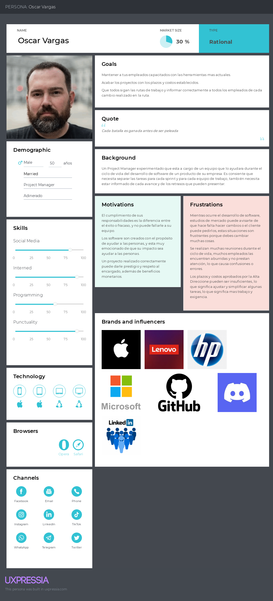

## Capítulo II: Requirements Elicitation & Analysis

### 2.1. Competidores

Wrike: Wrike es una plataforma de gestión de proyectos colaborativa que permite a los equipos planificar, rastrear y gestionar proyectos con alta eficiencia.

Trello:Trello es una herramienta de gestión de proyectos basada en tableros que permite organizar tareas de manera visual y sencilla.

ClickUp: ClickUp es una plataforma todo-en-uno de gestión de proyectos que incluye desde tareas simples hasta colaboración avanzada y gestión de tiempo.

### 2.1.1. Análisis competitivo

Competitive Analysis Landscape

¿Por qué llevar a cabo este análisis?  
Para poder tener un análisis completo sobre nuestro modelo de negocio además de poder comprender a nuestros competidores.

| Nombre de  los Startups   o Empresas | | Nuestra startup| Competidor 1| Competidor 2| Competidor 3|
| -- | -- | -- | -- | -- | -- |
| Perfil                                     | Overview                                                      | Horizon                                                                                                                                                                                            | Wrike                                                                                                                                                                                                                                                     | Trello                                                                                                                                    | ClickUp                                                                                                                                               |
|                                            | Ventaja competitiva: ¿Qué valor ofrece  a los clientes? | Proporciona una interfaz intuitiva  y fácil de usar, en la que Lo usan  antes, durante y después del  Ciclo de Vida del Desarrollo de  Software.                                                                                                     | ofrece análisis predictivos,  automatización avanzada y  herramientas de colaboración  que permiten a los equipos  mejorar la productividad y  la visibilidad del proyecto  en tiempo real.                                                                                                    | Proporciona una interfaz  intuitiva y fácil de usar,  ideal para equipos pequeños  y startups que buscan  simplicidad en la gestión  de tareas.                                     | Proporciona una solución  altamente personalizable  que puede adaptarse a  diferentes necesidades  empresariales, integrando  gestión de tareas, tiempo  y recursos en una sola  plataforma. |
| Perfil de Marketing                        | Mercado Objetivo                                              | Startups de tecnología que buscan  mejorar la eficiencia y la colaboración  en sus equipos de desarrollo                                                                                                                                                   | Empresas medianas a grandes,  así como equipos de proyectos  complejos que requieren  integración y colaboración  avanzadas.                                                                                                                                                                         | Equipos pequeños, startups  y empresas que necesitan  una herramienta  de gestión de proyectos  visual y simple.                                                                       | Startups, pequeñas y medianas  empresas que buscan una  herramienta flexible y completa  para la gestión de proyectos.                                                                                   |
|                                            | Estrategias de Marketing                                      | Uso de marketing digital dirigido  a comunidades tecnológicas, con   pruebas gratuitas y asociaciones  estratégicas                                                                                                                                     | Wrike se posiciona como una  herramienta robusta y flexible  para equipos que necesitan  mejorar la eficiencia operativa  y la gestión de proyectos.  Su estrategia incluye  demostraciones personalizadas  y un enfoque en las  integraciones con otras  herramientas empresariales. | Se enfoca en la simplicidad  y la accesibilidad,  promocionando su facilidad  de uso y la posibilidad de  integrarse con herramientas  populares como Slack y  Google Workspace. | Se posiciona como una alternativa  más económica y todo-en-uno a  las herramientas tradicionales de  gestión de proyectos, con un  fuerte enfoque en la personalización  y la escalabilidad.       |
| Perfil del producto                        | Productos y servicios                                         | Plataforma que ofrece un sistema  de colaboración en tiempo real  con características como edición  simultánea de documentos y un  espacio de trabajo unificado,  permitiendo a los equipos trabajar  de manera más eficiente y  conectada. | Ofrece un conjunto completo de  herramientas de gestión de  proyectos, desde la planificación  hasta la ejecución, incluyendo  paneles de control, cronogramas  de Gantt y flujos de trabajo  automatizados.                                                                                   | Ofrece tableros Kanban para  la gestión de proyectos, con  opciones de listas de tareas,  etiquetas y archivos adjuntos                                                                   | Ofrece una amplia gama de  herramientas para la gestión de  tareas, seguimiento del tiempo,  automatización de flujos de  trabajo y colaboración en equipo.                                           |
|                                            | Precios y Costos                                              | Planes escalables, comenzando  con versiones gratuitas para  atraer startups en etapas iniciales                                                                                                                                                           | Sus planes varían desde versiones  gratuitas limitadas hasta  suscripciones empresariales  premium, comenzando en aproximadamente $9.80 por  usuario/mes.                                                                                                                                         | Ofrece una versión gratuita  con limitaciones y planes  premium que comienzan en  $5 por usuario/mes.                                                                                     | Plan gratuito robusto y planes  pagos que comienzan en $5  por usuario/mes.                                                                                                                                 |
|                                            | Canales de distribución  (Web y/o Móvil)                   | La plataforma se ofrecerá  como un servicio web basado  en la nube (SaaS), accesible  desde cualquier navegador,  con integraciones clave como  Slack y Google Workspace.                                                                         | Se distribuye principalmente a  través de su sitio web oficial,  con soporte adicional en  aplicaciones móviles y a través  de integraciones con plataformas  como Microsoft Teams y  Salesforce.                                                                                              | Distribuido principalmente a  través de su sitio web oficial,  y también disponible en  aplicaciones móviles para iOS  y Android.                                                      | Se distribuye a través de su  sitio web y tiene aplicaciones  para dispositivos móviles,  además de extensiones  para navegadores.                                                                    |
| Análisis SWOT                              | Fortalezas                                                    | Innovación en colaboración  en tiempo real, enfoque en startups.                                                                                                                                                                                              | Funcionalidad robusta,  integración con otras herramientas  empresariales, análisis predictivo.                                                                                                                                                                                                            | Interfaz intuitiva, amplia  accesibilidad, integración  con múltiples herramientas.                                                                                                          | Altamente personalizable,  excelente relación calidad-precio,  fuerte integración.                                                                                                                          |
|                                            | Debilidades                                                   | Base de usuarios inicial limitada.                                                                                                                                                                                                                               | Curva de aprendizaje  pronunciada para nuevos usuarios.                                                                                                                                                                                                                                                       | Limitaciones en funciones  avanzadas para la gestión  de proyectos complejos.                                                                                                                | Puede ser abrumador para  usuarios nuevos debido  a su vasta cantidad de funciones.                                                                                                                         |
|                                            | Oportunidades                                                 | Expansión en mercados emergentes  y nuevas tecnologías.                                                                                                                                                                                                       | Expansión en mercados emergentes,  desarrollo de nuevas   funcionalidades de IA.                                                                                                                                                                                                                           | Expansión de integraciones  y nuevas funcionalidades  para grandes equipos.                                                                                                                  | Expansión en mercados globales,  mejoras continuas en  automatización y AI.                                                                                                                                 |
|                                            | Amenazas                                                      | Competencia con herramientas  más establecidas y la necesidad  de mantenerse al día con la  evolución tecnológica.                                                                                                                                      | Competencia creciente con  herramientas más accesibles  y económicas.                                                                                                                                                                                                                                      | Competencia con  herramientas que ofrecen  más funciones por un costo  similar.                                                                                                           | La competencia con  herramientas establecidas  que tienen una base de  usuarios leal.                                                                                                                    |

### 2.1.2. Estrategias y tácticas frente a competidores

Para enfrentarnos a la competencia, nuestra estrategia se centrará en maximizar nuestra ventaja competitiva mediante la oferta de una interfaz intuitiva que optimice la colaboración en tiempo real, dirigida a startups tecnológicas. Aprovecharemos tácticas de marketing digital segmentadas, destacando nuestras pruebas gratuitas y estableciendo asociaciones estratégicas con comunidades tecnológicas clave. Para competir con empresas como Wrike y ClickUp, que ofrecen herramientas robustas y personalizables, nos enfocaremos en nuestra simplicidad y eficiencia, adaptando nuestros precios de manera flexible para atraer a equipos en crecimiento. Además, desarrollaremos integraciones con plataformas populares como Slack y Google Workspace, facilitando la conectividad y colaboración entre equipos. Nuestro compromiso con la mejora continua incluirá no solo la automatización de tareas, sino también la incorporación de funcionalidades innovadoras basadas en la retroalimentación de los usuarios. Este enfoque proactivo nos permitirá no solo diferenciarnos en el mercado, sino también garantizar que nuestra propuesta evolucione y se mantenga relevante, ofreciendo un valor excepcional que responda a las necesidades cambiantes de nuestros clientes y fomente una experiencia de usuario excepcional.

### 2.2. Entrevistas

En esta sección del informe se realizará el diseño, registro y análisis de las entrevistas de nuestros segmentos objetivos

### 2.2.1. Diseño de entrevistas

Segmentos encontrados:

- Líder o Gerente de Empresa de Desarrollo de Software en Crecimiento(Product Owner y Scrum Master)

- Equipo de Desarrollo de Software

Antes de poder realizar las entrevistas, consideramos prudente poder concretar un análisis previo para poder realizar las entrevistas de una mejor manera. Es por ello, que para cada uno de nuestros segmentos proponemos estas preguntas para poder conocer un poco más sobre nuestro público objetivo.

Preguntas :
preguntas ordenadas para entrevistar a los dos segmentos objetivos de la startup "Horizon":

**Segmento: Líder o Gerente de Empresa de Desarrollo de Software en Crecimiento (Product Owner y Scrum Master)**

**Principales:**

1. **Introducción al Rol**: ¿Podría describir su rol en la empresa y las principales responsabilidades que tiene en el área de desarrollo de software?
2. **Contexto Empresarial**: ¿Cuál es el enfoque principal de su empresa en términos de productos o servicios de software?
3. **Crecimiento y Desafíos**: ¿Cuáles son los mayores desafíos que enfrenta su empresa actualmente en términos de crecimiento y gestión de proyectos?
4. **Experiencias Pasadas**: ¿Ha tenido alguna experiencia negativa con las herramientas actuales de gestión de proyectos que utiliza?
5. **Necesidades Específicas**: ¿Qué características considera esenciales en una herramienta de gestión de proyectos para apoyar el crecimiento y la eficiencia de su equipo?
6. **Colaboración y Comunicación**: ¿Cómo maneja actualmente la colaboración y la comunicación entre los diferentes equipos dentro de su empresa?
7. **Evaluación de Soluciones Actuales**: ¿Siente que las herramientas actuales limitan su capacidad para innovar y liderar en su sector?
8. **Visión Futura**: ¿Cómo imagina la evolución de sus procesos de gestión de proyectos en los próximos 5 años?
9. **Interés en Nuevas Soluciones**: ¿Qué tan abierto estaría a explorar y adoptar una nueva herramienta de gestión de proyectos que ofrezca características avanzadas y personalizables?
10. **Experiencia con Proveedores Externos**: ¿Cuál ha sido su experiencia al trabajar con proveedores externos de soluciones de software? ¿Qué busca en un socio estratégico?
11. **Expectativas a Largo Plazo**: ¿Qué expectativas tendría para una colaboración a largo plazo con una empresa que ofrezca soluciones de gestión de proyectos?
12. **Adaptabilidad y Personalización**: ¿Qué tan importante es para usted que una herramienta de gestión se adapte específicamente a las necesidades y procesos de su empresa?
13. **Consideraciones de Seguridad**: ¿Qué preocupaciones o requisitos de seguridad tiene al implementar nuevas herramientas de software?
14. **Disposición a Colaborar**: Si encuentra que una herramienta cumple con sus expectativas, ¿estaría dispuesto a colaborar con la empresa desarrolladora para ajustar la herramienta a las necesidades emergentes de su equipo?

**Complementarias:**

1. **Integración con Herramientas Existentes**: ¿Qué tan importante es para usted que la nueva herramienta de gestión de proyectos se integre sin problemas con las herramientas de software que ya utiliza su equipo?
2. **Medición del Éxito del Proyecto**: ¿Cuáles son los indicadores clave que utiliza para medir el éxito de un proyecto? ¿Cómo una nueva herramienta podría ayudar a mejorar estos indicadores?
3. **Gestión de Riesgos**: ¿Cómo maneja actualmente los riesgos en los proyectos de desarrollo de software? ¿Qué características le gustaría ver en una herramienta de gestión para facilitar este proceso?
4. **Personalización de Flujos de Trabajo**: ¿Qué tan crucial es para usted la capacidad de personalizar los flujos de trabajo dentro de una herramienta de gestión de proyectos?
5. **Soporte y Actualizaciones**: ¿Qué expectativas tiene respecto al soporte técnico y la frecuencia de actualizaciones de una herramienta de gestión de proyectos?

**Segmento: Equipo de Desarrollo de Software**

**Principales:**

1. **Introducción al Rol**: ¿Podría compartirnos un poco sobre su rol en el equipo de desarrollo y las tareas diarias que realiza?
2. **Contexto del Equipo**: ¿Cómo describiría la estructura de su equipo y el tipo de proyectos en los que trabajan habitualmente?
3. **Desafíos en el Desarrollo**: ¿Cuáles son los principales desafíos que enfrenta su equipo en la gestión del flujo de trabajo y la colaboración?
4. **Experiencias Pasadas**: ¿Han tenido alguna experiencia negativa con las herramientas actuales que utilizan para la gestión de proyectos?
5. **Necesidades Específicas**: ¿Qué funcionalidades cree que le facilitarían a su equipo la colaboración y la gestión del trabajo diario?
6. **Impacto en la Productividad**: ¿Cómo afecta la falta de herramientas adecuadas en la eficiencia y productividad del equipo?
7. **Visibilidad y Supervisión**: ¿Qué tan importante es para su equipo tener visibilidad sobre el progreso de los proyectos y el trabajo de cada miembro?
8. **Satisfacción con Soluciones Actuales**: ¿Sienten que las herramientas actuales limitan su capacidad de entregar proyectos de alta calidad en tiempo y forma?
9. **Visión Futura**: ¿Cómo imagina que podrían mejorar los procesos de desarrollo con una herramienta que optimice la gestión y la colaboración?
10. **Evaluación de Nuevas Soluciones**: ¿Qué factores considera cruciales al evaluar una nueva herramienta de gestión para su equipo?
11. **Experiencia con Proveedores Externos**: ¿Han trabajado anteriormente con proveedores de herramientas de software? ¿Cómo fue esa experiencia?
12. **Expectativas a Largo Plazo**: ¿Qué espera de una colaboración a largo plazo con un proveedor de soluciones de gestión de proyectos?
13. **Personalización y Flexibilidad**: ¿Qué tan importante es para su equipo que una herramienta de gestión sea flexible y personalizable según sus necesidades?
14. **Disposición a Adoptar Nuevas Herramientas**: Si una nueva herramienta satisface las necesidades del equipo, ¿estaría dispuesto a adoptarla y colaborar con la empresa desarrolladora para su mejora continua?

**Complementarias:**

1. **Interfaz de Usuario**: ¿Qué tan importante es para usted que la interfaz de la herramienta de gestión sea intuitiva y fácil de usar? ¿Cómo influiría esto en la adopción por parte del equipo?
2. **Colaboración entre Equipos**: ¿Cómo podría una nueva herramienta de gestión mejorar la colaboración no solo dentro de su equipo, sino también con otros departamentos de la empresa?
3. **Manejo de Prioridades**: ¿Cómo maneja actualmente su equipo las prioridades de tareas y proyectos? ¿Qué funcionalidades en una herramienta de gestión podrían facilitar este proceso?
4. **Capacitación y Adaptación**: ¿Qué tan fácil o difícil le resulta a su equipo adaptarse a nuevas herramientas? ¿Qué tipo de soporte o capacitación considera necesario para una transición exitosa?
5. **Retroalimentación Continua**: ¿Cómo se maneja actualmente la retroalimentación dentro del equipo? ¿Qué tan útil sería una herramienta que facilite la retroalimentación continua sobre el progreso y la calidad del trabajo?

Estas preguntas están diseñadas para llevar la conversación de manera lógica y ordenada, desde la comprensión del rol y desafíos actuales hasta la exploración de futuras colaboraciones y expectativas.

### 2.2.2. Registro de entrevistas

**Segmento 1: Líder o Gerente de Empresa de Desarrollo de Software en Crecimiento(Product Owner y Scrum Master)**

1. Entrevista 1:  
   Datos del entrevistado  
   Nombre:   
   Apellidos:  
   Edad:   
   Distrito:   

URL: [Link de entrevista](https://drive.google.com/file/d/1WrxFb_8KqRk6mWSrgUbvFpkfpjyIU0vI/view?usp=sharing)

Inicio: 0:00 
Duracion: 

Resumen: 

2.  Entrevista 2:  
    Datos del entrevistado  
    Nombre:  
    Apellidos:  
    Edad:   
    Distrito:   

URL: [Link de entrevista](https://drive.google.com/file/d/1URH3QIgHteG1cNFRdPeFrunflBu3zA8j/view?usp=sharing "Entrevista 2")

Inicio:  
Duracion: 

Resumen: 

3.  Entrevista 3:  
    Datos del entrevistado  
    Nombre:   
    Apellidos:  
    Edad:   
    Distrito:   

URL: [Link de entrevista](https://drive.google.com/file/d/11xswJuEZQy51WRqAmZDu0KfjyF-6rV-F/view?usp=sharing "Entrevista 3")

Inicio:  
Duracion: 

Resumen: 

**Segmento 2: Equipo de Desarrollo de Software**

1.  Entrevista 1:  
    Datos del entrevistado  
    Nombre: Diego  
    Apellidos:  
    Edad: 22  
    Distrito: Puente Piedra 

URL: [Link de entrevista](https://upcedupe-my.sharepoint.com/:v:/g/personal/u202217804_upc_edu_pe/EYlzDLybn_RLj47ItGE5h8sBACQmRw-WWlpaAtlBSC9kqQ?nav=eyJyZWZlcnJhbEluZm8iOnsicmVmZXJyYWxBcHAiOiJPbmVEcml2ZUZvckJ1c2luZXNzIiwicmVmZXJyYWxBcHBQbGF0Zm9ybSI6IldlYiIsInJlZmVycmFsTW9kZSI6InZpZXciLCJyZWZlcnJhbFZpZXciOiJNeUZpbGVzTGlua0NvcHkifX0&e=wdqUzW "Entrevista 1")

Inicio: 0:03 
Duracion: 8:44

Resumen: 

2.  Entrevista 2:  
    Datos del entrevistado  
    Nombre:  
    Apellidos:  
    Edad:   
    Distrito:   

URL: [Link de entrevista](https://drive.google.com/file/d/1GgzFpXSX2uaFr_GiZCo5utxRtd5Z-t24/view?usp=sharing "Entrevista 2")

Inicio:  
Duracion: 

Resumen: 

3.  Entrevista 3:  
    Datos del entrevistado  
    Nombre:   
    Apellidos:  
    Edad:   
    Distrito:   

URL: [Link de entrevista](https://drive.google.com/file/d/1aZ94C1wixcfQNa_dZCZSkIKiBnpPf91i/view?usp=sharing "Entrevista 3")

Inicio:  
Duracion: 

Resumen: 

### 2.2.3. Análisis de entrevistas

**Análisis Segmento 1: Líder o Gerente de Empresa de Desarrollo de Software en Crecimiento(Product Owner y Scrum Master)**

Las entrevistas con líderes de empresas de desarrollo de software destacan una urgente necesidad de modernizar las herramientas de gestión de proyectos. Un 75% de los entrevistados enfatiza la importancia de integrar tecnologías emergentes, mientras que 85% considera que estas herramientas deben ser intuitivas y adaptables a diversos dispositivos.

La mayoría de los líderes, aproximadamente 67%, ha tenido experiencias mixtas con las soluciones actuales, citando problemas de integración y personalización. La flexibilidad y una buena relación costo-beneficio son cruciales, con un 70% de los encuestados indicando que las nuevas soluciones deben adaptarse a las necesidades del equipo. Además, la seguridad de los datos es prioritaria para el 80%, quienes buscan proveedores confiables.

Los líderes están enfocados en encontrar herramientas modernas que no solo mejoren la eficiencia y la colaboración, sino que también respondan a las cambiantes demandas de los proyectos. La integración de la IA y la personalización de las herramientas son vistas como esenciales para el éxito futuro en sus organizaciones.

**Análisis Segmento 2: Equipo de Desarrollo de Software**

Las entrevistas con integrantes de equipos de desarrollo de software revelan desafíos significativos con las herramientas de gestión actuales. Un 78% menciona la falta de flexibilidad y adaptabilidad, lo que limita la colaboración y la eficiencia. Estas herramientas son a menudo percibidas como poco intuitivas y difíciles de personalizar.
Los entrevistados coinciden en que es crucial contar con herramientas innovadoras con una interfaz de usuario mejorada y seguimiento constante del progreso. Un 70% sostiene que las soluciones ideales deben ser precisas y adaptables a distintos modelos de negocio.
Fabricio destaca que la falta de herramientas innovadoras afecta la colaboración. Agustín señala que herramientas como GitHub son poco intuitivas y que la comunicación podría mejorar con mejores programas de gestión. Rodrigo menciona que la falta de seguimiento y flexibilidad ralentiza el trabajo y espera que futuras herramientas integren tecnologías emergentes.
En resumen, los equipos de desarrollo buscan soluciones que mejoren la eficiencia y la colaboración, priorizando la adaptabilidad y la facilidad de uso.

### 2.3. Needfinding

### 2.3.1. User Personas

**Segmento 1: Líder o Gerente de Empresa de Desarrollo de Software en Crecimiento(Product Owner y Scrum Master)**

  

**Segmento 2: Equipo de Desarrollo de Software**

### 2.3.2. User Task Matrix

En este apartado de la User Task Matrix se va a hacer un análisis de las tareas realizadas por dos perfiles clave en el ámbito del desarrollo de software: Líder o Gerente de Empresa de Desarrollo de Software (Leonardo) y Equipo de Desarrollo de Software (Oscar). A través de esta matriz, se identificarán las tareas críticas y su frecuencia e importancia según cada User Persona, lo que permitirá comprender mejor sus necesidades y aspiraciones en la gestión de proyectos.
| **Tarea** | **Leonardo Frecuencia** | **Leonardo Importancia** | **Oscar Frecuencia** | **Oscar Importancia** |
| ---------------------------------------------------------------------------- | ----------------------- | ------------------------ | -------------------- | --------------------- |
| Monitorear operaciones y gestionar proyectos | A menudo | Alta | A menudo | Alta |
| Evaluar y seleccionar software de gestión de proyectos | A menudo | Alta | A menudo | Alta |
| Verificar la adaptabilidad y facilidad de uso del software | A veces | Alta | A veces | Alta |
| Asegurarse de que el software tenga seguridad de datos | A veces | Alta | A veces | Alta |
| Investigar sobre nuevas tecnologías e IA aplicadas a la gestión de proyectos | Mensual | Media | Mensual | Media |
| Utilizar herramientas de desarrollo para colaboración | A menudo | Alta | A menudo | Alta |
| Conducir capacitaciones sobre nuevas herramientas | A veces | Media | A veces | Media |
| Evaluar la precisión y fiabilidad de las herramientas usadas | Mensual | Alta | Mensual | Alta |
| Adaptar herramientas a los modelos de negocio específicos | A veces | Alta | A veces | Alta |
| Mantener un registro del avance de cada miembro del equipo | A menudo | Alta | A menudo | Alta |
|

**Análisis de Tareas**

Al observar la matriz, podemos destacar que tanto Oscar como Leonardo consideran como tareas de alta frecuencia e importancia las siguientes:

**Monitorear operaciones y gestionar proyectos**: Es fundamental para garantizar el desarrollo óptimo y la coordinación del equipo.

**Evaluar y seleccionar software de gestión de proyectos**: Ambas User Personas están alineadas en la necesidad de herramientas efectivas que les ayuden a optimizar su flujo de trabajo.

**Utilizar herramientas de desarrollo para colaboración**: La colaboración efectiva es vital, especialmente para Leonardo, quien enfatiza que la falta de herramientas innovadoras limita el trabajo en equipo.

### 2.3.3. User Journey Mapping

**User Journey Mapping - Líder de Empresa de Desarrollo de Software(Product Owner y Scrum Master)**

1. End-to-End Journey: Líder o Gerente de Empresa()  

   El siguiente recorrido detalla el proceso completo que atraviesa un líder o gerente de empresa, desde la planificación inicial del proyecto hasta la evaluación y cierre. Este viaje abarca la supervisión estratégica y la toma de decisiones críticas para asegurar el éxito del proyecto y la alineación con los objetivos del negocio.

   1. Planificación del Proyecto: 

   El líder comienza identificando nuevas ideas para proyectos y definiendo objetivos claros para el equipo. Durante esta fase, se asegura de que los recursos sean asignados adecuadamente, pero también enfrenta ansiedad por la falta de visibilidad sobre los recursos disponibles y posibles retrasos en la planificación.

   2. Ejecución del Proyecto: 

   A medida que avanza el proyecto, el líder supervisa el progreso, revisa los reportes de rendimiento y participa en reuniones clave. Aquí, enfrenta estrés por la gestión de múltiples canales de información y frustración si los reportes de desempeño no son precisos. Es crucial que las herramientas de seguimiento sean automáticas y accesibles para evitar la incertidumbre sobre si el equipo está alineado con los plazos y presupuestos.

   3. Evaluación y Cierre: 

   En la etapa final, el líder revisa el rendimiento del proyecto en comparación con los objetivos y evalúa áreas de mejora para futuros proyectos. El cierre puede generar motivación si el proyecto es exitoso, pero también puede haber inseguridad si los informes de desempeño no fueron claros. El feedback del cliente es esencial para asegurar mejoras continuas en futuros proyectos.

**User Journey Mapping - Equipo de Desarrollo de Software**

1. End-to-End Journey: Integrante del Equipo de Desarrollo de Software 

Este recorrido muestra el proceso completo que experimenta un integrante del equipo de desarrollo de software, desde la recepción de tareas hasta la entrega final del proyecto. A lo largo del ciclo, el equipo de desarrollo enfrenta diversos retos, ajustes y expectativas, donde la eficiencia y la colaboración son claves para el éxito.

1.  Recibo de Tareas: 
    En esta fase inicial, el integrante recibe las asignaciones del proyecto y revisa los requerimientos. Su principal preocupación es obtener toda la información y los recursos necesarios para realizar su trabajo sin complicaciones. La confusión o la falta de acceso a estos recursos puede causar frustración y retrasos.

2.  Desarrollo y progreso: 
    Una vez que tiene las tareas claras, comienza el trabajo en las asignaciones. El desarrollador participa en reuniones de seguimiento para asegurar que su progreso esté alineado con las expectativas del cliente. Durante esta fase, la presión por cumplir con los plazos es constante, y la colaboración eficaz con herramientas adecuadas es fundamental para mantener el flujo de trabajo.

3.  Revisión y Entrega 
    En la fase final, el integrante revisa su código o entregables desarrollados y prueba las funcionalidades para asegurarse de que cumplen con los requisitos del cliente. Al finalizar la entrega, se siente alivio, aunque puede haber incertidumbre sobre si el resultado cumplirá con las expectativas del cliente o si surgirán problemas técnicos cerca del cierre.

### 2.3.4. Empathy Mapping

**Segmento 1: María (Líder/Gerente de Proyecto)**

| **¿Qué Piensa y Siente?**                                                                                                | **¿Qué Ve?**                                                                             |
| ------------------------------------------------------------------------------------------------------------------------ | ---------------------------------------------------------------------------------------- |
| Necesita garantizar que todos los proyectos se gestionen eficazmente y que el equipo alcance los objetivos establecidos. | Observa un entorno empresarial donde muchas empresas aún usan herramientas anticuadas.   |
| Está interesada en nuevas tecnologías y en cómo pueden mejorar la gestión de proyectos.                                  | Ve que la competencia está adoptando nuevas tecnologías y herramientas más avanzadas.    |
| Quiere un software intuitivo y adaptable que mejore la eficiencia del equipo y proteja los datos de la empresa.          | Nota una creciente integración de las tecnologias emergentes en la gestión de proyectos. |
| Lidiar con herramientas obsoletas y encontrar soluciones que se adapten a las necesidades cambiantes de la empresa.      |                                                                                          |

| **¿Qué Dice y Hace?**                                                                                     | **¿Qué Oye?**                                                                                                                   |
| --------------------------------------------------------------------------------------------------------- | ------------------------------------------------------------------------------------------------------------------------------- |
| Habla sobre la necesidad de modernizar el software y la importancia de la seguridad de los datos.         | Recibe comentarios de su equipo sobre la falta de funcionalidad en las herramientas actuales y las necesidades de capacitación. |
| Busca constantemente nuevas soluciones y herramientas que puedan integrarse y ser útiles para la empresa. | Escucha sobre nuevas tecnologías y herramientas que podrían ser beneficiosas para su empresa.                                   |

| **Dolores**                                                                                                                  | **Ganancias**                                                                                                    |
| ---------------------------------------------------------------------------------------------------------------------------- | ---------------------------------------------------------------------------------------------------------------- |
| Experimenta frustraciones con las herramientas obsoletas y la falta de opciones intuitivas que se adapten a sus necesidades. | Una solución moderna y segura que facilite la gestión de proyectos y mejore la colaboración del equipo.          |
| Preocupada por la seguridad de los datos y la posible falta de protección que puedan ofrecer las herramientas actuales.      | La implementación exitosa de un software eficiente que permita al equipo alcanzar sus metas con mayor facilidad. |

**Segmento 2: Fabricio (Equipo de Desarrollo de Software)**

| **¿Qué Piensa y Siente?**                                                                                                                 | **¿Qué Ve?**                                                                                                                 |
| ----------------------------------------------------------------------------------------------------------------------------------------- | ---------------------------------------------------------------------------------------------------------------------------- |
| Le preocupa que las herramientas actuales limiten la colaboración efectiva y el flujo de trabajo del equipo.                              | Observa que muchas herramientas están desactualizadas y no cumplen con las expectativas actuales del desarrollo de software. |
| Está interesado en herramientas que mejoren la eficiencia y precisión en el desarrollo de software.                                       | Ve que otras empresas están usando herramientas más avanzadas y adaptativas.                                                 |
| Desea trabajar con herramientas innovadoras que faciliten la colaboración y permitan un mejor seguimiento del progreso.                   | Nota una necesidad creciente de herramientas que promuevan una colaboración más efectiva y un registro preciso del trabajo.  |
| Enfrenta desafíos al trabajar con herramientas que no se adaptan bien a las necesidades del equipo y a la falta de capacitación adecuada. |                                                                                                                              |

| **¿Qué Dice y Hace?**                                                                                                   | **¿Qué Oye?**                                                                                                                        |
| ----------------------------------------------------------------------------------------------------------------------- | ------------------------------------------------------------------------------------------------------------------------------------ |
| Habla sobre la importancia de la precisión y fiabilidad de las herramientas y cómo estas impactan en su trabajo diario. | Escucha a sus compañeros expresar la necesidad de herramientas más actualizadas y la falta de eficacia de las herramientas actuales. |
| Participa en capacitaciones y busca herramientas que mejoren la colaboración y el seguimiento del progreso del equipo.  | Oye sobre nuevas soluciones y tecnologías que podrían ayudar a resolver problemas de colaboración y precisión.                       |

| **Dolores**                                                                                                                               | **Ganancias**                                                                                                    |
| ----------------------------------------------------------------------------------------------------------------------------------------- | ---------------------------------------------------------------------------------------------------------------- |
| **Frustraciones:** Frustrado por la falta de herramientas innovadoras que limiten la colaboración y el seguimiento del progreso.          | Herramientas de desarrollo que sean precisas, fiables, y que faciliten una colaboración efectiva.                |
| **Riesgos:** Preocupado por la falta de adaptación de las herramientas a los modelos de negocio y las necesidades específicas del equipo. | Un entorno de trabajo más colaborativo y eficiente con herramientas que se adaptan a las necesidades del equipo. |

### 2.3.5. As-is Scenario Mapping

**Segmento 1:** Lider o gerente de empresa de desarrollo de software en crecimiento(Product Owner y Scrum Master)

Anexo C

**Segmento 2:** Miembros de un equipo de Desarrollo de Software

Anexo D

### 2.4. Ubiquitous Language

| Término              | Definición                                                                                                                                                                                                                                                                                                                                                                                                                                                                                                                                   |
| -------------------- | -------------------------------------------------------------------------------------------------------------------------------------------------------------------------------------------------------------------------------------------------------------------------------------------------------------------------------------------------------------------------------------------------------------------------------------------------------------------------------------------------------------------------------------------- |
| **Proyecto**         | En el contexto del ciclo de vida de desarrollo de software, un proyecto es el uso de la mano de obra de programadores de manera estructurada y con planificación para el desarrollo de un producto de software especifico, para cumplir con objetivos, marco de tiempo y presupuesto definidos en reuniones con expertos en otras áreas.                                                                                                                                                                                                     |
| **Herramienta**      | En este contexto, una herramienta se refiere a un software, aplicación o recurso que se especializa en facilitar o automatizar aspectos de la gestión, desarrollo o comunicación en el proceso de desarrollo de un software especifico.                                                                                                                                                                                                                                                                                                      |
| **Opciones**         | En este contexto, las opciones son las diferentes características, funcionalidades, configuraciones que las herramientas que ayudan en la gestión de desarrollo de software ofrecen.                                                                                                                                                                                                                                                                                                                                                         |
| **Scrum**            | Scrum es un marco de gestión de proyectos de mitología ágil que es popular entre los desarrolladores de software. Facilita la gestión y ejecución de proyectos mediante reuniones recurrentes y tiempos específicos de entrega de avances, una ventaja significativa es su predisposición a ser flexible y permitir adaptarse a los cambios.                                                                                                                                                                                                 |
| **Product owner**    | Es un rol dentro del Scrum y miembro del Scrum Team, su función es ser el contacto entre los desarrolladores del proyecto y los clientes internos. Los últimos conocen las características que los clientes finales buscan, necesitan y utilizan, sin embargo, el Product owner debe filtrar por razones económicas, limitaciones tecnológicas o falta de experiencia del equipo de desarrollo para decidir qué características son aceptadas. Recordando que el Scrum pide la mayor cantidad de funcionalidades en el menor tiempo posible. |
| **Scrum Master**     | Es un rol dentro del Scrum y miembro del Scrum Team, sin embargo, no es un líder, él es un personal encargado en facilitar y corroborar el cumplimiento del Scrum de parte de todos los miembros del equipo de desarrollo. Entre sus responsabilidades esta la planificación de reuniones en todo el ciclo de tiempo de cada Sprint y estimar el tiempo para completar cada objetivo.                                                                                                                                                        |
| **Development Team** | En el Scrum se refiere al equipo de desarrollo del producto de software conformado por profesionales como los programadores, Frontends o Backends, y miembros del Scrum Team. Aquí se encuentran también los lideres del proyecto o los Project mánager, pues aquí se encuentran todos los que no tienen un rol especifico dentro del Scrum.                                                                                                                                                                                                 |
| **Customers**        | Es un rol en Scrum pero no son miembros del Scrum Team, son los clientes internos de la organización, ellos reconocen y comunican las características, apariencias o facilidades debe tener el software desarrollado. Aquí se encuentran los equipos de marketing, contabilidad, ventas todas las personas que pueden dar una opinión informada de otros campos, sin embargo, aquí no se encuentran los usuarios finales.                                                                                                                    |
| **Backlog**          | Dentro del Scrum es una lista de historias de usuario de donde se pueden sacar una o varias tareas filtradas por el Product owner y aprobadas por los Customers, pero solo el Development Team decide el orden y cantidad de objetivos desarrollados en cada sprint.                                                                                                                                                                                                                                                                         |
| **Sprint**           | El tiempo de desarrollo con Scrum se divide en Sprints, generalmente duran entre 1 y 4 semanas y se caracterizan en que terminado el tiempo estimado se espera que una parte funcional del proyecto este ya desarrollado.                                                                                                                                                                                                                                                                                                                    |
