## Capítulo IV: Product Design

### 4.1. Style Guidelines.

En este capítulo se mostrará el desarrollo de las interfaces y procesos relacionados a la aplicación. Se tiene como objetivo ser llamativa y simple para el usuario. Para ello, se usaron colores atractivos, uso del espacio de manera dinámica independiente del dispositivo enfocado, uso de imágenes y texto que no sobrecarga de información al usuario y la separación de las herramientas según su grupo determinado.

### 4.1.1. General Style Guidelines.

**Colors:**

Para los colores de la aplicación “MANAGEWISE” utilizamos una corta variedad de colores vivos, enfocado en los caminos que brinda nuestro logo. Hubo variaciones en PC, ya que se decidió darle espacio a la interfaz y a la simplicidad de está. Además, utilizamos colores importantes para llamar la atención del usuario. Esto se debe a que el mayor público se encuentra en estos dispositivos y se necesita de mayor visibilidad de la app.

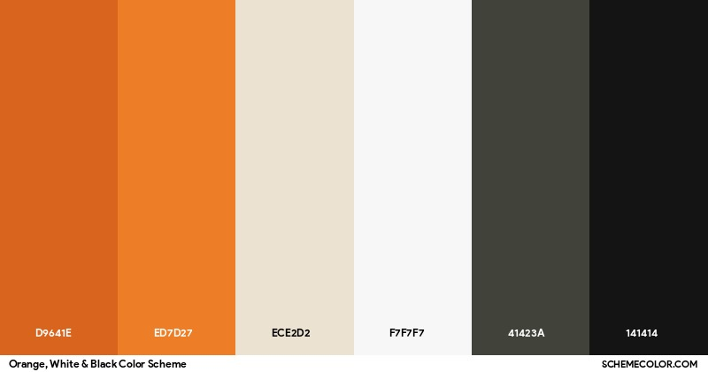

**Logo:**

**Tipografía:**

**Escala:**

En formato general se utiliza 30px y Sulphur point como tipografía del programa. Estas medidas tendrán variaciones según el dispositivo. A continuación, se presentará la tipografía elegida para el diseño de la app web.

**• Base:** 30 px

**• Ratio:** 2,05

**• Tipografía:** Sulphur Point

**• Interlineado:** 1,1

**Weights:**

**Nomenclature:**

**Example:**

**• Título:** Sulphur Point

**• Cuerpo:** Sulphur Point

**• Tamaño:** 30 letra y 60 título

**Elementos Gráficos:**

La principal estética tanto de la página web como de la aplicación será minimalista, enfocándose en mantener una paleta de colores limitada y resaltando el producto por encima del diseño de la interfaz.

### 4.1.2. Web Style Guidelines.

**Diseño de Página:**

- La página contará con una barra de navegación, en donde se encontrarán los apartados de: Descripción general, Beneficios y FAQ. Así mismo, contará con un footer en donde habrán links a diferentes redes como por ejemplo instagram.  
  Se emplearán animaciones simples y básicas para mostrar diferentes imágenes y texto que ayude al usuario a conocer más acerca del servicio. Si este se encuentra en una laptop o pc, bastará con scrollear para poder visualizar toda la página.

**Diseño Responsive:**

- Para permitir que la página se adapte a diferentes pantallas o el usuario cambie el tamaño de la ventana para que el contenido siga pudiéndose entender y visualizar de manera correcta, se utilizará CSS3 y media queries para definir estilos según el tamaño de la pantalla. Los elementos clave, como la barra de navegación y el footer, se ajustarán automáticamente en diferentes dispositivos mediante unidades de medida relativas.

**Imágenes**

- Los formatos de imagen sugeridos son JPEG y PNG para asegurar una alta calidad. Se establecerán tamaños recomendados y se aplicarán normas de compresión para mejorar el rendimiento del sitio web.

**Interacción del Usuario**

- Se utilizarán animaciones sencillas para presentar imágenes y textos que informen al usuario sobre el servicio. En laptops o PCs, basta con hacer scroll para ver toda la página y disfrutar de estas interacciones.

**Navegación:**

- La barra de navegación y el pie de página tendrán márgenes y espaciado apropiados para garantizar una visualización óptima en distintos dispositivos. El menú de navegación será intuitivo y fácil de usar, incluyendo una opción de menú tipo hamburguesa para dispositivos más pequeños. Los enlaces a las redes sociales en el footer serán fácilmente accesibles y se ajustarán al diseño responsive.

**Recursos:**

- Se facilitarán enlaces a recursos visuales, como imágenes de marca y gráficos, para que el equipo pueda acceder a ellos de manera sencilla. Además, se incluirán enlaces de descarga para las fuentes y archivos de diseño utilizados en el sitio web.

### 4.1.3. Mobile Style Guidelines.

#### 4.1.3.1. iOS Mobile Style Guidelines.

#### 4.1.3.2. Android Mobile Style Guidelines.

### 4.2. Information Architecture

#### 4.2.1. Organization Systems

Tenemos como objetivo proporcionar una experiencia de usuario coherente y eficiente tanto en nuestra página web como en nuestra aplicación móvil. A continuación, podemos ver la estructura visual, la cual fue diseñada para adaptarse a nuestros dos segmentos objetivos.

Aunque ambos segmentos tienen acceso a las mismas secciones, la diferencia clave radica en los permisos. Mientras que el Scrum Master o Product Owner puede gestionar y editar múltiples aspectos del proyecto, los miembros del equipo solo pueden visualizar el contenido y acceder a los enlaces, sin posibilidad de modificar la información.

**Scrum Master/Product Owner:**  
Se inicia accediendo a la plataforma "ManageWise" desde la landing page, donde se presenta una lista de todos los proyectos en los que el usuario está involucrado. El usuario puede seleccionar un proyecto específico para gestionar o crear nuevos proyectos. Una vez dentro de un proyecto, se despliegan las siguientes secciones clave:

- Statistics: Aquí, el Scrum Master/Product Owner puede ver métricas clave sobre el proyecto, como el número de backlog items completados. También puede acceder a la Timeline del proyecto, donde se muestra un flujo visual de las tareas y eventos a lo largo del tiempo.

- Backlog: En esta sección, el usuario puede gestionar tanto el product backlog como el sprint backlog. Tiene la opción de agregar items al sprint backlog y comenzar un nuevo sprint. Además, hay un botón para acceder a la gestión de items (user stories, epics y tasks).

- Board: Este espacio ofrece un Scrum Board donde el Scrum Master puede actualizar el estado de los items de trabajo (to-do, in progress, done), facilitando el monitoreo del flujo de trabajo.

- Meeting: Aquí, el usuario puede gestionar las reuniones de Scrum (planning, daily scrum, review, retrospective). Si tiene los permisos adecuados, puede agregar enlaces a herramientas externas (ej. Google Meet) y visualizar grabaciones externas de las reuniones.

- Members: El Scrum Master/Product Owner puede invitar o agregar nuevos miembros al equipo, así como ver y gestionar los roles de los usuarios actuales.

- Issues: En esta sección, el usuario puede crear nuevos reportes de issues (problemas o errores) y añadir un historial para monitorear el progreso de cada problema a lo largo del tiempo.

**Miembro del equipo de desarrollo:**  
Este segmento tiene acceso a las mismas secciones de la plataforma, pero su capacidad se limita a la visualización de información. Puede acceder a las estadísticas del proyecto, ver la timeline, consultar el product y sprint backlog, revisar el Scrum Board y los issues, pero no puede editar ni gestionar ningún aspecto del proyecto, a exepción de actualizar el historial en issues. En la sección de Meeting, puede unirse a reuniones y acceder a los enlaces proporcionados por el Scrum Master, pero no puede agregar o modificar enlaces.

#### 4.2.2. Labeling Systems

El equipo de "ManageWise" opto por usar etiquetas simples, claras y que están diseñadas para minimizar la confusión, garantizando una navegación intuitiva y fluida para todos los usuarios de la plataforma "ManageWise". Acontinuacion las mencionaremos y sus relaciones:

- Proyectos:  
  La sección de Proyectos en ManageWise es el punto de partida de la aplicación. Aquí, los usuarios pueden crear, visualizar y administrar proyectos de manera integral.

- Statistics:  
  La sección de Statistics proporciona diferentes métricas clave del proyecto y es a través de esta se puede acceder a la timeline.

- Backlog:  
  La sección de Backlog permite visualizar el product backlog y gestionar el sprint backlog, además se cuenta con acceso a backlog items, en donde se puede gestionar estos.

- Board:  
  La sección de Board permite visualizar el estado de los diferentes items, ademas de modificar este dependiendo del avance en los mismos.

- Meeting:  
  Meeting es la sección dedicada a la gestión de reuniones y sus enlaces.

- Members:  
  La sección de Members permite visualizar los diferentes miembros de un proyecto, además de agregar o invitar a nuevos.

- Issues:  
  La sección de Issues permite a los usuarios gestionar reportes sobre incidencias y seguir el historial de estas, además de modificarlo según sea necesario.

#### 4.2.3. SEO Tags and Meta Tags

Para mejorar la visibilidad de "ManageWise" en los motores de búsqueda y atraer a los usuarios adecuados se ha optado por definir los siguientes datos:

- Landing Page

  - Title : 
    ManageWise - Plataforma de Gestión de Proyectos para Startups de Software  
  - Meta Description: ManageWise es una plataforma integral diseñada para startups de desarrollo de software. Mejora la eficiencia, calidad y rentabilidad de tus proyectos con herramientas avanzadas de gestión, seguimiento de progreso y colaboración en equipo. 
  - Keywords :
    gestión de proyectos, plataforma para startups, administración de tareas, herramientas de colaboración, software de gestión, productividad de equipos. 
  - Author: ManageWise Team

- Statistics

  - Title : 
    Estadísticas de Proyecto  
  - Meta Description: Revisa las métricas clave de tus proyectos y accede a la timeline para monitorear el progreso de principio a fin. 
  - Keywords :
    estadísticas de proyecto, timeline, progreso de proyecto, backlog completado. 
  - Author: ManageWise Team

- Backlog

  - Title : 
    Product Backlog y Sprint Backlog 
  - Meta Description: Gestiona tus items de backlog y organiza sprints efectivos con ManageWise. 
  - Keywords :
    product backlog, sprint backlog, gestión de tareas, sprints ágiles. 
  - Author: ManageWise Team

- Board

  - Title : 
    Scrum Board  
  - Meta Description: Visualiza y actualiza el estado de tus tareas en el Scrum Board interactivo de ManageWise. 
  - Keywords :
    Scrum Board, gestión de tareas, flujo de trabajo ágil. 
  - Author: ManageWise Team

- Meeting

  - Title : 
    Gestión de Reuniones Scrum 
  - Meta Description: Accede a tus reuniones Scrum, agenda enlaces y consulta grabaciones de las sesiones pasadas. 
  - Keywords :
    reuniones Scrum, planificación de sprint, daily scrum, enlaces de reunión. 
  - Author: ManageWise Team

- Members

  - Title : 
    Gestión de Miembros y Roles 
  - Meta Description: Administra los roles y permisos de los miembros de tu equipo en ManageWise. 
  - Keywords :
    gestión de miembros, roles de equipo, administración de equipo ágil. 
  - Author: ManageWise Team

- Issues

  - Title : 
    Gestión de Issues y Reportes  
  - Meta Description: Crea y monitorea issues en tus proyectos de software para mejorar la calidad y el rendimiento. 
  - Keywords :
    gestión de issues, reporte de errores, seguimiento de problemas. 
  - Author: ManageWise Team

#### 4.2.4. Searching Systems

1. Búsqueda en Issues 
   Objetivo: Facilitar la localización de reportes de incidencias específicos dentro de los proyectos.

   - Ubicación: En la sección de Issues.

   - Funcionalidad: Permite buscar por nombre de incidencia, descripción, encargado.

   - Vista de Resultados: Muestra los reportes de incidencias correspondientes.

#### 4.2.5. Navigation Systems

1. **Página Principal (Proyectos)**

   - **Estructura**:
     - Muestra todos los proyectos en los que el usuario está involucrado.
     - Botones de acción para crear, editar o gestionar los proyectos existentes.
   - **Acción del Usuario**:
     - **Scrum Master/Product Owner**: Puede gestionar proyectos, crear nuevos y editar los existentes.
     - **Miembro del equipo de desarrollo**: Solo puede visualizar los proyectos en los que participa.

2. **Sección de Statistics**

   - **Estructura**:
     - Visualización de estadísticas sobre el proyecto: backlog items completados, tareas pendientes, entre otros.
     - Submenú para acceder a la vista **Timeline**.
   - **Acción del Usuario**:
     - **Scrum Master/Product Owner**: Puede interactuar con las estadísticas y ver la **Timeline** del proyecto.
     - **Miembro del equipo de desarrollo**: Solo puede visualizar las estadísticas y la **Timeline**.

3. **Sección de Backlog**

   - **Estructura**:
     - Dividido en **Product Backlog** y **Sprint Backlog**.
     - Botón de acceso a la gestión de **User Stories, Epics y Tasks** mediante la opción **Items**.
   - **Acción del Usuario**:
     - **Scrum Master/Product Owner**: Puede gestionar el backlog, agregar items y comenzar el sprint.
     - **Miembro del equipo de desarrollo**: Solo puede visualizar los items del backlog y acceder a la sección de items sin editar.

4. **Sección de Board**

   - **Estructura**:
     - Un Scrum Board que muestra los items del sprint en categorías como **To Do**, **In Progress** y **Done**.
   - **Acción del Usuario**:
     - **Scrum Master/Product Owner**: Puede cambiar el estado de los items en el board.
     - **Miembro del equipo de desarrollo**: Solo puede visualizar el estado de los items.

5. **Sección de Meetings**

   - **Estructura**:
     - Acceso a las reuniones Scrum del proyecto, como **Daily Standup**, **Sprint Planning**, etc.
     - Los usuarios con permisos pueden agregar enlaces a reuniones externas (como Google Meet) y ver grabaciones.
   - **Acción del Usuario**:
     - **Scrum Master/Product Owner**: Puede agregar o modificar enlaces a las reuniones.
     - **Miembro del equipo de desarrollo**: Solo puede visualizar las reuniones y acceder a los enlaces agregados.

6. **Sección de Members**

   - **Estructura**:
     - Gestión de miembros del equipo, incluyendo invitaciones y roles asignados.
   - **Acción del Usuario**:
     - **Scrum Master/Product Owner**: Puede agregar nuevos miembros e invitar usuarios al proyecto, además de gestionar roles.
     - **Miembro del equipo de desarrollo**: Solo puede visualizar la lista de miembros y los roles.

7. **Sección de Issues**

   - **Estructura**:
     - Permite la creación de reportes de issues o errores detectados en el proyecto.
     - Los usuarios pueden añadir un historial para ver el progreso de resolución de cada issue.
   - **Acción del Usuario**:
     - **Scrum Master/Product Owner**: Puede gestionar el historial y editar los reportes.
     - **Miembro del equipo de desarrollo**: Puede crear nuevos issues, pero no modificar los existentes.

8. **Sistema de Navegación Condicional por Roles**

   - **Scrum Master/Product Owner**: Tienen acceso completo a todas las opciones de navegación y pueden realizar acciones en todas las secciones mencionadas.
   - **Miembro del equipo de desarrollo**: Solo puede visualizar la información disponible en las secciones, sin opciones de edición o gestión.

### 4.3. Landing Page UI Design

#### 4.3.1. Landing Page Wireframe

**Introducción a las decisiones de diseño y arquitectura de información**:  
El diseño de la landing page se realizó con el objetivo de optimizar la experiencia del usuario, asegurando una navegación clara y accesible en dispositivos de distintos tamaños. Se optó por una estructura de navegación sencilla y eficiente, permitiendo a los usuarios desplazarse fácilmente por las secciones más importantes. Se priorizó un diseño responsive que se adapta a diferentes dispositivos, desde computadoras de escritorio hasta teléfonos móviles. Además, la arquitectura de información asegura que el contenido más relevante esté destacado, facilitando la interacción con el usuario.

Se estructuró la landing page para facilitar la navegación y claridad del contenido, con un navbar con links que redirigen al usuario a la sección deseada. El diseño es responsive, adaptándose a un hamburger menu en pantallas pequeñas. En el hero, se ubica el eslogan y un call-to-action, al igual que en la sección Nosotros, para redirigir así a los usuarios al formulario de registro. El footer contiene enlaces a redes sociales, manteniendo la coherencia visual.

##### Desktop Web Browser:

La landing page cuenta con diferentes secciones:

- Hero o header: Se encuentra la barra de navegación, además del eslogan de la aplicación e imagen referencial.
- Descripción general: Se muestran las principales características de la aplicación al usuario.
- Beneficios: El usuario puede ver los beneficios de usar la aplicación.
- Nosotros: Se muestran la visión, misión y un breve resumen sobre la empresa detrás del proyecto. Además se incentiva al usuario a registrarse.
- Footer: Enlaces a las redes sociales de la plataforma.
- Preguntas Frecuentes: Se muestra las preguntas frecuentes que suelen hacernos al momento de utilizar nuestra aplicación web
   
  
   

Apartado de registro:  
 

 

Apartado de inicio de sesión:  
 

 

##### Mobile Web Browser:

Se cuenta con un hamburger menu, el cual puede ser desplegado por el usuario y en donde se ecuentran los links de navegación. 

 

Se cuenta con las mismas secciones que para desktop web browser (Hero o header, Descripción general, Beneficios, Nosotros, preguntas frecuentes), las cuales tienen la misma finalidad, pero en este caso se adaptan a la pantalla; permitiendo así acceso óptimo a la información.
 

 

El formulario de registro se adapta a la pantalla 

 

El formulario de inicio de sesión se adapta a la pantalla 

 

#### 4.3.2. Landing Page Mock-up

Los mock-ups proporcionan una representación visual de la estructura final de la landing page, tanto para la versión de escritorio como para dispositivos móviles. En el diseño de escritorio (Desktop Web Browser), se priorizó una disposición clara y organizada, mientras que en la versión móvil (Mobile Web Browser), se implementó un diseño responsive para asegurar una experiencia de usuario fluida y óptima en cualquier tamaño de pantalla.

##### Desktop Web Browser:

La landing page cuenta con diferentes secciones:

- Hero o header: Se encuentra la barra de navegación, además del eslogan de la aplicación e imagen referencial.
- Descripción general: Se muestran las principales características de la aplicación al usuario, junto con una imagen referente.
- Beneficios: El usuario puede ver los beneficios de usar la aplicación.
- Nosotros: Se muestran la visión, misión y un breve resumen sobre la empresa detrás del proyecto. Además, se incentiva al usuario a registrarse.
- Preguntas Frecuentes: Se muestra las preguntas mas recurrentes de la aplicación lo cual le da a saber al usuario algunas respuestas de lo que es nuestra aplicación y lo facil de usar.
- Footer: Enlaces a las redes sociales de la plataforma.
   
  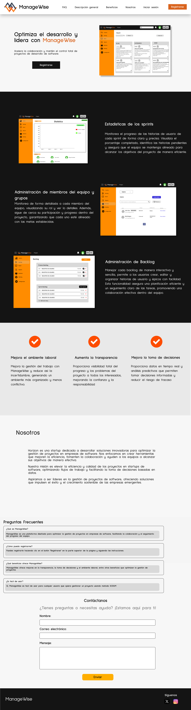
   

Apartado de registro, en donde el usuario deberá ingresar los datos necesarios de la manera que vea conveniente.  
 

 

Apartado de inicio de sesión, en donde el usuario ingresa el correo y contraseña asociados a la cuenta.  
 

 

##### Mobile Web Browser:

Se cuenta con un hamburger menu, el cual puede ser desplegado por el usuario y en donde se encuentran los links de navegación.  
 

 

Se cuenta con las mismas secciones que para desktop web browser (Hero o header, Descripción general, Beneficios, Nosotros, Preguntas Frecuentes), las cuales tienen la misma finalidad, pero en este caso se adaptan a la pantalla, permitiendo así un acceso óptimo a la información.  
 

 

El formulario de registro se adapta a la pantalla del dispositivo, permitiendo de esta manera una navegación fluida.  
 

 

El formulario de inicio de sesión se adapta a la pantalla del dispositivo, permitiendo de esta manera una navegación fluida.  
 
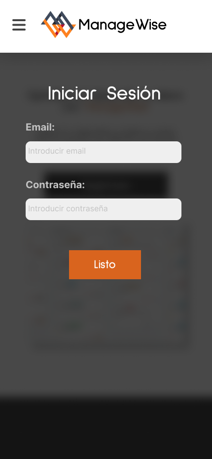
 

### 4.4. Mobile Applications UX/UI Design

#### 4.4.1. Mobile Applications Wireframes.

En la sección Backlog, el usuario podrá visualizar el product backlog y puede crear un sprint backlog, añadiendo backlog items a este. Además cuenta con una vista Backlog items, en donde en caso tener permisos, puede gestionar estos.
 
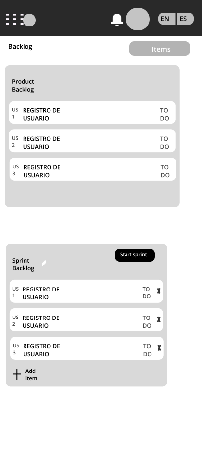
 
Vista Backlog Items
 

 
 

En la sección Members, el usuario visualiza a los diferentes miembros del equipo, puediendo añadir mas en caso desearlo. Además en caso seleccionar Groups, podrá gestionar estos.
 
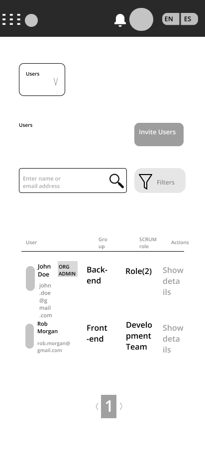
 
 

En la sección de Statistics, el usuario podrá visualizar diferentes datos estadísticos sobre el proyecto y en caso seleccionar Timeline, podra ver el cronograma de este.
 
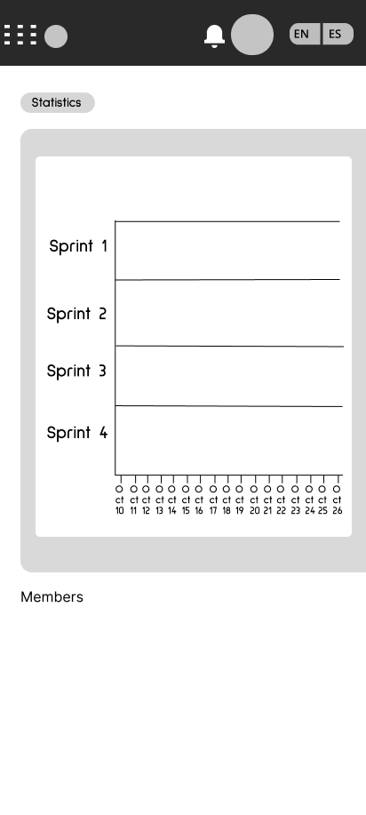
 
 

En la sección Meeting el usuario podrá visualizar si se encuentra activa alguna reunión e ingresar a esta.
 
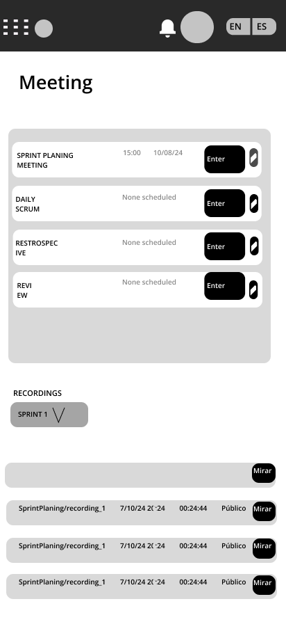
 
 

En la sección Issues, el usuario crear reportes sobre incidencias, además de visualizar los ya existentes.Ademas ,puede añadir eventos dentro del historial de eventos de cambios para el issue , de esta manera mantiene informado a los miembros.
 
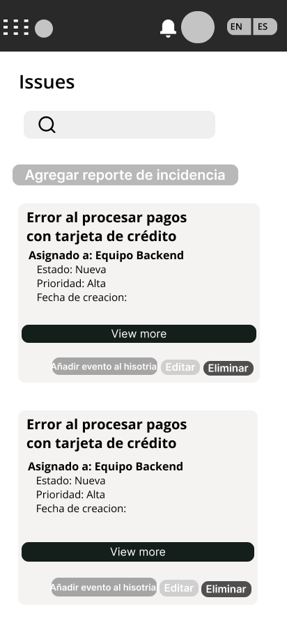
 
 

#### 4.4.2. Mobile Applications Wireflow Diagrams.

#### 4.4.3. Mobile Applications Mock-ups.

La sección de Statistics es fundamental, en donde el product Owner y Scrum Master podrá visualizar las estadisticas en base a los sprints de las historias de usuario. Tanto tambien se podrá saber si el sprint se esta elaborando bien en temas de avance.
 

 
En la sección Backlog permite gestionar y mover historias de usuario entre el product backlog y el sprint backlog, con la opción de iniciar sprints una vez las historias estén listas.
 
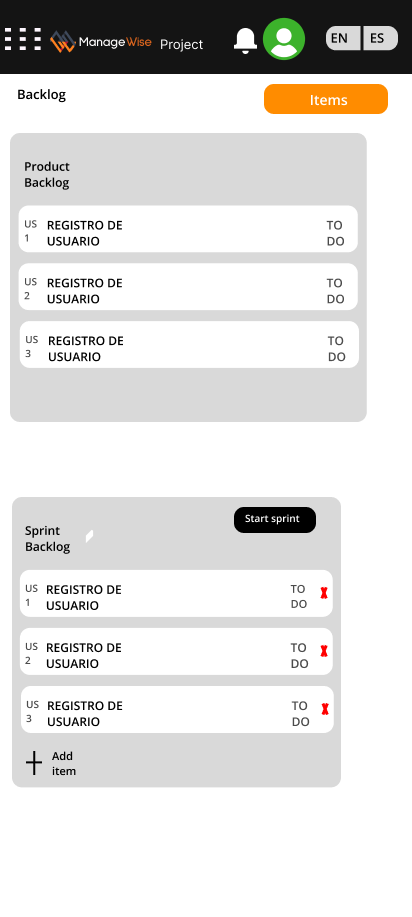
 
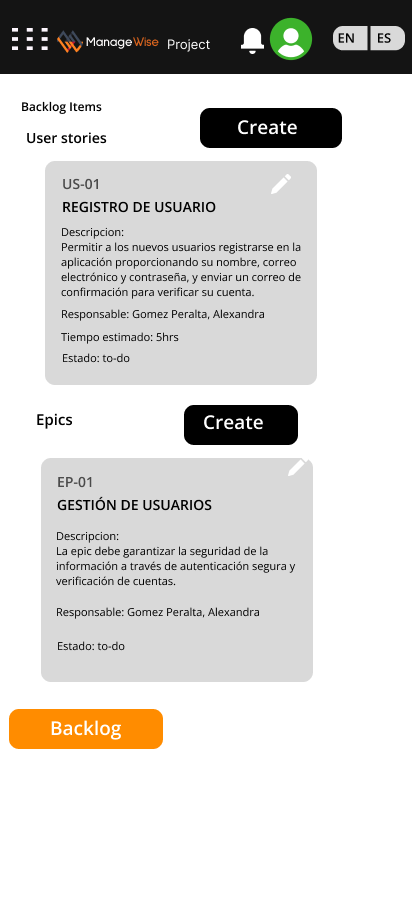
 
 
En en el apartado Meeting, el Scrum Master o el Product Owner se registrara las reuniones y se podra planificar a que dia y hora estara dicha reunion.
 
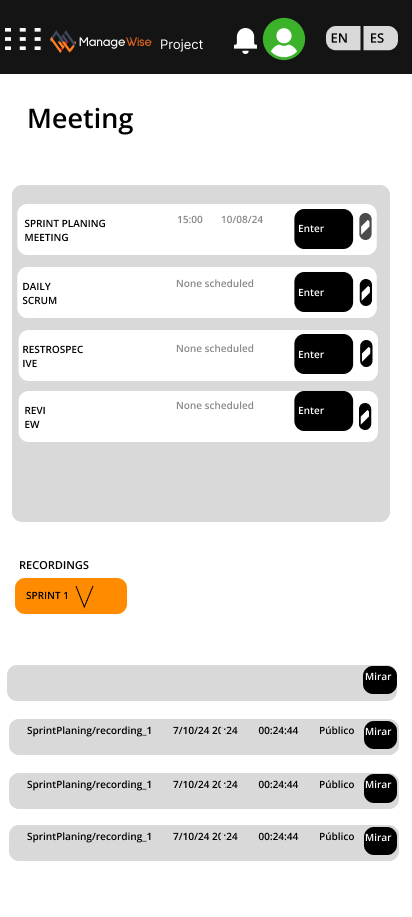
 
 

La sección Members permite al project manager gestionar el equipo de desarrollo, invitando, removiendo miembros y asignándolos a grupos de trabajo, facilitando la colaboración en tareas específicas.
 

 

 
 

#### 4.4.4. Mobile Applications User Flow Diagrams.

### 4.5. Mobile Applications Prototyping.

#### 4.5.1. Android Mobile Applications Prototyping.

#### 4.5.2. iOS Mobile Applications Prototyping.
	

### 4.6. Web Applications UX/UI Design

#### 4.6.1. Web Applications Wireframes

En esta parte se explorará el diseño de la experiencia que tendrán los usuarios al interactuar con la aplicación web. Tanto la ubicación de elementos, como las fuentes y colores, están pensados para ofrecer al usuario una experiencia visualmente atractia y fluida.

La sección de Proyectos es la principal, en donde el usuario podrá visualizar los diferentes proyectos que ha creado y en caso desearlo, crear uno nuevo. Además de contar con una breve descripción de la app general.  
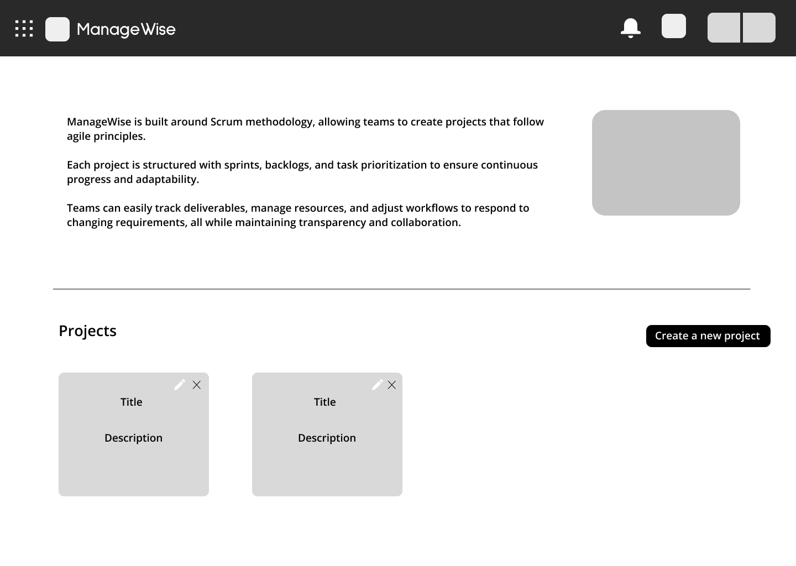
 
 

En la sección Backlog, el usuario podrá visualizar el product backlog y puede crear un sprint backlog, añadiendo backlog items a este. Además cuenta con una vista Backlog items, en donde en caso tener permisos, puede gestionar estos.

 
Vista Backlog Items

 
 

En la sección Members, el usuario visualiza a los diferentes miembros del equipo, puediendo añadir mas en caso desearlo. Además en caso seleccionar Groups, podrá gestionar estos.

 
Vista Groups

 
 

En la sección de Statistics, el usuario podrá visualizar diferentes datos estadísticos sobre el proyecto y en caso seleccionar Timeline, podra ver el cronograma de este.
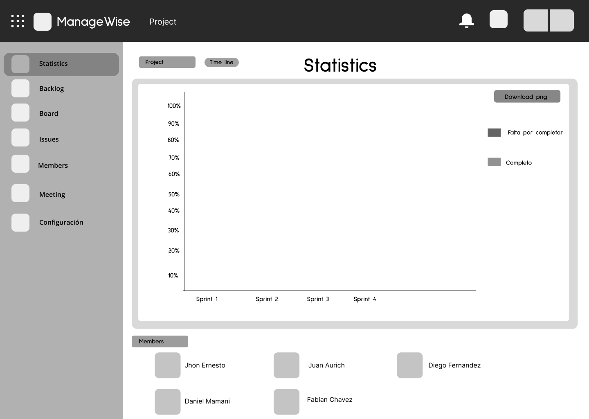
 
Vista Timeline
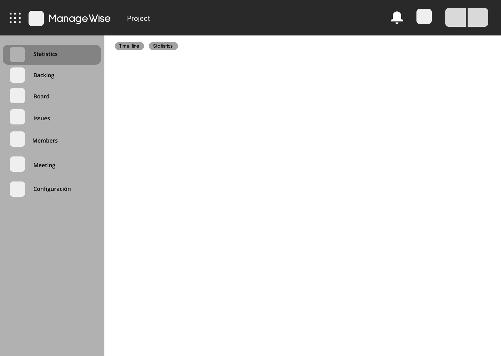
 
 

En la sección Meeting el usuario podrá visualizar si se encuentra activa alguna reunión e ingresar a esta.
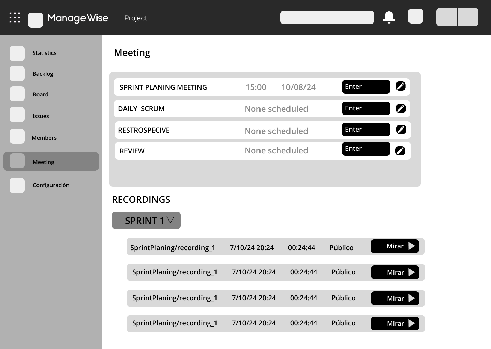
 
 

En la sección Issues, el usuario crear reportes sobre incidencias, además de visualizar los ya existentes.Ademas ,puede añadir eventos dentro del historial de eventos de cambios para el issue , de esta manera mantiene informado a los miembros.
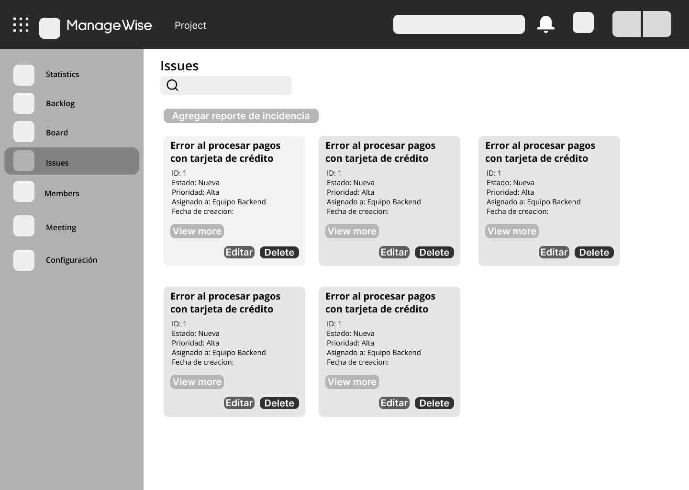
 
 

En la sección Board, el usuario será capaz visualizar un tablero scrum, en donde podrá visualizar quién es el encargado de cada item, además de, en caso de tener permisos, poder editar el estado de los items.
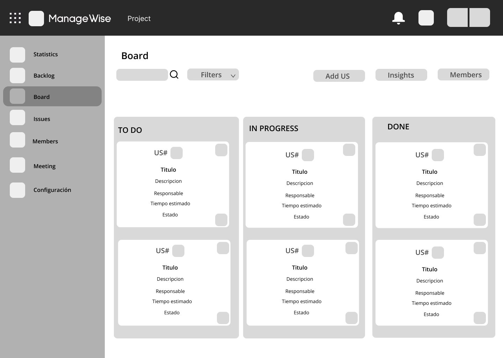
 
Vista de Miembros asignados

 

#### 4.6.2. Web Applications Wireflow Diagrams

##### User goal: Registrar un nuevo usuario

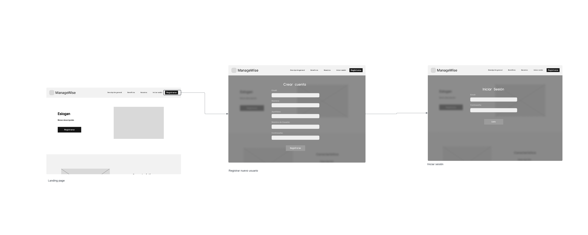

##### User goal: Iniciar sesión

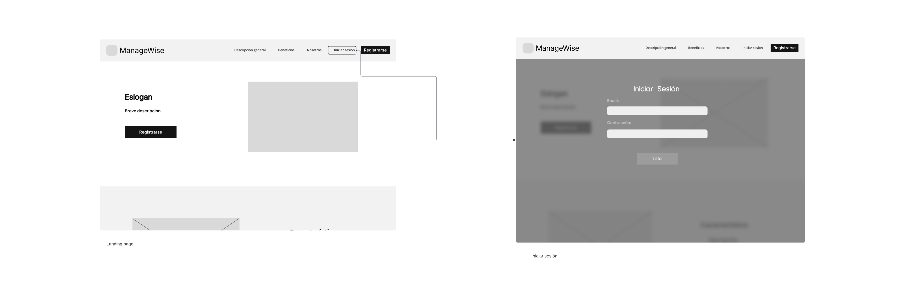

##### User goal: Acceso a meeting

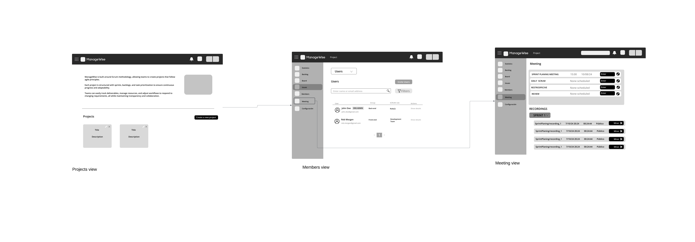

##### User goal: Agregar un nuevo miembro

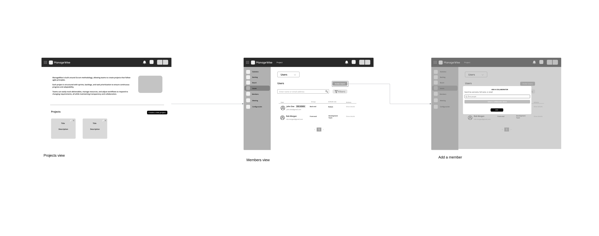

##### User goal: Crear un nuevo grupo

##### User goal: Crear un nuevo backlog item

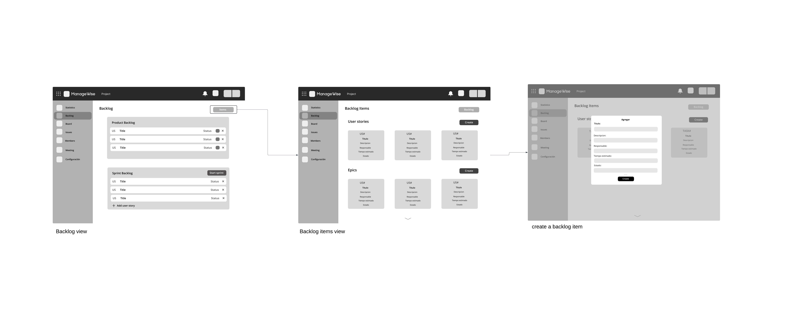

##### User goal: Editar un backlog item

##### User goal: Eliminar un backlog item

##### User goal: Crear un sprint

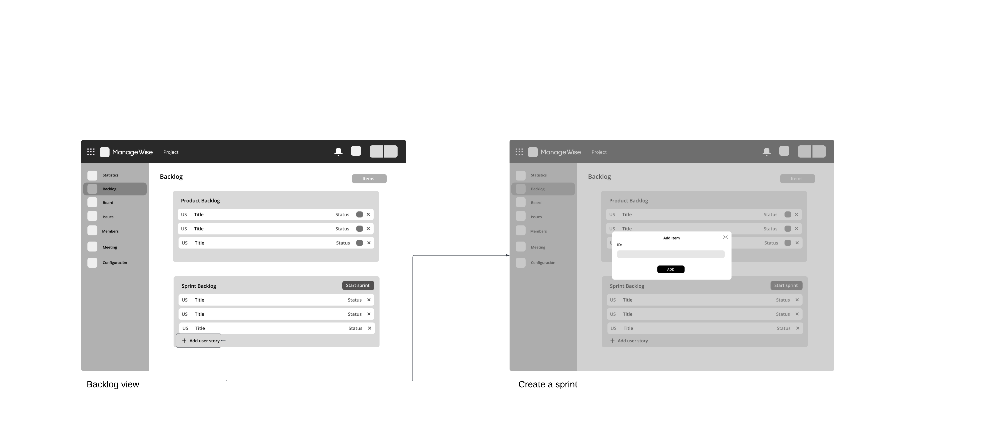

##### User goal: Acceder a metricas del proyecto

##### User goal: Acceder a la timeline del proyecto

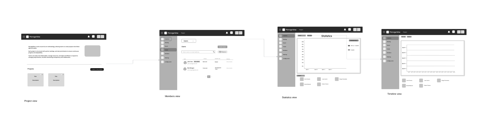

##### User goal: Acceder al tablero scrum

##### User goal: Acceder a Issues

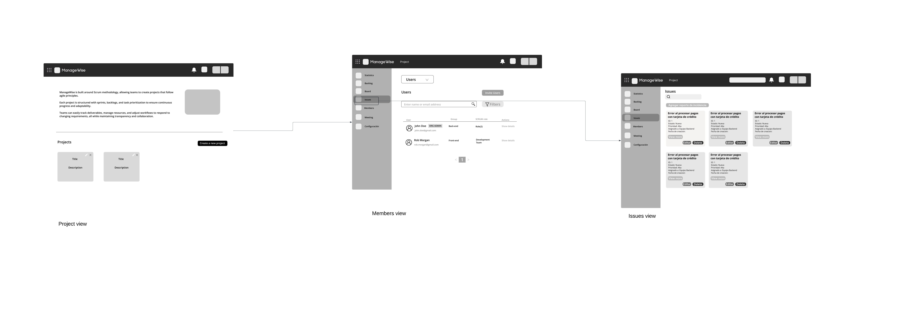

##### User goal: Eliminar un backlog item

#### 4.6.3. Web Applications Mock-ups

Los siguientes mockups ofrecen una vista previa del diseño y estructural visual de la aplicación web antes de su desarrollo final. Gracias a estos mockups podemos visualizar como se dispondrán los diferentes elementos en la interaz, garantizando que el diseño sea claro e intuitivo.

La sección de Statistics es fundamental, en donde el product Owner y Scrum Master podrá visualizar las estadisticas en base a los sprints de las historias de usuario. Tanto tambien se podrá saber si el sprint se esta elaborando bien en temas de avance.
 

 
En en el apartado Estado de TimeLine, en lo cual el product Owner y Scrum Master podrá colocar en que tiempo se completo las historias de usuario en en esquema del tiempo por sprints.

 
En la sección Backlog permite gestionar y mover historias de usuario entre el product backlog y el sprint backlog, con la opción de iniciar sprints una vez las historias estén listas.

 
En la sección Board permite gestionar visualmente las User Stories, moviéndolas entre las columnas TO DO, IN PROGRESS, y DONE, con opciones para agregar, editar, eliminar y filtrar las tareas por prioridad.

 
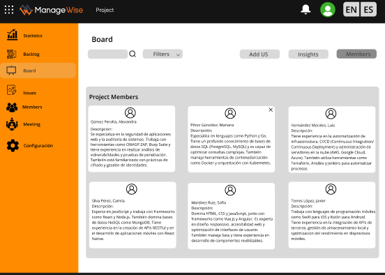
 
 
En en el apartado Meeting, el Scrum Master o el Product Owner se registrara las reuniones y se podra planificar a que dia y hora estara dicha reunion.

 
 

La sección Members permite al project manager gestionar el equipo de desarrollo, invitando, removiendo miembros y asignándolos a grupos de trabajo, facilitando la colaboración en tareas específicas.

 
 

 
 

#### 4.6.4. Web Applications User Flow Diagrams

##### User goal: Como usuario quiero poder iniciar sesión en ManageWise. Para lograrlo, completar el formulario, en caso de usar datos válidos, podre iniciar sesión, caso contrario, el formulario se reinicia.

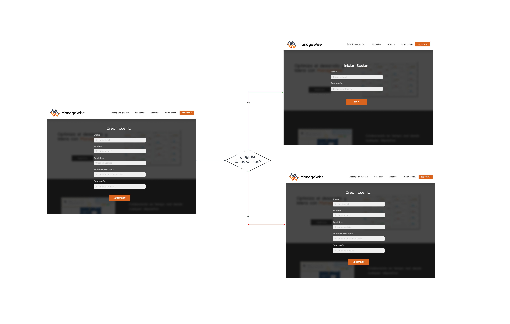

##### User goal: Como usuario quiero poder registrarme en ManageWise. Para lograrlo, ingreso mi usuario y contraseña en el formulario, en caso sean válidos, ingresaré a la plataforma, de lo contrario, el formulario se reinicia.

##### User goal: Como scrum master o product owner, quiero poder agregar backlog items al sprint backlog. Para logralo selcciono add items en el sprint backlog, ingreso el id de este y selecciono add, en caso ingrese un dato incorrecto, el formulario se reiniciara.

##### User goal: Como miembro product owner, quiero poder crear backlog items para reflejar los requisitos y necesidades del cliente. Para lograrlo, dentro de la sección backlog, selecciono backlog items, y en en el item deseado, selecciono create. En caso llene el formulario de forma correcta y seleccione create, el item se creara y en caso contrario, el formulario se cerrará.

##### User goal: Como miembro product owner, quiero poder editar backlog items para ajustar los requisitos. Para lograrlo, dentro de la sección backlog, selecciono backlog items, y en en el item deseado, selecciono edit. En caso llene el formulario de forma correcta y seleccione save, el item se actualizara y en caso contrario, el formulario se cerrará.

##### User goal: Como miembro product owner, quiero poder eliminar backlog items para no tener requisitos innecesarios. Para lograrlo, dentro de la sección backlog, selecciono backlog items, y en en el item deseado, selecciono delete. En caso llene el formulario de forma correcta y seleccione delete, el item se eliminará y en caso contrario, el formulario se cerrará.

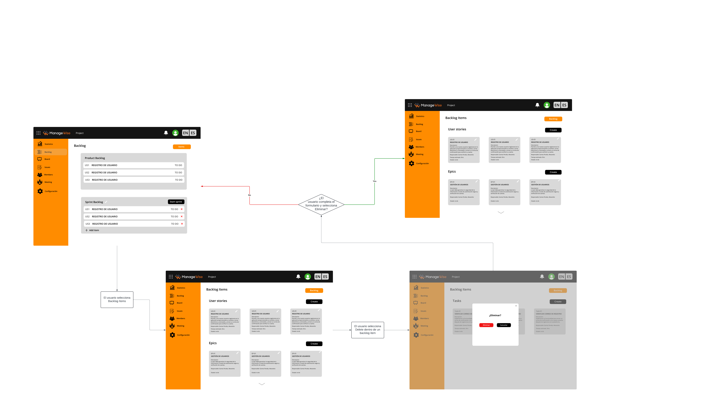

##### User goal: Como miembro del equipo de desarrollo quiero poder acceder a las reuniones, para asi contribuír con el equipo. Para lograrlo, selecciono Meetings en el menu lateral izquierdo e ingreso al meeting deseado, en caso no este disponible, se mostrará un mensaje.

##### User goal: Como miembro de equipo de desarrollo, quiero poder eliminar un reporte de incidencias. Para lograrlo, estando en la sección issues, selecciono el boton de eliminar en el reporte deseado y posteriormente confirmo, en caso no lo haga, se cancelará la acción.

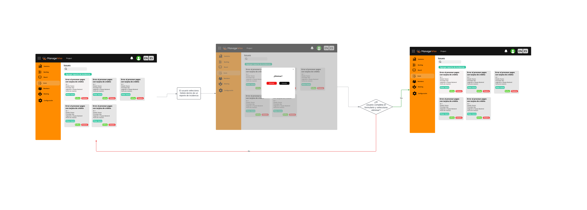

##### User goal: Como miembro de equipo de desarrollo, quiero poder editar un reporte de incidencias. Para lograrlo, estando en la sección issues, selecciono el boton de editar en el reporte deseado y posteriormente relleno el formulario de forma correcta y selecciono update, en caso no lo haga, se cancelará la acción.

##### User goal: Como miembro de equipo de desarrollo, quiero poder crear un reporte de incidencias. Para lograrlo, estando en la sección issues, selecciono el boton de crear reporte de incidencias y posteriormente relleno el formulario y confirmo, en caso no lo haga, se cancelará la acción.

##### User goal: Como scrum master o product owner, quiero poder agregar nuevos miembros al equipo. Para lograrlo, estando en la sección members, selecciono invite member y paso a la persona el link de invitación o simplemenente ingreso el user name de esta.

##### User goal: Como scrum master o product owner, quiero poder crear subgrupos para así separar a los miembros según el perfil de cada uno. Para lograrlo, estando en la sección members, selecciono groups y posteriormente create group, relleno el formulario y confirmo, caso contrario se cancelará la acción.

##### User goal: Como miembro de equipo de desarrollo, quiero observar el tablero scrum del proyecto. Para lograrlo, selecciono board en el menu lateral izquierdo.

##### User goal: Como miembro de equipo de desarrollo quiero poder observar metricas sobre el proyecto. Para lograrlo, selecciono statistics en el menu lateral izquierdo.

##### User goal: Como miembro de equipo de desarrollo, quiero poder observar la timeline del proyecto, para asi estar al tanto de límites. Para lograrlo, selecciono Statistics en el menu lateral izquierdo y posteriormente selecciono Timeline.

### 4.7. Web Applications Prototyping

El prototipo de la aplicación busca ofrecer una experiencia intuitiva para la gestión de proyectos. Las principales decisiones de interacción se centraron en la accesibilidad, permitiendo a usuarios seleccionados, en este caso los líderes, crear, editar y visualizar tareas fácilmente. Además, secciones como Proyectos, Herramientas, Seguridad y Reportes están diseñadas para asegurar una navegación clara y eficiente, optimizando la colaboración y el seguimiento del progreso en tiempo real.

Link del prototipo: https://www.figma.com/proto/mz9XRI1PRFgIvEPIuqHzgd/webapp-managewis?page-id=571%3A4620&node-id=593-8064&node-type=canvas&viewport=322%2C241%2C0.19&t=y2voS4erht03K4To-1&scaling=scale-down&content-scaling=fixed&starting-point-node-id=593%3A8064
 
Link del video: https://drive.google.com/drive/folders/12NAEuYcQpbOkQ6pO8YS2SoGiv-g4CQp4?usp=sharing

 

### 4.8. Domain-Driven Software Architecture

### 4.8.1. Software Architecture Context Diagram

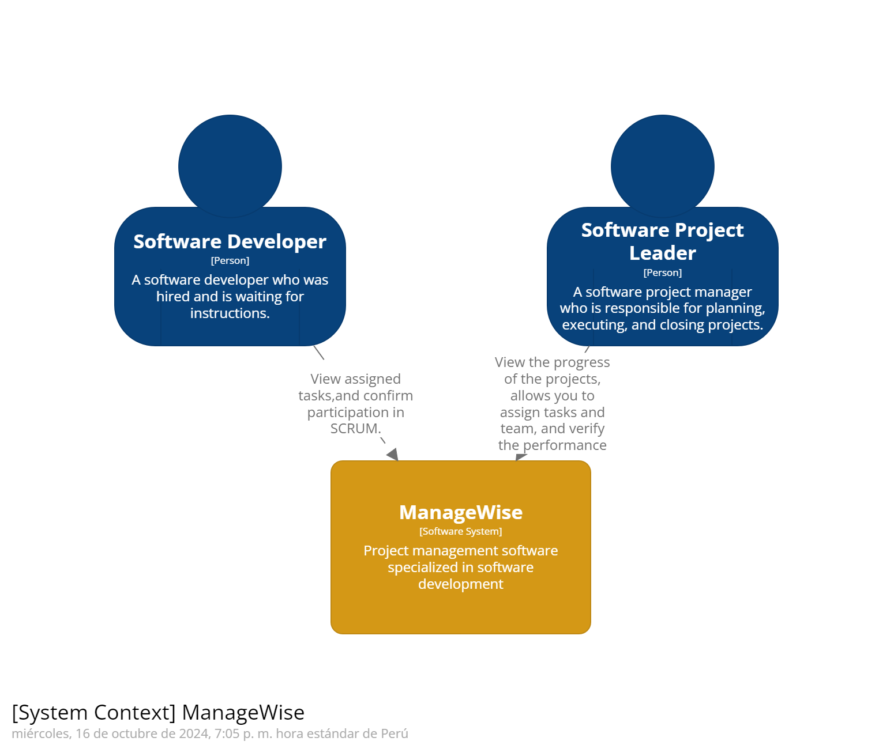

### 4.8.2. Software Architecture Container Diagrams

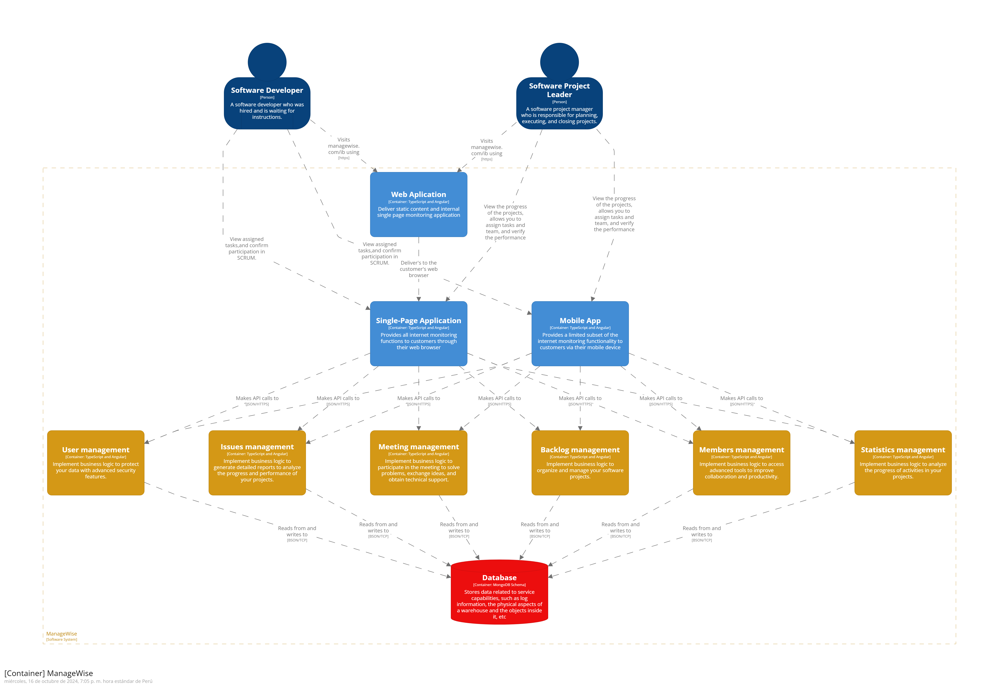

### 4.8.3. Software Architecture Components Diagrams

#### **Component: Backlog management**

### 4.9. Software Object-Oriented Design

#### 4.9.1. Class Diagrams

LINK diagrama de clases:
https://lucid.app/lucidchart/a8574ee7-c46c-4f80-ab16-b2b91cd5abde/edit?viewport_loc=941%2C706%2C2376%2C1266%2CHWEp-vi-RSFO&invitationId=inv_aaac668a-b1fb-479d-93c9-5c7af375894a

### 4.10. Database Design

### 4.10.1. Database Dictionary

Este es el formato que deberán seguir nuestras colecciones en MongoDB para replicar nuestras entidades de la base de datos.

**User**  
Descripción: Colección que representa a los empleados o usuarios del sistema.
| Campo | Tipo de dato | Descripción |
|-----------|----------------|------------------------------------------|
| id | int | Identificador único del usuario |
| email | nvarchar(150) | Correo electronico del usuario |
| phone | nvarchar(50) | Numero telefonico del usuario |
| password | nvarchar(150) | Contraseña del usuario |

**Issue**  
Descripción: Colección que representa los reportes de errores de un proyecto creado por un desarrollador.
| Campo | Tipo de dato | Descripción |
|------------|----------------|------------------------------------------|
| id | int | Identificador del reporte de issue |
| title | varchar(150) | Titulo del reporte de issue |
| description | varchar(500) | Descripcion del issue |
| status | varchar(50) | Estado del issue |
| priority | varchar(50) | Prioridad del issue |
| creationDate | date | Fecha de creacion del reporte de issue |
| resolutionDate | date | Fecha de resolucion del issue |
| sprintId | int | Identificador del sprint asociado al issue |
| madeBy | varchar(150) | Nombre del creador del reporte de issue|
| assignedId | int | Identificador del miembro asignado a resolver el reporte |

**Event**  
Descripción: Colección que representa los eventos para el historial eventos de cambios dentro de un issue .
| Campo | Tipo de dato | Descripción |
|--------------|----------------|------------------------------------------|
| issueId | int | Identificador del reporte asociado |
| id | int | Identificador único del evento |
| creationDate | date | Fecha de creacion del evento |
| madeBy | varchar(150) | Nombre del creador del evento |
| description | varchar(500) | Descripcion del evento |

**Sprint**  
Descripción: Colección que representa los sprint de un proyecto.
| Campo | Tipo de dato | Descripción |
|--|--|--|
| id | int | Identificador único del sprint |
| name | varchar(150) | Nombre del sprint |
| status | varchar(50) | Estado del sprint |
| startDate | date | Fecha de inicio del sprint |
| endDate | date | Fecha de cierre del sprint |
| projectId | int | Identificador del proyecto asociado al sprint |

**Meeting**  
Descripción: Colección que representa las reuniones de un proyecto.
| Campo | Tipo de dato | Descripción |
|--------------|----------------|------------------------------------------|
| id | int | Identificador de la reunion |
| title | varchar(150) | Titulo de la reunion |
| date | date | Fecha de la reunion |
| time | time | Duracion de la reunion |
| link | varchar(150) | Link de la reunion |
| recordingLink | varchar(150) | Link de la grabacion de la reunion |
| hostId | int | Identificador del creador de la reunion |

**Statistic**  
Descripción: Colección que representa las estadisticas de un sprint.
| Campo | Tipo de dato | Descripción |
|-------------|----------------|------------------------------------------|
| id | int | Identificador unico de las estadisticas |
| sprintId | int | Identificador del sprint |

**Member**  
Descripción: Colección que almacena los miembros de un proyecto.
| Campo | Tipo de dato | Descripción |
|---------------|----------------|------------------------------------------|
| userId | int | Identificador único del miembro y identificador del User que hereda sus atributos |
| roleId | int | Identificador del rol del miembro |
| biography | varchar(500) | Biografia del miembro |
| lastname | varchar(150) | Apellido del miembro |
| firstname | nvarchar(150) | Nombre del miembro |

**Project**  
Descripción: Colección que los proyectos que el sistema guarda.
| Campo | Tipo de dato | Descripción |
|--------------|----------------|------------------------------------------|
| id | int | Identificador del proyecto asociado |
| name | nvarchar(255)| Nombre del proyecto |
| description | datetime | Descripcion del proyecto |
| startDate | int | Fecha de inicio del proyecto |
| status | int | Estado del proyecto |
| companyId | int | Identificador de la compañia asociada |

**Company**  
Descripción: Colección que representa los usuarios Compañia que pueden crear proyectos.
| Campo | Tipo de dato | Descripción |
|------------|----------------|------------------------------------------|
| name | varchar(150) | Nombre de la compañia |
| userId | int | Identificador único de la compañia y identificador del User que hereda sus atributos |

**Task**  
Descripción: Colección que almacena las tareas de un user story.
| Campo | Tipo de dato | Descripción |
|------------|----------------|------------------------------------------|
| id | int | Identificador de la tarea |
| name | int | Nombre de la tarea |
| description | int | Descripcion de la tarea |
| status | int | Estado de la tarea |
| startDate | int | Fecha de inicio de la tarea |
| endDate | int | Fecha de cierre de la tarea |
| userStorieId | int | Identificador del user storie asociado a la tarea |
| memberId | int | Identificador del miembro que hara la tarea |

**UserStorie**  
Descripción: Colección de los user stories relacionados a las epicas de un proyecto.
| Campo | Tipo de dato | Descripción |
|--------------|----------------|------------------------------------------|
| id | int | Identificador unico del user storie |
| title | varchar(150) | Titulo del User Storie |
| description | varchar(500) | Descripcion del user storie |
| status | varchar(150) | Estado del user storie |
| epicId | int | Identificador de la epica asociada |
| backlogId | int | Identificador del backlog asociado |
| effort | varchar(150) | Explicacion del esfuerzo para cumplirlo |

**Backlog**  
Descripción: Colección del backlog para los user stories en un sprint.
| Campo | Tipo de dato | Descripción |
|--------------|----------------|------------------------------------------|
| id | int | Identificador unico del backlog |
| projectId | int | Identificador del projecto asociado |
| sprintId | int | Identificador del sprint asociado |

**Role**  
Descripción: Colección de los roles que un miembro del equipo puede tener.
| Campo | Tipo de dato | Descripción |
|--------------|----------------|------------------------------------------|
| id | int | Identificador unico del rol |
| name | varchar(150) | Nombre del rol |

**Epic**  
Descripción: Colección de los epicas de un proyecto.
| Campo | Tipo de dato | Descripción |
|--------------|----------------|------------------------------------------|
| id | int | Identificador unico de la epica |
| name | varchar(150) | Nombre de la epica |
| description | varchar(500) | Descripcion de la epica |

**Participation**  
Descripción: Colección de los participantes de una reunion.
| Campo | Tipo de dato | Descripción |
|--------------|----------------|------------------------------------------|
| meetingId | int | Identificador unico de una reunion |
| memberId | varchar(150) | Identificador unico de un miembro |

**MembersInProject**  
Descripción: Colección de los miembros de un proyecto.
| Campo | Tipo de dato | Descripción |
|--------------|----------------|------------------------------------------|
| projectId | int | Identificador unico de un proyecto |
| memberId | varchar(150) | Identificador unico de un miembro |

#### 4.10.2. Database Diagram

Para la elección de cómo relacionar las entidades, primero nos basamos en buscar tablas principales. Por ejemplo, en el sistema de gestión de proyectos, las entidades principales incluyen Clientes, Empleados, Proyectos, Tareas y Requisitos. Basándonos en ellas como punto de partida es que se nos hizo más sencillo y lógico la relación con las otras entidades. Esto nos ayudó a modelar eficazmente los datos y asegurar la coherencia de la información en nuestra aplicación.

